<style type='text/css'>
figure {
  width: 100%;
  text-align: center;
  font-style: italic;
  font-size: smaller;
  text-indent: 0;
  border: thin silver solid;
  margin: 0.5em;
  padding: 0.5em;
}
figcaption {  
    padding-top: 10px;
}
</style>

# Site certification for API integrations

As a merchant partner, you are granted access to our full API solution, so it is important that we certify your system to ensure that it meets our minimum criteria and represents an optimal API integration.

I.e., your interface, search criteria, category filtering, and booking platform should all mirror Viator.com to the extent that this is possible.

As a merchant partner, you are the merchant of record for your customers; therefore, you are responsible for transactions - including bookings and cancellations – carried out by your customers.

During your integration phase, you will have been using an apiKey for the RC/sandbox environment, which cannot be used to make real bookings. Before we issue you an apiKey for the production API that allows you to make **real** bookings on our **live** systems, we need to certify your integration to ensure that it operates optimally from a sales conversion perspective and you're communicating everything to the customer necessary to meet legal requirements.

This section describes in detail what you need to do in order to meet this certification standard.

When you believe your site is ready for inspection, [contact the API onboarding team](mailto:affiliateapi@tripadvisor.com) to review your implementation and provide certification and feedback if necessary.

## Certification elements

The complete certification check will comprise:

- [Front-end (UX/UI) checks](#front-end-checks): These involve providing screenshots of various elements of your site's booking UX/UI; e.g., the **search**, **product selection**, **product detail** and **checkout** stages. You will submit screenshots and explanations via our [Site Certification Tool](https://docs.google.com/forms/d/e/1FAIpQLSeqIgMaK6siS56NHdOaq-hg82sDew76KhkFVdMs62QaH9RclQ/viewform?vc=0&c=0&w=1&flr=0&pli=1). <br />The front-end checks comprise:
    + [Product search](#product-search)
        * [Clickable breadcrumb (location/category)](#clickable-breadcrumb-locationcategory)
        * [Default sort-order](#default-sort-order)
        * [Categories and subcategories](#categories-and-sub-categories)
        * [Free-text search](#free-text-search)
    + [Product detail page](#product-detail-page)
        * [Mandatory display elements](#mandatory-display-elements)
    + [Age band and passenger mix validation](#age-band-and-passenger-mix-validation)
        * [Infant ticketing](#infant-ticketing)
        * [Senior ticketing](#senior-ticketing)
        * [Excluded age bands](#excluded-age-bands)
        * [Included age bands and definitions](#included-age-bands-and-definitions)
        * [Maximum traveler count](#maximum-traveler-count)
    + [Tour grade selection](#tour-grade-selection)
        * [Search for availability by desired passenger mix](#search-for-availability-by-desired-passenger-mix)
        * [Tour grade search results](#tour-grade-search-results)
        * [Tour grade unit price](#tour-grade-unit-price)
    + [Payment details page](#payment-details-page)
        * [Lead traveler details](#lead-traveler-details)
        * [Booking question - passenger weights](#booking-questions-passenger-weights)
        * [Booking questions – transfer information](#booking-questions-transfer-information)
        * [Hotel pick-up](#hotel-pick-up)
        * [Order details](#order-details)
    + [Cancellation terms](#cancellation-terms)
        * [Standard cancellation policy](#standard-cancellation-policy)
        * ['All sales final' cancellation policy](#all-sales-final-cancellation-policy)
- [Back-end checks](#back-end-checks): These will require you to document the major elements of your back-end workflow to ensure efficiency and correctness. We will also use this documentation to help in providing technical support for your integration, rather than having to request this information from you if a problem arises.<br />The back-end checks comprise:
    * [Content ingestion process](#content-ingestion-process)
    * [Booking process](#booking-process)
        + [Bookings checks](#bookings-checks):
            - [Check 1: A booking has been made and confirmed](#check-1-a-booking-has-been-made-and-confirmed)
            - [Check 2: A booking has been successfully cancelled](#check-2-a-booking-has-been-successfully-cancelled)
            - [Check 3: The customer's telephone number is being successfully recorded in each booking](#check-3-the-customers-telephone-number-is-being-successfully-recorded-in-each-booking)
            - [Check 4: The customer's email address is being successfully recorded in each booking](#check-4-the-customers-email-address-is-being-successfully-recorded-in-each-booking)
            - [Check 5: A booking with successfully completed booking questions has been made](#check-5-a-booking-with-successfully-completed-booking-questions-has-been-made)
            - [Check 6: A booking with successfully completed hotel pick-up information has been made](#check-6-a-booking-with-successfully-completed-hotel-pick-up-information-has-been-made)
            - [Check 7: A booking with 'special requirements' has been made](#check-7-a-booking-with-special-requirements-has-been-made)
            - [Check 8: A booking with a standard cancellation policy has been made](#check-8-a-booking-with-a-standard-cancellation-policy-has-been-made)
            - [Check 9: An 'on-request' product has been booked and confirmed](#check-9-an-on-request-product-has-been-booked-and-confirmed)
            - [Check 10: A booking with a passenger mix containing multiple age bands has been made](#check-10-a-booking-with-a-passenger-mix-containing-multiple-age-bands-has-been-made)
- [Customer communications checks](#customer-communications-checks)
    - [Check: Voucher display](#check-voucher-display)
    - [Check: Pending status display for on-request bookings](#check-pending-status-display-for-on-request-bookings)
    - [Check: Email templates](#check-email-templates)
 - [Booking cancellation checks in the production environment](#booking-cancellation-checks-in-the-production-environment)
    - Once the certification in the sandbox testing environment is completed, we will ask you to confirm and cancel bookings in the live production environment. This is a necessary step to ensure that cancellations are processed correctly. A final approval from our finance team will be required in order to consider the certification process complete. 

## Front-end checks

To get your site's front-end certified, we would like you to provide screenshots similar to the examples here – taken directly from Viator.com – that demonstrate compliance with each criterion.

### Product search

**Instruction**: Perform a search for the destination 'Las Vegas' and observe the search results page

#### Clickable breadcrumb (location/category)

- **Action 1**: Demonstrate that your destination hierarchy mirrors that of Viator.com by providing a screenshot of your search results page that shows the correct destination hierarchy according to the example below taken from Viator.com:

<figure>
    
    <figcaption>Destination hierarchy on viator.com search results page</figcaption>
</figure>

- **Action 2**: Demonstrate that your destination hierarchy mirrors that of Viator.com by providing a screenshot of your product display page that shows the correct destination hierarchy according to the example below taken from Viator.com:

<figure>
    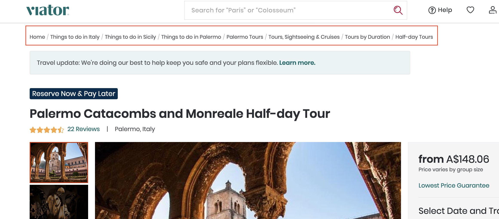
    <figcaption>Destination hierarchy on viator.com product display page</figcaption>
</figure>

<hr />

#### Default sort-order

- **Action**: Demonstrate by providing a screenshot that your default sort-order for the product search results is the default sort order received from the Viator API.
- **Example**: Default sort order of 'Featured'
    - **Note**: this corresponds to the order of products received from <a href="https://docs.viator.com/partner-api/merchant/technical/#operation/product" target="_blank" data-wm-adjusted="done">/product</a> when `sortOrder` is set to 'TOP_SELLERS' or allowed to default to this sort order by omitting the `sortOrder` field in the request body:

<figure>
    
    <figcaption>Default sort order on viator.com</figcaption>
</figure>

#### Categories and sub-categories

- **Action**: Demonstrate by providing a screenshot that 'categories' and 'subcategories' have been implemented correctly on your website in a similar manner to that on Viator.com.
- **Example**: 'Subcategories' nested within 'categories' implemented as an accordion on Viator.com:
  
<figure>
    
    <figcaption>Categories and subcategories display on viator.com</figcaption>
</figure>

#### Free-text search

- **Action**: Demonstrate by providing a screenshot that it is possible for the customer to search for products by destination (city/region/country), by association with an attraction, and/or by product title.
- **Example**: Free-text search for 'Las Vegas' on Viator.com with suggested search results.

<figure>
    
    <figcaption>Free-text search on viator.com</figcaption>
</figure>

#### Date search

- **Action**: Show with a screenshot that the date search is available.
- **Example**: Date search is available on the search results page on Viator.com.

<figure>
    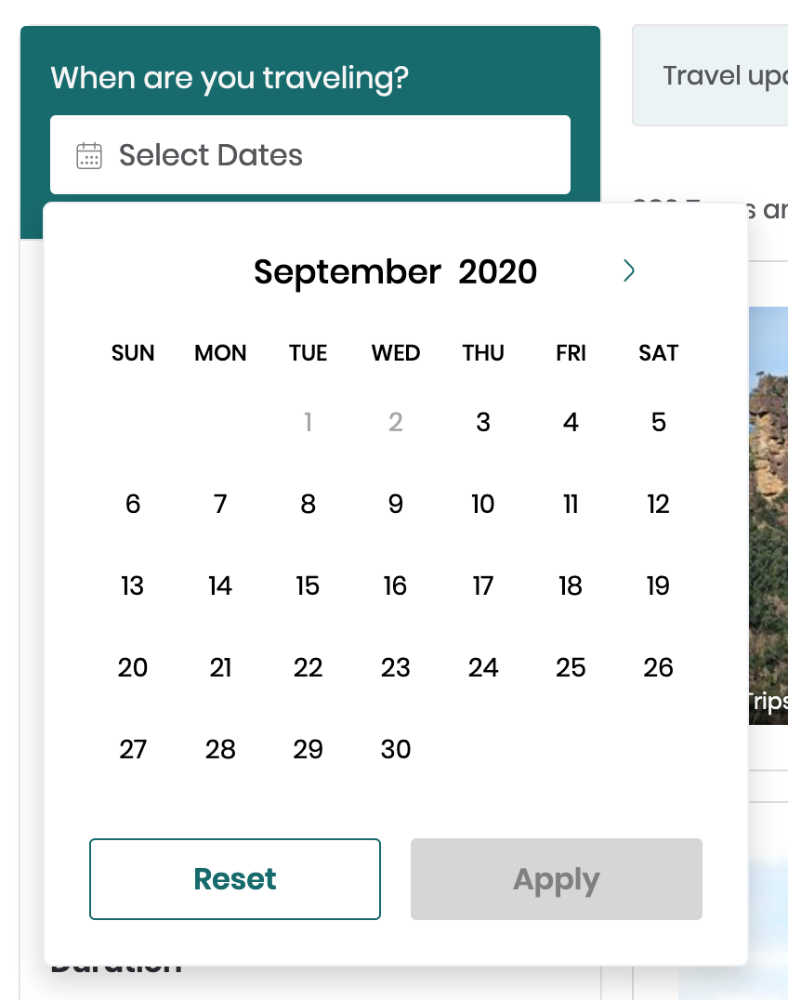
    <figcaption>Date search on viator.com</figcaption>
</figure>

### Product detail page

**Instruction**: Navigate to **your** product detail page for the [Las Vegas Helicopter Night Flight with Optional VIP Transportation (5516ST5)](https://www.viator.com/tours/Las-Vegas/Deluxe-Las-Vegas-Helicopter-Night-Flight-with-VIP-Transportation/d684-5516ST5).

#### Mandatory display elements

**Action**: Provide screenshots to demonstrate that <u>all</u> the following elements are displayed on your product detail page:

<table>
    <tr>
        <th>Element</th>
        <td><strong>Location</strong></td>
    </tr>
    <tr>
        <th>Source</th>
        <td>Snippet of response from <a href="https://docs.viator.com/partner-api/merchant/technical/#operation/product" target="_blank" data-wm-adjusted="done">/product</a>:<br /><pre>{
  "data": {
     "location": "North Las Vegas, United States",
    ...
  },
  ...
}</pre></td>
    </tr>
    <tr>
        <th>Screenshot</th>
        <td>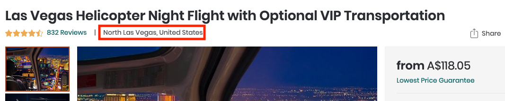</td>
    </tr>
</table>

<table>
    <tr>
        <th>Element</th>
        <td><strong>Product title</strong></td>
    </tr>
    <tr>
      <th>Source</th>
      <td>Snippet of response from <a href="https://docs.viator.com/partner-api/merchant/technical/#operation/product">/product</a>:<br /><pre>{
  "data": {
    "title": "Las Vegas Helicopter Night Flight with Optional VIP Transportation",
    ...
  },
  ...
}</pre></td>
    </tr>
    <tr>
        <th>Screenshot</th>
        <td>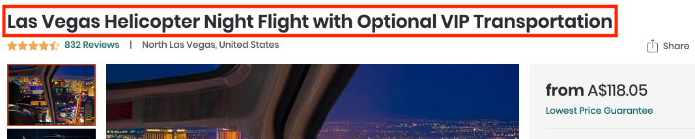</td>
    </tr>
</table>

<table>
    <tr>
        <th>Element</th>
        <td><strong>Supplier and user photos</strong></td>
    </tr>
    <tr>
        <th>Source</th>
        <td>You must display <strong>at least two</strong> supplier-provided photos, and optionally display user-provided photos.<br> 

        These photos are available from the following sections in the response from <a href="https://docs.viator.com/partner-api/merchant/technical/#operation/product" target="_blank" data-wm-adjusted="done">/product</a>:<br><br>

        <strong>Supplier-provided photo(s) in the <code>productPhotos</code> array:</strong>

        <pre>{
  "data": {
    "productPhotos": [
      {
        "caption": "",
        "photoURL": "https://hare-media-cdn.tripadvisor.com/media/attractions-splice-spp-674x446/07/91/a6/57.jpg",
        "path": "attractions-splice-spp-674x446/07/91/a6/57.jpg",
        "supplier": "SUPPLIER"
      }
    ],
    ...
  }
}</pre>

<strong>Supplier-provided photo in the <code>thumbnailHiResURL</code> field:</strong>

<pre>{
  "data": {
    "thumbnailHiResURL": "https://hare-media-cdn.tripadvisor.com/media/attractions-splice-spp-674x446/06/6b/8c/9f.jpg",
    ...
  }
}
</pre>

<strong>User-provided photos in the <code>userPhotos</code> array</strong>:

**Note**: User photos may not be available for all products. This example is taken from a different product: Grand Canyon National Park Bus Tour (18262P1)

<pre>{
  "data": {
      "userPhotos": [
        {
          "sortOrder": 1,
          "ownerName": "Matias R",
          "ownerCountry": null,
          "productTitle": "Grand Canyon National Park Bus Tour",
          "productUrlName": "Grand-Canyon-National-Park-Bus-Tour",
          "ownerAvatarURL": "http://cache-graphicslib.viator.com/graphicslib/media/ca/matias-r-account_30810314-45sq.jpg",
          "sslSupported": false,
          "editorsPick": false,
          "timeUploaded": "2018-04-09",
          "productCode": "18262P1",
          "caption": "<p></p>",
          "thumbnailURL": "http://cache-graphicslib.viator.com/graphicslib/media/1a/-photo_31691034-133sq.jpg",
          "ownerId": 30810314,
          "photoURL": "http://cache-graphicslib.viator.com/graphicslib/media/1a/-photo_31691034-770tall.jpg",
          "photoId": 31691034,
          "photoHiResURL": "http://cache-graphicslib.viator.com/graphicslib/media/1a/-photo_31691034-1536tall.jpg",
          "photoMediumResURL": "http://cache-graphicslib.viator.com/graphicslib/media/1a/-photo_31691034-260tall.jpg",
          "title": ""
        },
        ...
      ],
      ...
    },
    ...
  }</pre></td>
    </tr>
    <tr>
        <th>Screenshot</th>
        <td></td>
    </tr>
</table>
<table>
    <tr>
        <th>Element</th>
        <td><strong>Product short description</strong></td>
    </tr>
    <tr>
        <th>Source</th>
        <td>Snippet of response from <a href="https://docs.viator.com/partner-api/merchant/technical/#operation/product" target="_blank" data-wm-adjusted="done">/product</a>:<br /><pre>{
  "data": {
    "shortDescription": "Explore the natural side of Arizona with a day trip to the Grand Canyon National Park South Rim on our luxury bus tour. Your professional bus driver is trained to provide you with interesting facts about the history, flora, and fauna on one of the great wonders of the modern world.<br><br>Join us for a journey to the Grand Canyon South Rim! Along the drive to the canyon, you will get to stop along historic Route 66 to see the Grand Canyon Caverns. These 100 year old natural caverns provide an amazing tour experience all on their own. <br><br>Once you arrive at the South Rim, enjoy stops along the rim such as Mather Point and Bright Angel Lodge. Explore popular attractions in the Grand Canyon National Park such as El Tovar, Hopi House, Kolb Photo Studio, and the Bright Angel Trail and make memories of a lifetime!",
    ...
  },
  ...
}</pre></td>
    </tr>
    <tr>
        <th>Screenshot</th>
        <td>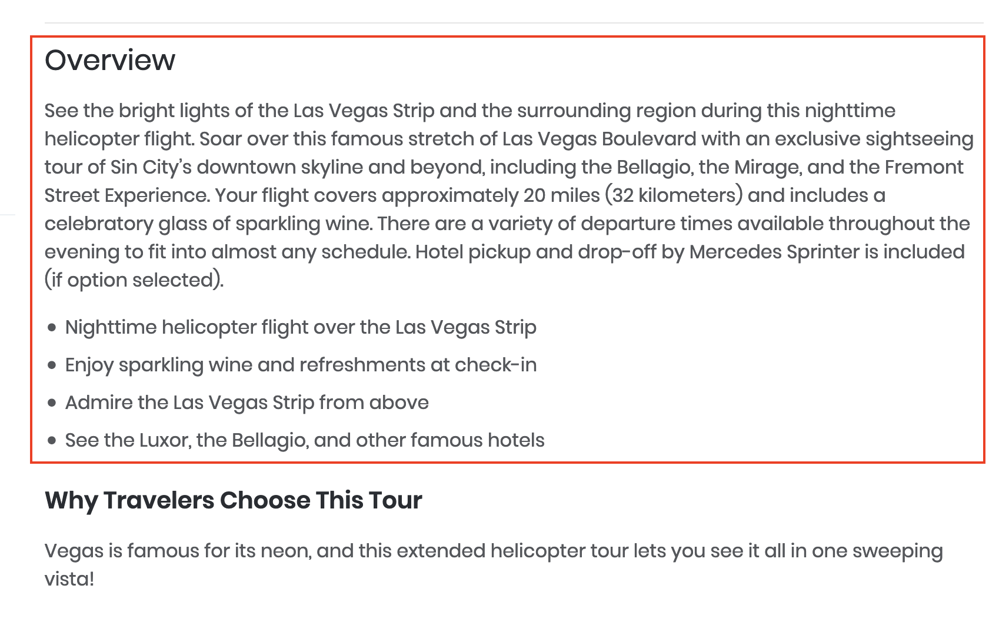</td>
    </tr>
</table>

<table>
    <tr>
        <th>Element</th>
        <td><strong>Itinerary</strong></td>
    </tr>
    <tr>
        <th>Source</th>
        <td>Snippet of response from <a href="https://docs.viator.com/partner-api/merchant/technical/#operation/product" target="_blank" data-wm-adjusted="done">/product</a>:<br /><pre>{
  "data": {
    "description": "&lt;b&gt;Itinerary&lt;/b&gt;&lt;br&gt;This is a typical itinerary for this product&lt;br&gt;&lt;br&gt;&lt;b&gt;Pass By:&lt;/b&gt; The Strip, S Las Vegas Blvd, Las Vegas, NV 89109&lt;br&gt;&lt;br&gt;Fly over the beautiful Las Vegas City Lights&lt;br&gt;&lt;br&gt;&lt;b&gt;Pass By:&lt;/b&gt; Stratosphere Tower, 2000 Las Vegas Blvd S Stratosphere Casino Hotel & Tower, Las Vegas, NV 89104-2507&lt;br&gt;&lt;br&gt;Fly past the 1149 foot ( 350 meters) high Strat Tower!&lt;br&gt;&lt;br&gt;&lt;b&gt;Pass By:&lt;/b&gt; Fountains of Bellagio, 3600 Las Vegas Blvd S Bellagio Hotel & Casino, Las Vegas, NV 89109-4303&lt;br&gt;&lt;br&gt;Fly past the Bellagio Hotel maybe see the fountains in action!&lt;br&gt;&lt;br&gt;&lt;b&gt;Pass By:&lt;/b&gt; Las Vegas Downtown, Fremont Street, Las Vegas, NV&lt;br&gt;&lt;br&gt;Fly over historic downtown vegas&lt;br&gt;&lt;br&gt;&lt;b&gt;Pass By:&lt;/b&gt; Fremont Street Experience, 425 Fremont Street, Las Vegas, NV 89101-5620&lt;br&gt;&lt;br&gt;Fly over the Historic Fremont Street Experience.&lt;br&gt;&lt;br&gt;",
    ...
  },
  ...
}</pre></td>
    </tr>
    <tr>
        <th>Screenshot</th>
        <td>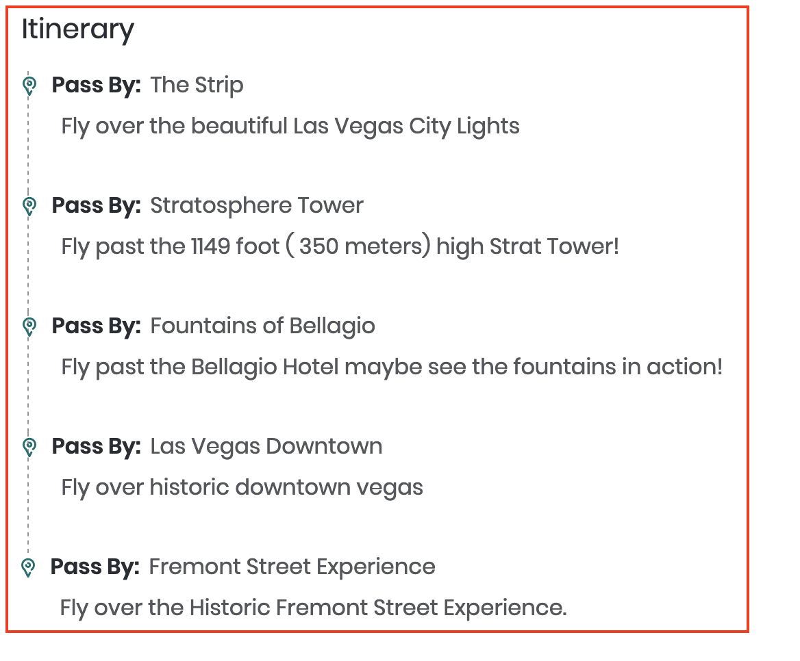</td>
    </tr>
</table>

<table>
    <tr>
        <th>Element</th>
        <td><strong>Departure point</strong></td>
    </tr>
    <tr>
        <th>Source</th>
        <td>Snippet of response from <a href="https://docs.viator.com/partner-api/merchant/technical/#operation/product" target="_blank" data-wm-adjusted="done">/product</a>:<br /><pre>{
  "data": {
    "departurePoint": "4511 W Cheyenne Ave, North Las Vegas, NV 89032, USA&lt;br /&gt;&lt;br&gt;Traveler pickup is offered&lt;br/&gt;You can choose to self-drive or we can pick up from most Las Vegas Hotels. Self- drive guests will travel to the terminal &lt;br&gt;&lt;br&gt;",
    ...
  },
  ...
}</pre></td>
    </tr>
    <tr>
        <th>Screenshot</th>
        <td>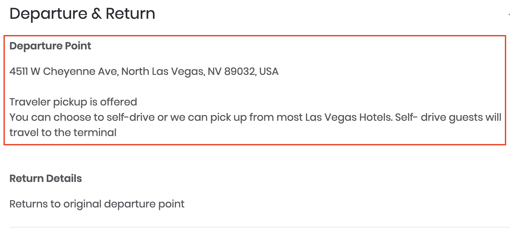</td>
    </tr>
</table>

<table>
    <tr>
        <th>Element</th>
        <td><strong>Return details</strong></td>
    </tr>
    <tr>
        <th>Source</th>
        <td>Snippet of response from <a href="https://docs.viator.com/partner-api/merchant/technical/#operation/product" target="_blank" data-wm-adjusted="done">/product</a>:<br /><pre>{
  "data": {
    "returnDetails": "Returns to original departure point&lt;br /&gt;",
    ...
  },
  ...
}</td></td>
    </tr>
    <tr>
        <th>Screenshot</th>
        <td></td>
    </tr>
</table>

<table>
    <tr>
        <th>Element</th>
        <td><strong>Duration</strong></td>
    </tr>
    <tr>
        <th>Source</th>
        <td>Snippet of response from <a href="https://docs.viator.com/partner-api/merchant/technical/#operation/product" target="_blank" data-wm-adjusted="done">/product</a>:<br /><pre>{
  "data": {
    "duration": "2 hours 30 minutes"
    ...
  },
  ...
}</pre></td>
    </tr>
    <tr>
        <th>Screenshot</th>
        <td>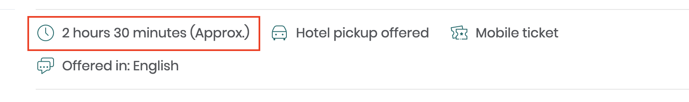</td>
    </tr>
</table>
<table>
    <tr>
        <th>Element</th>
        <td><strong>Inclusions</strong></td>
    </tr>
    <tr>
        <th>Source</th>
        <td>Snippet of response from <a href="https://docs.viator.com/partner-api/merchant/technical/#operation/product" target="_blank" data-wm-adjusted="done">/product</a>:<br /><pre>{
  "data": {
    "inclusions": [
      "15-minute helicopter flight",
      "Hotel pickup and drop-off by Mercedes Sprinter (if option selected)",
      "Sparkling wine toast",
      "All taxes and fees"
    ],
    ...
  },
  ...
}</pre></td>
    </tr>
    <tr>
        <th>Screenshot</th>
        <td></td>
    </tr>
</table>
<table>
    <tr>
        <th>Element</th>
        <td><strong>Exclusions</strong></td>
    </tr>
    <tr>
        <th>Source</th>
        <td>Snippet of response from <a href="https://docs.viator.com/partner-api/merchant/technical/#operation/product" target="_blank" data-wm-adjusted="done">/product</a>:<br /><pre>{
  "data": {
    "exclusions": [
      "Gratuities",
      "Transport (if self drive option selected)"
    ],
    ...
  },
  ...
}</pre></td>
    </tr>
    <tr>
        <th>Screenshot</th>
        <td>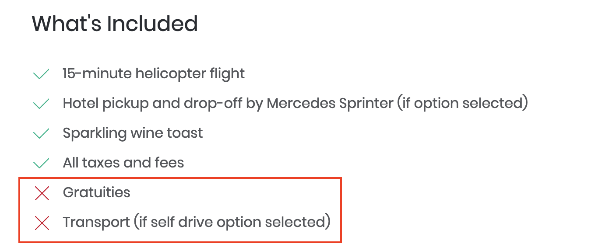</td>
    </tr>
</table>


<table>
    <tr>
        <th>Element</th>
        <td><strong>Additional Info</strong></td>
    </tr>
    <tr>
        <th>Source</th>
        <td>Snippet of response from <a href="https://docs.viator.com/partner-api/merchant/technical/#operation/product" target="_blank" data-wm-adjusted="done">/product</a>:<br /><pre>{
  "data": {
    "additionalInfo": [
        "Confirmation will be received at time of booking",
        "Due to comfort and weight / balance of the aircraft, passengers weighing over 275lbs (125 kg/ 19.64 st) will be required to purchase an additional seat. This is payable directly to the tour operator on the day of the tour.",
        "Minimum age is 2 years",
        "Children age 2 years and older require a seat per FAA regulations",
        "Flights depart from North Las Vegas airport",
        "Special offer is valid on bookings of 2 passengers. Prices for odd passenger counts will vary. Please see pricing calendar for exact pricing.",
        "Not wheelchair accessible",
        "Near public transportation",
        "Infants must sit on laps",
        "No heart problems or other serious medical conditions",
        "Customers choosing to make their own way to the airport will need to arrive 30 minutes prior to flight time at this address. 4511 W. CHEYENNE AVE, SUITE 101, NORTH LAS VEGAS, NEVADA 89032",
        "The flight is not private unless 6 seats are purchased. The helicopter may have upto 6 passengers plus the pilot onboard.",
        "Most travelers can participate",
        "This experience requires good weather. If it’s canceled due to poor weather, you’ll be offered a different date or a full refund",
        "This experience requires a minimum number of travelers. If it’s canceled because the minimum isn’t met, you’ll be offered a different date/experience or a full refund",
        "This tour/activity will have a maximum of 6 travelers",
        "Face masks required for travelers in public areas",
        "Face masks required for guides in public areas",
        "Face masks provided for travelers",
        "Hand sanitizer available to travelers and staff",
        "Regularly sanitized high-traffic areas",
        "Gear/equipment sanitized between use",
        "Transportation vehicles regularly sanitized",
        "Guides required to regularly wash hands",
        "Regular temperature checks for staff",
        "Temperature checks for travelers upon arrival",
        "Paid stay-at-home policy for staff with symptoms",
        "This is not a private flight. The aircraft seats six (6) passengers plus the Pilot. Social distancing is not practiced during your 15 minute flight. Face masks must be worn at all times"
    ],
    ...
  },
  ...
}</pre></td>
    </tr>
    <tr>
        <th>Screenshot</th>
        <td>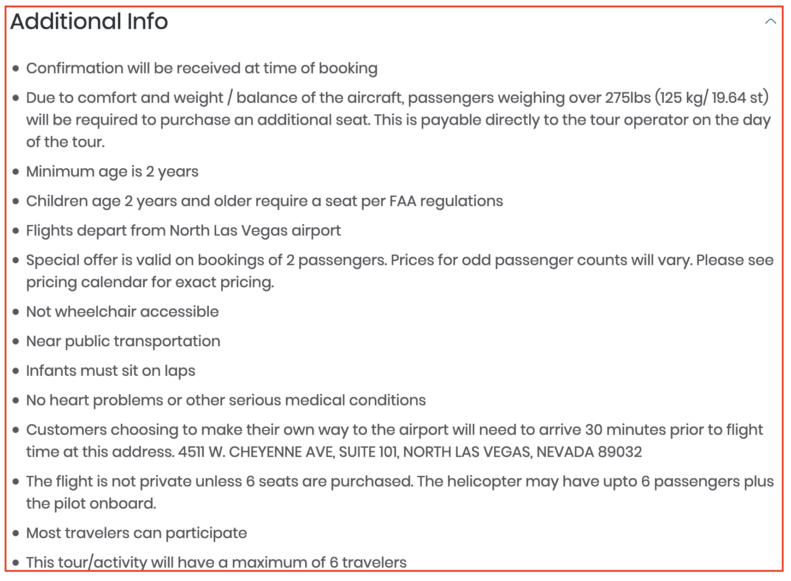</td>
    </tr>
</table>
<table>
    <tr>
        <th>Element</th>
        <td><strong>Reviews</strong></td>
    </tr>
    <tr>
      <th>Source</th>
      <td>Snippet of response from <a href="https://docs.viator.com/partner-api/merchant/technical/#operation/product" target="_blank" data-wm-adjusted="done">/product</a>:<br /><pre>{
  "data": { 
    "rating": 4.4,
    "reviewCount": 582,
    "ratingCounts": { "1": 30, "2": 26, "3": 43, "4": 105, "5": 498 },
    "reviews": [{
        "ownerName": "Signe",
        "submissionDate": "2020-08-25",
        "rating": 5,
        "review": "<p>I enjoyed talking with Tony about our reservation.  He has quite the personality. The flight was short but amazing.</p>",
        ...
        },
      ...
    ],
    ...
  },
  ...
}
      </pre></td>
    </tr>
    <tr>
        <th>Screenshot</th>
        <td></td>
    </tr>
</table>

### Age band and passenger mix validation

#### Infant ticketing

**Instruction**: Remain on your product detail page for the product <a href="https://www.viator.com/tours/Boston/Daily-Ferry-to-the-Boston-Harbor-Islands/d678-3283FERRY" target="_blank" data-wm-adjusted="done">"Boston Harbor Islands: Round-Trip Ferry to Spectacle Island" (3283FERRY)</a> and observe the passenger-mix selection section / widget.

- **Action**: Demonstrate with a screenshot that it is <u>impossible</u> to purchase an **infant** ticket without an accompanying adult ticket; for example, by imposing this restriction via the UI.
- **Example**: On the [viator.com](https://viator.com) site, an error message is displayed if one tries to set the passenger mix to infants alone:


<figure>
    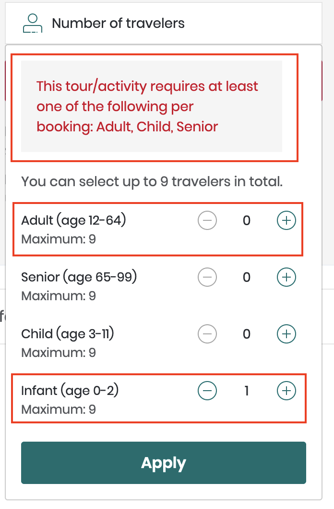
    <figcaption>Passenger mix selection widget with error message</figcaption>
</figure>

<hr />

#### Senior ticketing

- **Action**: Demonstrate with a screenshot that it is <u>possible</u> to purchase a **senior** ticket on its own, *without* an accompanying adult, for product 3283FERRY.
- **Example**: On the viator.com site, the ⊖ button for the number of travelers becomes disabled when the number of Adults reaches one (1) unless the product has a **senior** age band. In this case, the ⊖ button for the number of Adults remains available so that the user can select a senior ticket on its own. If the user attempts to set a passenger mix that includes the infant age band on its own, an error message is displayed prompting the user to select a valid passenger mix.

<hr />

<figure>
    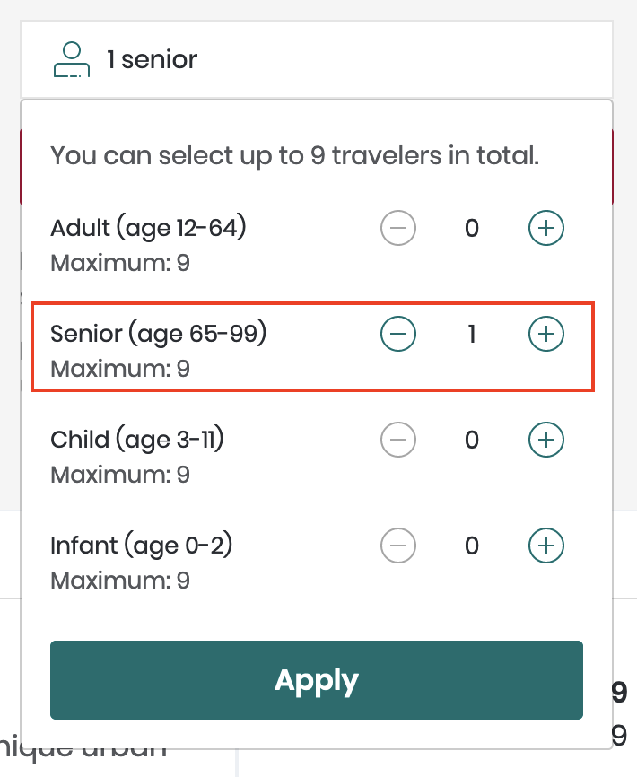
    <figcaption>Passenger mix including <strong>senior</strong> but no <strong>adult</strong> age band</figcaption>
</figure>

<hr />

#### Excluded age bands

- **Action**: Demonstrate with a screenshot that **Senior** tickets are **not** available for product [5713P109](https://www.viator.com/tours/Boston/North-End-Small-Group-Food-Tour/d678-5713P109).
- **Example**: If a particular age band is not available for a product, it should not be available for selection. For product [5713P109](https://www.viator.com/tours/Boston/North-End-Small-Group-Food-Tour/d678-5713P109), only 'Adult', 'Child' and 'Infant' can be selected:

<figure>
    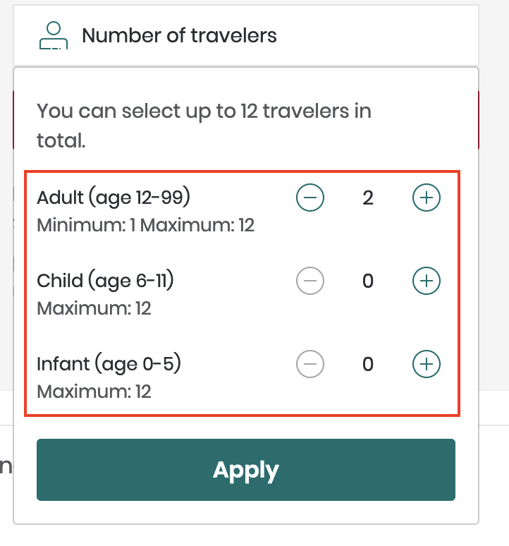
    <figcaption>Passenger mix selection tool on viator.com</figcaption>
</figure>

<hr />

#### Included age bands and definitions

**Instruction**: Perform a new product search and navigate to the product display page for the product "[Palermo Catacombs and Monreale Half-day Tour" (26487P3)](https://www.viator.com/tours/Palermo/Palermo-Catacombs-and-Monreale-Half-day-Tour/d4815-26487P3) and observe the passenger-mix selection section / widget.

- **Action**: Demonstrate with a screenshot that all age band categories and their respective definitions (age ranges) are displayed; i.e.,
    + Adult (age 19-90)
    + Youth (age 11-18)
    + Child (age 4-10)
    + Infant (age 0-3)

- **Example**: All five age bands for product 26487P3 on the [viator.com](https://viator.com) site:

<figure>
    
    <figcaption>Passenger mix selection tool on viator.com showing all available age bands</figcaption>
</figure>

<hr />

#### Maximum traveler count

- **Action**: Demonstrate with a screenshot that the **maximum traveler count** is observed cumulatively across age bands.
- **Example**: If the maximum traveler count is <u>fifteen</u>, then the user must not be able to select any combination of age bands that amount to more than fifteen travelers. The exact figure will depend on the `maxTravellerCount` field in the response from the <a href="https://docs.viator.com/partner-api/merchant/technical/#operation/product" target="_blank" data-wm-adjusted="done">/product</a>) service:

<figure>
    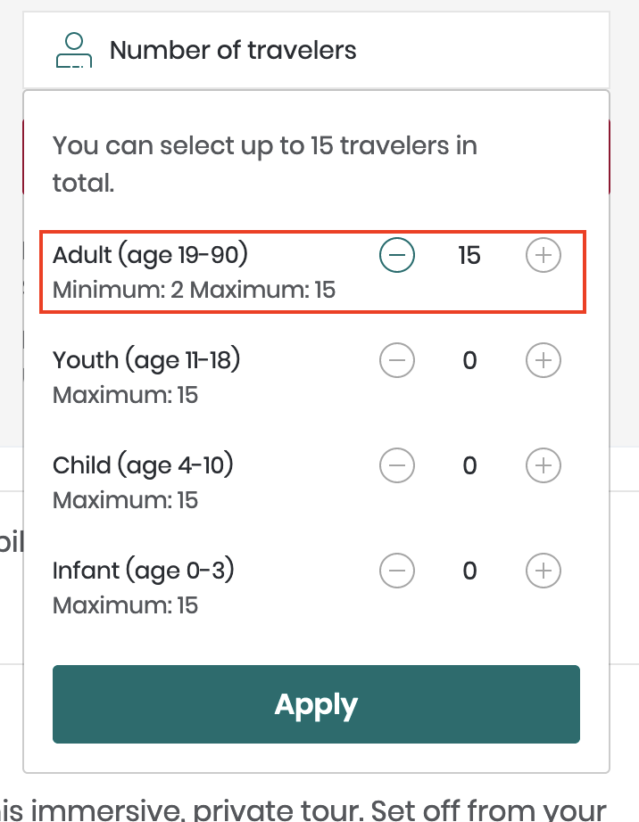
    <figcaption>Passenger mix selection tool indicating the maximum number of travelers has been reached on viator.com</figcaption>
</figure>

<hr />

### Tour grade selection

#### Search for availability by desired passenger mix

- **Action**: Demonstrate with a screenshot that it is possible for the user to search for product availability in the future according to their desired passenger mix.
- **Example**: The user can alter their desired date and passenger mix and click **Update Search** to perform the search:

<figure>
    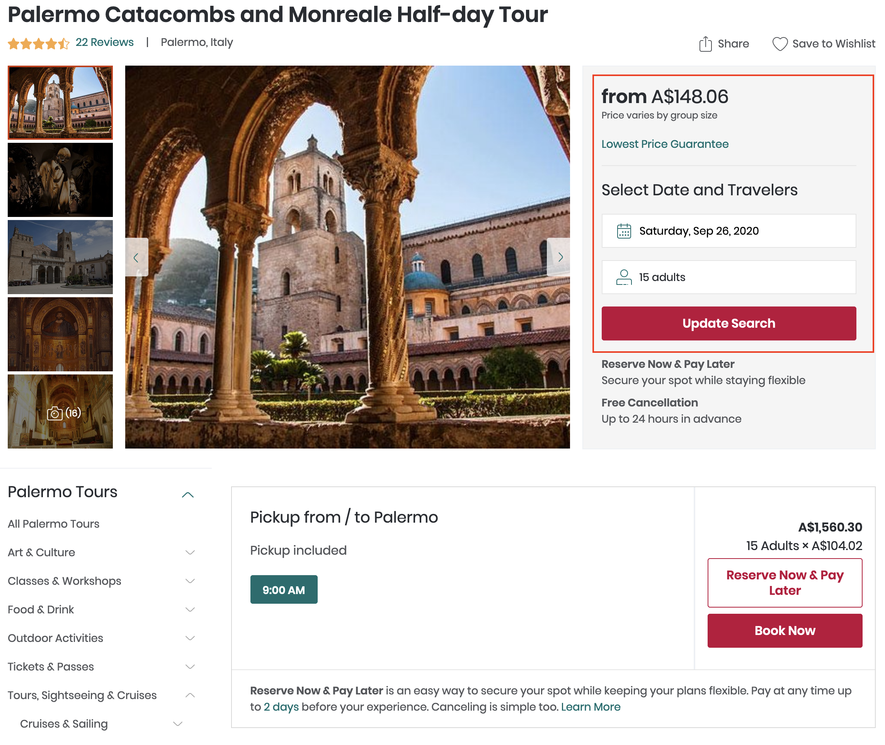
    <figcaption>Passenger mix, date and update search button on viator.com</figcaption>
</figure>

<hr />

#### Tour grade search results

**Instruction**: Use your date and passenger mix selection tool to search for available tour grades for a certain date and passenger mix

- **Action**: Demonstrate with a screenshot that <u>all</u> relevant tour grade information is displayed in your tour grade search results / selection section; i.e., the tour grade title (`gradeTitle`), tour grade description (`gradeDescription`) and tour grade departure time (`gradeDeparture`) are all displayed (if these fields are populated in the response from **/product** for the product in question).

<figure>
    
    <figcaption>Tour grade (product option) display on viator.com</figcaption>
</figure>

<hr />

#### Tour grade unit price

- **Action**: Demonstrate with a screenshot that the unit price for each tour grade is displayed.
    - **Note**: the unit price for each tour grade is available from the `merchantNetPriceFromFormatted` field in the response from the <a href="https://docs.viator.com/partner-api/merchant/technical/#operation/product" target="_blank" data-wm-adjusted="done">/product</a> service
- **Example**: Tour grade unit price displayed separate from the total price: 

<figure>
    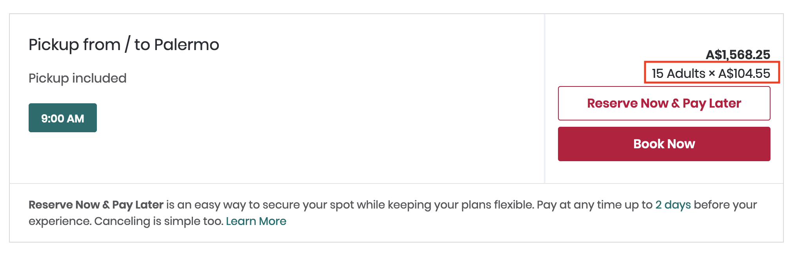
    <figcaption>Tour grade unit price display on viator.com</figcaption>
</figure>

<hr />

### Payment details page

#### Lead traveler details

- **Action**: Demonstrate that one traveller must be identified as the lead traveller by providing a screenshot from your payment details / checkout page.
- **Example**: The first traveler is, by default, the lead traveler:

<figure>
    
    <figcaption>Lead traveler indication on viator.com</figcaption>
</figure>

<hr />

#### Booking questions - passenger weights

- **Action**: Demonstrate with a screenshot that all booking questions returned in the `bookingQuestions` field are displayed and function correctly; e.g., all passenger weights are requested for product [5516ST5](https://www.viator.com/tours/Las-Vegas/Deluxe-Las-Vegas-Helicopter-Night-Flight-with-VIP-Transportation/d684-5516ST5)
- **Example**: Booking questions are included in the **Traveler Details** form: 

<figure>
    
    <figcaption>Booking question form on viator.com</figcaption>
</figure>

<hr />

#### Booking questions – transfer information

- **Action**: Demonstrate with a screenshot that transfer information for product [3627PARAPTHTLCDG – Paris Shuttle Arrival Transfer: Charles de Gaulle Airport (CDG)](https://www.viator.com/tours/Paris/Paris-Shuttle-Arrival-Transfer-Charles-de-Gaulle-Airport-CDG/d479-3627PARAPTHTLCDG) is requested. These are **booking questions** located in the `bookingQuestions` array in the response from <a href="https://docs.viator.com/partner-api/merchant/technical/#operation/product" target="_blank" data-wm-adjusted="done">/product</a>:

<table>
  <tr>
    <th>Item</th>
    <th>Source</th>
  </tr>
  <tr>
    <th>Arrival Airline</th>
    <td><pre>"bookingQuestions": [
  {
    "sortOrder": 1,
    "questionId": 7,
    "stringQuestionId": "transfer_air_arrival_airline",
    "subTitle": "(e.g. United, British Airways, Qantas, etc)",
    "title": "Arrival Airline",
    "required": true,
    "message": "Enter the name of your airline."
  },
  ...,
]</pre></td>
  </tr>
  <tr>
    <th>Arrival Flight No</th>
    <td><pre>"bookingQuestions": [
  ...,
  {
    "sortOrder": 2,
    "questionId": 8,
    "stringQuestionId": "transfer_air_arrival_flightNo",
    "subTitle": "(e.g. UA 864, BA 923, QA 233, etc)",
    "title": "Arrival Flight No",
    "required": true,
    "message": "Enter your flight number."
  },
  ...,
]</pre></td>
  </tr>
  <tr>
    <th>Arrival Time</th>
    <td><pre>"bookingQuestions": [
  ...,
  {
    "sortOrder": 3,
    "questionId": 12,
    "stringQuestionId": "transfer_arrival_time",
    "subTitle": "(eg. 8pm, 20:30 etc)",
    "title": "Arrival Time",
    "required": true,
    "message": "Enter your arrival time. Please indicate AM/PM or use the 24-hour clock."
  },
  ...,
]</pre></td>
  </tr>
  <tr>
    <th>Drop Off Location</th>
    <td><pre>"bookingQuestions": [
  ...,
  {
    "sortOrder": 4,
    "questionId": 11,
    "stringQuestionId": "transfer_arrival_dropOff",
    "subTitle": "(e.g. 1234 Cedar Way, Brooklyn, NY 00123)",
    "title": "Drop Off Location",
    "required": true,
    "message": "Enter the address for drop off."
  }
]</pre></td>
  </tr>
</table>

- **Example**: Transfer information input fields included in the **Traveler Details** form:

<figure>
    
    <figcaption>Traveler details input form on viator.com</figcaption>
</figure>

<hr />


#### Hotel pick-up

- **Action**: Demonstrate with a screenshot that the result from <a href="https://docs.viator.com/partner-api/merchant/technical#operation/bookingHotels" target="_blank" data-wm-adjusted="done">/booking/hotels</a>) is displayed to the customer for product [26487P3 – Palermo Catacombs and Monreale Half-day Tour](https://www.viator.com/tours/Las-Vegas/Grand-Canyon-All-American-Helicopter-Tour/d684-2280AAHT) at the point of hotel pick-up selection.
- **Example**: A **Pickup Location** drop-down input field is included in the **Traveler Details** form on the payment details page:

<figure>
    
    <figcaption>Pick-up location selection form on viator.com</figcaption>
</figure>

<hr />

#### Order details

- **Action**: Demonstrate that the customer's order details appear on the checkout page. Mandatory elements include the tour title, date, time, passenger mix and price.
- **Example**: Order details on checkout page

<figure>
    
    <figcaption>Pick-up location selection form on viator.com</figcaption>
</figure>

<hr />

### Cancellation terms

For more information about cancellation polices, see: <a href="https://docs.viator.com/partner-api/merchant/technical/#section/Key-concepts/Cancellation-policy" target="_blank" data-wm-adjusted="done">Cancellation policy</a>).

#### Standard cancellation policy

- **Action**: Demonstrate with a screenshot that the standard cancellation policy for a product is communicated to the customer
- **Example**: Cancellation policy displayed near the **Book Now** button, which submits the **Traveler Details** form:

<figure>
    
    <figcaption>Standard cancellation policy display on viator.com</figcaption>
</figure><br />

#### 'All sales final' cancellation policy

- **Action**: Demonstrate with a screenshot the 'all sales final' cancellation policy is communicated to the customer
- **Example**: Cancellation policy displayed on the Product Display Page (PDP) under **Cancellation Policy** heading for product 8541P1 - One Night Leopard Tour of Kruger National Park from Nelspruit:

<figure>
    
    <figcaption>All sales final cancellation policy display on viator.com</figcaption>
</figure><br />

## Back-end checks

These checks will involve:

- Summarizing your **content ingestion** and **booking** processes, including 
- Making various types of bookings and having these bookings assessed to ensure correctness and completeness

### Content ingestion process

We would like you to summarize how you have implemented your content ingestion and caching process.

Are you are periodically ingesting content – e.g., product lists and pricing details – and loading this into a local database, or are you calling Viator's servers and caching the replies?

- Which endpoints do you call when ingesting content?
- How often are you making calls to these endpoints?
- What is the total number of products you have been able to download using these methods?

### Booking process

We would also like a summary of your booking process. Please write a short summary of the endpoints you use in your booking workflow, from product search to completing the booking.

### Bookings checks

As well as meeting the various requirements regarding your booking platform's front end mentioned in the front-end site certification section, we will also need to verify that your system is correctly fulfilling its requirements with regard to bookings. 

All checks must be passed before we can issue you a production-level apiKey that will allow you to start making real bookings.

All tests in this section evaluate booking records made with your sandbox apiKey to ensure that all essential data elements have been successfully registered in our database.

For information on how to make and check bookings, see the following sections in the technical manual for merchant partners:

- <a href="/partner-api/merchant/technical/index.html#section/Key-concepts/Booking" target="_blank" data-wm-adjusted="done">Booking</a>
- <a href="/partner-api/merchant/technical/index.html#section/Common-workflows-and-data-validation/Booking-process-flow" target="_blank" data-wm-adjusted="done">Booking process flow</a>
- <a href="/partner-api/merchant/technical/index.html#section/Using-the-API/Making-a-booking" target="_blank" data-wm-adjusted="done">Making a booking</a>
- <a href="/partner-api/merchant/technical/index.html#section/Using-the-API/Reviewing-bookings" target="_blank" data-wm-adjusted="done">Reviewing bookings</a>
- <a href="/partner-api/merchant/technical/index.html#section/Using-the-API/Reviewing-bookings" target="_blank" data-wm-adjusted="done">Checking bookings</a>
- <a href="https://docs.viator.com/partner-api/merchant/technical/#section/Common-workflows-and-data-validation/Cancellation-API-workflow" target="_blank" data-wm-adjusted="done">Cancellation API workflow</a>
- <a href="/partner-api/merchant/technical/index.html#tag/Booking-services" target="_blank" data-wm-adjusted="done">Booking services</a>

#### Check 1: A booking has been made and confirmed

This test looks for a booking made with your apiKey that has a 'confirmed' status.

**How to verify**: When making a booking via the API using the <a href="/partner-api/merchant/technical/index.html#operation/bookingBook" target="_blank" data-wm-adjusted="done">/booking/book</a> service, the booking's status will be communicated in the response object from this service; i.e.:

```javascript
"data": {
    "bookingStatus": {
        "status": 3,
        "text": "Confirmed",
        "type": "CONFIRMED",
        "level": "ITINERARY",
        "confirmed": true,
        "pending": false,
        "amended": false,
        "cancelled": false,
        "failed": false
    },
    ...
}
```

Alternatively, you can inspect the status of bookings using the following services:

- <a href="/partner-api/merchant/technical/index.html#operation/bookingStatus" target="_blank" data-wm-adjusted="done">/booking/status</a>
- <a href="/partner-api/merchant/technical/index.html#operation/bookingStatusItems" target="_blank" data-wm-adjusted="done">/booking/status/items</a>
- <a href="/partner-api/merchant/technical/index.html#operation/bookingPastbooking" target="_blank" data-wm-adjusted="done">/booking/pastbooking</a>
- <a href="/partner-api/merchant/technical/index.html#operation/bookingMybookings" target="_blank" data-wm-adjusted="done">/booking/mybookings</a>

**To pass the test**: As in the example above, the `type` field of the `bookingStatus` object must have the value `"CONFIRMED"`.

#### Check 2: A booking has been successfully cancelled

This test looks for a booking made with your apiKey that has a 'cancelled' status. For information about cancelling bookings via the API, see [Cancellation API workflow](https://docs.viator.com/partner-api/merchant/technical/#section/Common-workflows-and-data-validation/Cancellation-API-workflow) in the technical manual for merchant partners.

**Instruction**: Once you have made a booking using the <a href="https://docs.viator.com/partner-api/merchant/technical/#operation/cancelBooking" target="_blank" data-wm-adjusted="done">/booking/book](/partner-api/merchant/technical/index.html#operation/bookingBook) service, use the [/bookings/{booking-reference}/cancel</a> service to cancel it.

**How to verify**: Check the item's status using any of the booking status services mentioned above. The `bookingStatus` object in the response should appear as follows:

```javascript
"data": {
    "bookingStatus": {
        "status": 3,
        "text": "Cancelled",
        "type": "CANCELLED",
        "level": "ITINERARY",
        "confirmed": false,
        "pending": false,
        "amended": false,
        "cancelled": true,
        "failed": false
    },
    ...
}
```
**To pass the test**: One booking made with your apiKey must have a status type of `"CANCELLED"`.

#### Check 3: The customer's telephone number is being successfully recorded in each booking

This test checks whether the customer's telephone number was included in the `booker` object in the request body for the <a href="/partner-api/merchant/technical/index.html#operation/bookingBook" target="_blank" data-wm-adjusted="done">/booking/book</a> service when making a booking.

Example of a correctly populated `booker` object:

```javascript
"booker": {
    "email": "bill.gates@microsoft.com",
    "homePhone": "+1 425-882-8080",
    "firstname": "William",
    "surname": "Gates III",
    "title": "Mr",
    "cellPhoneCountryCode": "+1",
    "cellPhone": "425-882-8080"
}
```

**How to verify**: Once a booking has been made, it is impossible to access the customer's telephone number via the API. However, if you have correctly populated the `homePhone` field of the `booker` object, your integration will certainly pass this test.

**To pass the test**: Ensure that the `homePhone` field in the booker object is populated when making a booking.

#### Check 4: The customer's email address is being successfully recorded in each booking

This check focuses on whether the `booker` object passed to <a href="/partner-api/merchant/technical/#operation/bookingBook" target="_blank" data-wm-adjusted="done">/booking/book</a> has been correctly populated. In this case, we're testing to see if the customer's email was submitted via the `email` field.

**How to verify**: It **is** possible to verify this for yourself using one of the following services:

- <a href="/partner-api/merchant/technical/index.html#operation/bookingPastbooking" target="_blank" data-wm-adjusted="done">/booking/pastbooking</a>
- <a href="/partner-api/merchant/technical/index.html#operation/bookingMybookings" target="_blank" data-wm-adjusted="done">/booking/mybookings</a>

Specifically, check an existing booking and inspect the `bookerEmail` field in the responses from either of the abovementioned services. It should contain a valid email address; e.g.:

```javascript
"data": {
    "bookerEmail": "bill.gates@microsoft.com",
    ...
}
```

**To pass the test**: `bookerEmail` must contain a valid email address.

#### Check 5: A booking with successfully completed booking questions has been made

All booking questions returned in the `bookingQuestions` array in the response from <a href="/partner-api/merchant/technical/index.html#operation/bookingBook" target="_blank" data-wm-adjusted="done">/product](/partner-api/merchant/technical/index.html#operation/product) must be correctly supplied in the `bookingQuestionAnswers` array in the request to [/booking/book</a>.

Example booking question in response from <a href="/partner-api/merchant/technical/index.html#operation/product" target="_blank" data-wm-adjusted="done">/product</a>:

```javascript
"data": {
    "bookingQuestions": [
        {
            "sortOrder": 1,
            "questionId": 23,
            "stringQuestionId": "weights_passengerWeights",
            "subTitle": "(e.g. 127 pounds, 145 kilos, etc)",
            "title": "Passenger Weights",
            "required": true,
            "message": "For safety reasons you must enter the weight of all passengers. Please indicate pounds or kilos."
        }
    ],
    ...
}
```

Example of a booking-question answer to a `bookingQuestion` in a request to <a href="/partner-api/merchant/technical/index.html#operation/bookingBook" target="_blank" data-wm-adjusted="done">/booking/book</a>:

```javascript
{
    "items": [
        {
            "bookingQuestionAnswers": [
                {
                    "questionId": 23,
                    "answer": "120 kgs"
                }
            ],
            ...
        }
    ],
    ...
}
```

**How to verify**: This criterion cannot be self-verified as there is no mechanism in the API to retrieve this data once it has been submitted.

**To pass the test**: Ensure that you submit answers (`bookingQuestionAnswers`)to all booking questions (`bookingQuestions`) when making the booking using <a href="/partner-api/merchant/technical/index.html#operation/bookingBook" target="_blank" data-wm-adjusted="done">/booking/book</a>.

#### Check 6: A booking with successfully completed hotel pick-up information has been made

This test relates to products for which it is necessary to specify a hotel pick-up point. Such products return the following in the response from <a href="/partner-api/merchant/technical/index.html#operation/bookingBook" target="_blank" data-wm-adjusted="done">/product</a>:

```javascript
"data": {
    "hotelpickup": true,
    ...
}
```

When booking these products, you must ensure that the `hotelId` and `pickupPoint` fields in each booking item object are populated with valid data, as retrieved from the <a href="/partner-api/merchant/technical/index.html#operation/bookingHotels" target="_blank" data-wm-adjusted="done">/booking/hotels</a> service.

For example, if the response from <a href="/partner-api/merchant/technical/index.html#operation/bookingHotels" target="_blank" data-wm-adjusted="done">/booking/hotels</a> includes the following:

```javascript
"data": [
    ...
    {
        "sortOrder": 7,
        "productCodes": null,
        "destinationId": 684,
        "phone": "+1 123 456 7890",
        "city": "Las Vegas",
        "postcode": "89109-8933",
        "latitude": 36.115753,
        "longitude": -115.174446,
        "notes": null,
        "brand": null,
        "hotelString": null,
        "address": "3570 Las Vegas Blvd South, ",
        "name": "Caesars Palace",
        "id": "1091762"
    },
...
]
```

...then the `hotelId` and `pickupPoint` fields would be valid in the booking request sent to <a href="/partner-api/merchant/technical/index.html#operation/bookingBook" target="_blank" data-wm-adjusted="done">/booking/book</a> if filled as follows:

```javascript
"items": [
    "hotelId": 1091762,
    "pickupPoint": "3570 Las Vegas Blvd South",
    ...
]
```

**How to verify**: This criterion cannot be self-verified as there is no mechanism in the API to retrieve this data once it has been submitted.

**To pass the test**: Ensure that you submit a pick up point when making the booking using <a href="/partner-api/merchant/technical/index.html#operation/bookingBook" target="_blank" data-wm-adjusted="done">/booking/book</a>.

#### Check 7: A booking with 'special requirements' has been made

The `specialRequirements` field – part of the request object sent to <a href="/partner-api/merchant/technical/index.html#operation/bookingBook" target="_blank" data-wm-adjusted="done">/booking/book</a> – is used to capture any additional requirements for the booking, such as dietary restrictions like "strict vegan" or mobility information, such as "wheelchair required".

You must provide a means for your customers to specify any such special requirements as part of the booking process. We will inspect your booking records to ensure that a `specialRequirements` field has been successfully submitted at least once.

Example <a href="/partner-api/merchant/technical/index.html#operation/bookingBook" target="_blank" data-wm-adjusted="done">/booking/book</a> request object snippet:

```javascript
{
    "items": [
        {
            "specialRequirements": "allergic to nuts",
            ...
        }
    ],
    ...
}
```
**How to verify**: This criterion cannot be self-verified as there is no mechanism in the API to retrieve this data once it has been submitted.

**To pass the test**: Make at least one booking with a filled-in `specialRequirements` field using <a href="/partner-api/merchant/technical/index.html#operation/bookingBook" target="_blank" data-wm-adjusted="done">/booking/book</a>.

#### Check 8: A booking with a standard cancellation policy has been successfully confirmed and cancelled

This test looks to see if a product with a 'standard' cancellation policy has been successfully confirmed and then cancelled by you.

The 'standard' cancellation policy is the most common type of cancellation policy for products in our inventory. The cancellation terms that apply to each product can be determined by inspecting the product information retrieved from the <a href="/partner-api/merchant/technical/index.html#operation/product" target="_blank" data-wm-adjusted="done">/product</a> service.

Products with a standard cancellation policy will return a `merchantTermsAndConditions` object with contents as follows:

```javascript
"merchantTermsAndConditions": {
    "termsAndConditions": "For a full refund, cancel at least 24 hours in advance of the start date of the experience.",
    "merchantTermsAndConditionsType": 1,
    "amountRefundable": null,
    "cancellationFromTourDate": [
        {
            "dayRangeMin": 1,
            "dayRangeMax": null,
            "percentageRefundable": 100,
            "policyStartTimestamp": null,
            "policyEndTimestamp": null
        },
        {
            "dayRangeMin": 0,
            "dayRangeMax": 1,
            "percentageRefundable": 0,
            "policyStartTimestamp": null,
            "policyEndTimestamp": null
        }
    ]
},
```

Importantly, the `merchantTermsAndConditionsType` must be `1`.

**How to verify**: 

- Ensure you have successfully booked for a product with a 'standard' cancellation policy by verifying that its booking status is `"CONFIRMED"`.
- Ensure that you have cancelled this booking

**To pass the test**: Successfully cancelling a confirmed booking of any product with a standard cancellation policy is sufficient to pass this test.

#### Check 8: A booking with an 'all sales final' cancellation policy has been successfully confirmed and cancelled

This test looks to see if a product with an 'all sales final' cancellation policy has been successfully confirmed and then cancelled by you. Products in this category cannot be cancelled or amended without incurring a 100% penalty; i.e., the refund amount will be zero.

Products with an 'all sales final' cancellation policy will return a `merchantTermsAndConditionsType` of `3`.

**How to verify**: 

- Ensure you have successfully booked for a product with an 'all sales final' cancellation policy by verifying that its booking status is `"CONFIRMED"`.
- Ensure that you have cancelled this booking

**To pass the test**: Successfully cancelling a confirmed booking of any product with an 'all sales final' cancellation policy is sufficient to pass this test.

#### Check 9: An 'on-request' product has been booked and confirmed

**Note**: This check is only for partners that have access to Viator's on-request product catalogue, which is not granted by default as it requires a slightly different workflow. See <a href="https://docs.viator.com/partner-api/merchant/technical/#section/Key-concepts/Selling-on-request-products" target="_blank" data-wm-adjusted="done">Selling on-request products</a> for more information on how to gain access to this section of the catalogue.

**To pass the test**: 

Make a test booking in the sandbox environment for an on-request product. You can determine if a product is an on-request product according to the `bookingEngineId` field, which will have a value of `DeferredCRMBE`. Or, use one of the following on-request products:

- 100213P25
- 100245P200

Make a booking for the product, ensuring that `demo` is set to `false`.

If successful, the booking status in the response will have a `type` of `PENDING`.

```json
"bookingStatus": {
  "status": 4,
  "text": "Pending",
  "type": "PENDING",
  "level": "ITINERARY",
  "confirmed": false,
  "pending": true,
  "amended": false,
  "cancelled": false,
  "failed": false
}
```

[Send an email to the Application Support team](mailto:apitechsupport@viator.com) and ask for this booking to be confirmed for you, mentioning this is for site-certification purposes.

#### Check 10: A booking with a passenger mix containing multiple age bands has been made

This test ensures that your implementation supports bookings for multiple passengers in different age categories (age bands); i.e., `Adult`, `Child`, `Senior`, `Youth` and `Infant`.

**To pass the test**: Make a test booking for a product, including at least two passengers, each from different age bands. The product must support multiple age bands; e.g., `5010SYDNEY`

**How to verify:** Inspect the response from [/booking/book] when you make the booking and ensure that the `travellerAgeBands` array contains more than one item; e.g.:

```javascript
"travellerAgeBands": [
  {
    "sortOrder": 0,
    "count": 1,
    "pluralDescription": "Adults",
    "description": "Adult",
    "ageBandId": 1
  },
  {
    "sortOrder": 1,
    "count": 1,
    "pluralDescription": "Children",
    "description": "Child",
    "ageBandId": 2
  }
]
```

## Customer communications checks

### Check: Voucher display

Once your customer has made a successful booking, you must present to them a URL from which they can download a valid Viator voucher. 

You will need to provide to the customer the voucher available via the URL  received from the API at the time of booking. The voucher includes all practical information – including the watermark and barcode. Without these key features, suppliers might not recognize the voucher, possibly leading to customers being unable to join the tour. You cannot construct your own voucher using the booking information returned through the API.

**Instruction**: Make a test booking and capture the voucher.

**Action**: Demonstrate that you are providing your customers with a link on your confirmation page to download the voucher and that the voucher is valid. Please provide a screenshot of your confirmation page showing the link and either a screenshot of the voucher or by attaching a PDF of the voucher.

**Example**: A test voucher (partial) for product [5010SYDNEY – "Big Bus Sydney and Bondi Hop-on Hop-off Tour"](https://www.viator.com/tours/Sydney/Sydney-and-Bondi-Hop-on-Hop-off-Tour/d357-5010SYDNEY):

<figure>
    
    <figcaption>Example of a valid voucher for a booking</figcaption>
</figure>

<hr />

### Check: Pending status display for on-request bookings

**Action**: Demonstrate with a screenshot that the status of the booking on the confirmation page is 'pending' and travelers are aware that they need to wait for the booking to be confirmed by the supplier.

**Example on-request product**: [100006P13 - South Indian Coffee Program with live brewing at Pondicherry – Auroville](https://www.viator.com/tours/Pondicherry/South-Indian-Coffee-Program-with-live-brewing-at-Pondicherry-Auroville/d22690-100006P13)


### Check: Email templates

As you will need to communicate to your users the changing status of on-request bookings, we need to ensure that you have created suitable email templates for the following scenarios:

1. **Pending confirmation**: A booking for an on-request product is pending confirmation from the supplier, and confirmation will take up to 48 hours, depending on the product's availability
2. **Booking confirmed**: An on-request booking has been confirmed by the supplier and a voucher is available from the URL provided
3. **Booking rejected**: An on-request booking has been rejected
4. **Mixed scenario**: There are a mixture of statuses in the case the customer has booked multiple on-request products:
    - all bookings have been confirmed
    - all bookings were rejected
    - there is a mixture of acceptance and rejection; i.e. 'pending', 'rejected', 'canceled' and 'amended'

**Note**: In the case that a booking is declined, it is useful to mention that the customer's credit card was not charged.

## Booking cancellation checks in the production environment

**Action**: Demonstrate that your booking cancellation mechanism is functioning correctly by confirming **two** bookings using the <a href="https://docs.viator.com/partner-api/merchant/technical/index.html#section/Key-concepts/Cancellation-policy" target="_blank" data-wm-adjusted="done">new format of API key](https://docs.viator.com/partner-api/merchant/technical/#section/Authentication/API-key) in the live/production environment **and** successfully cancel those bookings. One booking must be for a product with a **standard** [cancellation policy</a> and the other must be for a product with an **all sales final** policy. Access to the live environment for this test will be granted once all other checks are verified and the certification process is completed.

**Note**: 

- When making bookings in the live production environment for this test, `demo` must be set to `false` in the request.
- Products with a **standard** cancellation policy should be booked for dates sufficiently far in the futures that cancellation can be accomplished without penalty.
- Bookings for non-refundable (all sales final) products will be manually refunded by the Viator team after the check is completed.
- It is mandatory to complete this check in order to go live.

### Product examples:

| Cancellation policy type | Example products |
|--------------------------|------------------|
| Standard | 54969P13, 2065CWL, 23043P2, 177350P25 |
| All sales final | 6479UY1DAY, 161943P27, 63607P2, 190211P3, 6787P5 |

