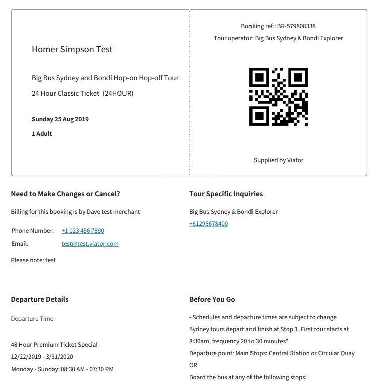

# Customer communications checks

## Check: Voucher display

Once your customer has made a successful booking, you must present to them a URL from which they can download a valid Viator voucher. 

You will need to provide to the customer the voucher available via the URL  received from the API at the time of booking. The voucher includes all practical information – including the watermark and barcode. Without these key features, suppliers might not recognize the voucher, possibly leading to customers being unable to join the tour. You cannot construct your own voucher using the booking information returned through the API.

**Instruction**: Make a test booking and capture the voucher.

**Action**: Demonstrate that you are providing your customers with a link on your confirmation page to download the voucher and that the voucher is valid. Please provide a screenshot of your confirmation page showing the link and either a screenshot of the voucher or by attaching a PDF of the voucher.

**Example**: A test voucher (partial) for product [5010SYDNEY – "Big Bus Sydney and Bondi Hop-on Hop-off Tour"](https://www.viator.com/tours/Sydney/Sydney-and-Bondi-Hop-on-Hop-off-Tour/d357-5010SYDNEY):

<figure>
    
    <figcaption>Example of a valid voucher for a booking</figcaption>
</figure>

## Check: Pending status display for on-request bookings

**Action**: Demonstrate with a screenshot that the status of the booking on the confirmation page is 'pending' and travelers are aware that they need to wait for the booking to be confirmed by the supplier.

**Example on-request product**: [100006P13 - South Indian Coffee Program with live brewing at Pondicherry – Auroville](https://www.viator.com/tours/Pondicherry/South-Indian-Coffee-Program-with-live-brewing-at-Pondicherry-Auroville/d22690-100006P13)

## Check: Email templates

As you will need to communicate to your users the changing status of on-request bookings, we need to ensure that you have created suitable email templates for the following scenarios:

1. **Pending confirmation**: A booking for an on-request product is pending confirmation from the supplier, and confirmation will take up to 48 hours, depending on the product's availability
2. **Booking confirmed**: An on-request booking has been confirmed by the supplier and a voucher is available from the URL provided
3. **Booking rejected**: An on-request booking has been rejected
4. **Mixed scenario**: There are a mixture of statuses in the case the customer has booked multiple on-request products:
    - all bookings have been confirmed
    - all bookings were rejected
    - there is a mixture of acceptance and rejection; i.e. 'pending', 'rejected', 'canceled' and 'amended'

**Note**: In the case that a booking is declined, it is useful to mention that the customer's credit card was not charged.