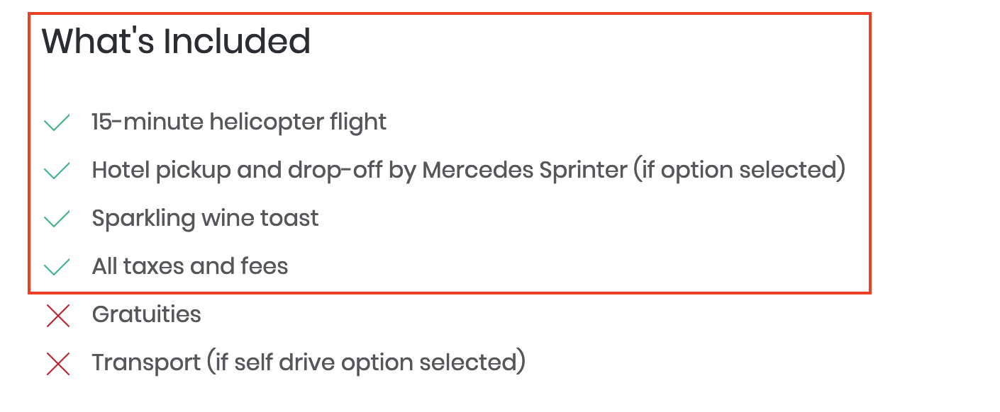

<style type='text/css'>
figure {
  width: 100%;
  text-align: center;
  font-style: italic;
  font-size: smaller;
  text-indent: 0;
  border: thin silver solid;
  margin: 0.5em;
  padding: 0.5em;
}
figcaption {  
    padding-top: 10px;
}
</style>

# Front-end checks

To get your site's front-end certified, we would like you to provide screenshots similar to the examples here – taken directly from Viator.com – that demonstrate compliance with each criterion.

## Product search

**Instruction**: Perform a search for the destination 'Las Vegas' and observe the search results page

### Clickable breadcrumb (location/category)

- **Action 1**: Demonstrate that your destination hierarchy mirrors that of Viator.com by providing a screenshot of your search results page that shows the correct destination hierarchy according to the example below taken from Viator.com:

<figure>
    
    <figcaption>Destination hierarchy on viator.com search results page</figcaption>
</figure>

- **Action 2**: Demonstrate that your destination hierarchy mirrors that of Viator.com by providing a screenshot of your product display page that shows the correct destination hierarchy according to the example below taken from Viator.com:

<figure>
    
    <figcaption>Destination hierarchy on viator.com product display page</figcaption>
</figure>

<hr />

### Default sort-order

- **Action**: Demonstrate by providing a screenshot that your default sort-order for the product search results is the default sort order received from the Viator API.
- **Example**: Default sort order of 'Featured'
    - **Note**: this corresponds to the order of products received from <a href="https://docs.viator.com/partner-api/merchant/technical/#operation/product" target="_blank" data-wm-adjusted="done">/product</a> when `sortOrder` is set to 'TOP_SELLERS' or allowed to default to this sort order by omitting the `sortOrder` field in the request body:

<figure>
    
    <figcaption>Default sort order on viator.com</figcaption>
</figure>

### Categories and sub-categories

- **Action**: Demonstrate by providing a screenshot that 'categories' and 'subcategories' have been implemented correctly on your website in a similar manner to that on Viator.com.
- **Example**: 'Subcategories' nested within 'categories' implemented as an accordion on Viator.com:
  
<figure>
    
    <figcaption>Categories and subcategories display on viator.com</figcaption>
</figure>

### Free-text search

- **Action**: Demonstrate by providing a screenshot that it is possible for the customer to search for products by destination (city/region/country), by association with an attraction, and/or by product title.
- **Example**: Free-text search for 'Las Vegas' on Viator.com with suggested search results.

<figure>
    
    <figcaption>Free-text search on viator.com</figcaption>
</figure>

### Date search

- **Action**: Show with a screenshot that the date search is available.
- **Example**: Date search is available on the search results page on Viator.com.

<figure>
    
    <figcaption>Date search on viator.com</figcaption>
</figure>

## Product detail pages

**Instruction**: Navigate to **your** product detail page for the [Las Vegas Helicopter Night Flight with Optional VIP Transportation (5516ST5)](https://www.viator.com/tours/Las-Vegas/Deluxe-Las-Vegas-Helicopter-Night-Flight-with-VIP-Transportation/d684-5516ST5) and provide screenshots to demonstrate that <u>all</u> the following elements are displayed on your product detail page:

### Location

Snippet of response from [/product](../../../../openapi/reference/operation/product):
```javascript
{
  "data": {
     "location": "North Las Vegas, United States",
    ...
  },
  ...
}
```
Screenshot:

<figure>
    
    <figcaption>Location information on viator.com</figcaption>
</figure>

### Product title

Snippet of response from [/product](../../../../openapi/reference/operation/product):
```javascript
{
  "data": {
    "title": "Las Vegas Helicopter Night Flight with Optional VIP Transportation",
    ...
  },
  ...
}
```

Screenshot

<figure>
    
    <figcaption>Product title on viator.com</figcaption>
</figure>

### Supplier and user photos

You must display **at least two** supplier-provided photos, and optionally display user-provided photos.

These photos are available from the following sections in the response from [/product](../../../../openapi/reference/operation/product):

Supplier-provided photo(s) in the `productPhotos` array:

```javascript
{
  "data": {
    "productPhotos": [
      {
        "caption": "",
        "photoURL": "https://hare-media-cdn.tripadvisor.com/media/attractions-splice-spp-674x446/07/91/a6/57.jpg",
        "path": "attractions-splice-spp-674x446/07/91/a6/57.jpg",
        "supplier": "SUPPLIER"
      }
    ],
    ...
  }
}
```

Supplier-provided photo in the `thumbnailHiResURL` field:

```javascript
{
  "data": {
    "thumbnailHiResURL": "https://hare-media-cdn.tripadvisor.com/media/attractions-splice-spp-674x446/06/6b/8c/9f.jpg",
    ...
  }
}
```

User-provided photos in the `userPhotos` array:

```javascript
{
  "data": {
    "userPhotos": [
      {
        "sortOrder": 1,
        "ownerName": "Matias R",
        "ownerCountry": null,
        "productTitle": "Grand Canyon National Park Bus Tour",
        "productUrlName": "Grand-Canyon-National-Park-Bus-Tour",
        "ownerAvatarURL": "http://cache-graphicslib.viator.com/graphicslib/media/ca/matias-r-account_30810314-45sq.jpg",
        "sslSupported": false,
        "editorsPick": false,
        "timeUploaded": "2018-04-09",
        "productCode": "18262P1",
        "caption": "",
        "thumbnailURL": "http://cache-graphicslib.viator.com/graphicslib/media/1a/-photo_31691034-133sq.jpg",
        "ownerId": 30810314,
        "photoURL": "http://cache-graphicslib.viator.com/graphicslib/media/1a/-photo_31691034-770tall.jpg",
        "photoId": 31691034,
        "photoHiResURL": "http://cache-graphicslib.viator.com/graphicslib/media/1a/-photo_31691034-1536tall.jpg",
        "photoMediumResURL": "http://cache-graphicslib.viator.com/graphicslib/media/1a/-photo_31691034-260tall.jpg",
        "title": ""
      },
      ...
    ],
    ...
  },
  ...
}
```

Screenshot

<figure>
    
    <figcaption>Supplier and user photos displayed on viator.com</figcaption>
</figure>

### Product short description

Snippet of response from [/product](../../../../openapi/reference/operation/product):
```javascript
{
  "data": {
    "shortDescription": "Explore the natural side of Arizona with a day trip to the Grand Canyon National Park South Rim on our luxury bus tour. Your professional bus driver is trained to provide you with interesting facts about the history, flora, and fauna on one of the great wonders of the modern world.<br><br>Join us for a journey to the Grand Canyon South Rim! Along the drive to the canyon, you will get to stop along historic Route 66 to see the Grand Canyon Caverns. These 100 year old natural caverns provide an amazing tour experience all on their own. <br><br>Once you arrive at the South Rim, enjoy stops along the rim such as Mather Point and Bright Angel Lodge. Explore popular attractions in the Grand Canyon National Park such as El Tovar, Hopi House, Kolb Photo Studio, and the Bright Angel Trail and make memories of a lifetime!",
    ...
  },
  ...
}
```

Screenshot

<figure>
    
    <figcaption>Short description on viator.com</figcaption>
</figure>

### Itinerary

Snippet of response from [/product](../../../../openapi/reference/operation/product):
```javascript
{
  "data": {
    "description": "&lt;b&gt;Itinerary&lt;/b&gt;&lt;br&gt;This is a typical itinerary for this product&lt;br&gt;&lt;br&gt;&lt;b&gt;Pass By:&lt;/b&gt; The Strip, S Las Vegas Blvd, Las Vegas, NV 89109&lt;br&gt;&lt;br&gt;Fly over the beautiful Las Vegas City Lights&lt;br&gt;&lt;br&gt;&lt;b&gt;Pass By:&lt;/b&gt; Stratosphere Tower, 2000 Las Vegas Blvd S Stratosphere Casino Hotel & Tower, Las Vegas, NV 89104-2507&lt;br&gt;&lt;br&gt;Fly past the 1149 foot ( 350 meters) high Strat Tower!&lt;br&gt;&lt;br&gt;&lt;b&gt;Pass By:&lt;/b&gt; Fountains of Bellagio, 3600 Las Vegas Blvd S Bellagio Hotel & Casino, Las Vegas, NV 89109-4303&lt;br&gt;&lt;br&gt;Fly past the Bellagio Hotel maybe see the fountains in action!&lt;br&gt;&lt;br&gt;&lt;b&gt;Pass By:&lt;/b&gt; Las Vegas Downtown, Fremont Street, Las Vegas, NV&lt;br&gt;&lt;br&gt;Fly over historic downtown vegas&lt;br&gt;&lt;br&gt;&lt;b&gt;Pass By:&lt;/b&gt; Fremont Street Experience, 425 Fremont Street, Las Vegas, NV 89101-5620&lt;br&gt;&lt;br&gt;Fly over the Historic Fremont Street Experience.&lt;br&gt;&lt;br&gt;",
    ...
  },
  ...
}
```

Screenshot

<figure>
    
    <figcaption>Itinerary/description information on viator.com</figcaption>
</figure>


### Departure point

Snippet of response from [/product](../../../../openapi/reference/operation/product):
```javascript
{
  "data": {
    "departurePoint": "4511 W Cheyenne Ave, North Las Vegas, NV 89032, USA&lt;br /&gt;&lt;br&gt;Traveler pickup is offered&lt;br/&gt;You can choose to self-drive or we can pick up from most Las Vegas Hotels. Self- drive guests will travel to the terminal &lt;br&gt;&lt;br&gt;",
    ...
  },
  ...
}
```

Screenshot

<figure>
    
    <figcaption>Departure point information on viator.com</figcaption>
</figure>

### Return details

Snippet of response from [/product](../../../../openapi/reference/operation/product):
```javascript
{
  "data": {
    "returnDetails": "Returns to original departure point&lt;br /&gt;",
    ...
  },
  ...
}
```

Screenshot

<figure>
    
    <figcaption>Return details information on viator.com</figcaption>
</figure>

### Duration

Snippet of response from [/product](../../../../openapi/reference/operation/product):
```javascript
{
  "data": {
    "duration": "2 hours 30 minutes"
    ...
  },
  ...
}
```

Screenshot

<figure>
    
    <figcaption>Duration information on viator.com</figcaption>
</figure>

### Inclusions

Snippet of response from [/product](../../../../openapi/reference/operation/product):
```javascript
{
  "data": {
    "inclusions": [
      "15-minute helicopter flight",
      "Hotel pickup and drop-off by Mercedes Sprinter (if option selected)",
      "Sparkling wine toast",
      "All taxes and fees"
    ],
    ...
  },
  ...
}
```

Screenshot

<figure>
    
    <figcaption>Inclusions information on viator.com</figcaption>
</figure>

### Exclusions

Snippet of response from [/product](../../../../openapi/reference/operation/product):
```javascript
{
  "data": {
    "exclusions": [
      "Gratuities",
      "Transport (if self drive option selected)"
    ],
    ...
  },
  ...
}
```

Screenshot

<figure>
    
    <figcaption>Exclusions information on viator.com</figcaption>
</figure>

### Additional info

Snippet of response from [/product](../../../../openapi/reference/operation/product):
```javascript
{
  "data": {
    "additionalInfo": [
        "Confirmation will be received at time of booking",
        "Due to comfort and weight / balance of the aircraft, passengers weighing over 275lbs (125 kg/ 19.64 st) will be required to purchase an additional seat. This is payable directly to the tour operator on the day of the tour.",
        "Minimum age is 2 years",
        "Children age 2 years and older require a seat per FAA regulations",
        "Flights depart from North Las Vegas airport",
        "Special offer is valid on bookings of 2 passengers. Prices for odd passenger counts will vary. Please see pricing calendar for exact pricing.",
        "Not wheelchair accessible",
        "Near public transportation",
        "Infants must sit on laps",
        "No heart problems or other serious medical conditions",
        "Customers choosing to make their own way to the airport will need to arrive 30 minutes prior to flight time at this address. 4511 W. CHEYENNE AVE, SUITE 101, NORTH LAS VEGAS, NEVADA 89032",
        "The flight is not private unless 6 seats are purchased. The helicopter may have upto 6 passengers plus the pilot onboard.",
        "Most travelers can participate",
        "This experience requires good weather. If it’s canceled due to poor weather, you’ll be offered a different date or a full refund",
        "This experience requires a minimum number of travelers. If it’s canceled because the minimum isn’t met, you’ll be offered a different date/experience or a full refund",
        "This tour/activity will have a maximum of 6 travelers",
        "Face masks required for travelers in public areas",
        "Face masks required for guides in public areas",
        "Face masks provided for travelers",
        "Hand sanitizer available to travelers and staff",
        "Regularly sanitized high-traffic areas",
        "Gear/equipment sanitized between use",
        "Transportation vehicles regularly sanitized",
        "Guides required to regularly wash hands",
        "Regular temperature checks for staff",
        "Temperature checks for travelers upon arrival",
        "Paid stay-at-home policy for staff with symptoms",
        "This is not a private flight. The aircraft seats six (6) passengers plus the Pilot. Social distancing is not practiced during your 15 minute flight. Face masks must be worn at all times"
    ],
    ...
  },
  ...
}
```

Screenshot

<figure>
    
    <figcaption>Additional info on viator.com</figcaption>
</figure>

### Reviews

Snippet of response from [/product](../../../../openapi/reference/operation/product):
```javascript
{
  "data": { 
    "rating": 4.4,
    "reviewCount": 582,
    "ratingCounts": { "1": 30, "2": 26, "3": 43, "4": 105, "5": 498 },
    "reviews": [{
        "ownerName": "Signe",
        "submissionDate": "2020-08-25",
        "rating": 5,
        "review": "<p>I enjoyed talking with Tony about our reservation.  He has quite the personality. The flight was short but amazing.</p>",
        ...
        },
      ...
    ],
    ...
  },
  ...
}
```

Screenshot

<figure>
    
    <figcaption>Reviews on viator.com</figcaption>
</figure>


## Age band and passenger mix validation

### Infant ticketing

**Instruction**: Remain on your product detail page for the product <a href="https://www.viator.com/tours/Boston/Daily-Ferry-to-the-Boston-Harbor-Islands/d678-3283FERRY" target="_blank" data-wm-adjusted="done">"Boston Harbor Islands: Round-Trip Ferry to Spectacle Island" (3283FERRY)</a> and observe the passenger-mix selection section / widget.

- **Action**: Demonstrate with a screenshot that it is <u>impossible</u> to purchase an **infant** ticket without an accompanying adult ticket; for example, by imposing this restriction via the UI.
- **Example**: On the [viator.com](https://viator.com) site, an error message is displayed if one tries to set the passenger mix to infants alone:


<figure>
    
    <figcaption>Passenger mix selection widget with error message</figcaption>
</figure>

<hr />

### Senior ticketing

- **Action**: Demonstrate with a screenshot that it is <u>possible</u> to purchase a **senior** ticket on its own, *without* an accompanying adult, for product 3283FERRY.
- **Example**: On the viator.com site, the ⊖ button for the number of travelers becomes disabled when the number of Adults reaches one (1) unless the product has a **senior** age band. In this case, the ⊖ button for the number of Adults remains available so that the user can select a senior ticket on its own. If the user attempts to set a passenger mix that includes the infant age band on its own, an error message is displayed prompting the user to select a valid passenger mix.

<hr />

<figure>
    
    <figcaption>Passenger mix including <strong>senior</strong> but no <strong>adult</strong> age band</figcaption>
</figure>

<hr />

### Excluded age bands

- **Action**: Demonstrate with a screenshot that **Senior** tickets are **not** available for product [5713P109](https://www.viator.com/tours/Boston/North-End-Small-Group-Food-Tour/d678-5713P109).
- **Example**: If a particular age band is not available for a product, it should not be available for selection. For product [5713P109](https://www.viator.com/tours/Boston/North-End-Small-Group-Food-Tour/d678-5713P109), only 'Adult', 'Child' and 'Infant' can be selected:

<figure>
    
    <figcaption>Passenger mix selection tool on viator.com</figcaption>
</figure>

<hr />

### Included age bands and definitions

**Instruction**: Perform a new product search and navigate to the product display page for the product "[Palermo Catacombs and Monreale Half-day Tour" (26487P3)](https://www.viator.com/tours/Palermo/Palermo-Catacombs-and-Monreale-Half-day-Tour/d4815-26487P3) and observe the passenger-mix selection section / widget.

- **Action**: Demonstrate with a screenshot that all age band categories and their respective definitions (age ranges) are displayed; i.e.,
    + Adult (age 19-90)
    + Youth (age 11-18)
    + Child (age 4-10)
    + Infant (age 0-3)

- **Example**: All five age bands for product 26487P3 on the [viator.com](https://viator.com) site:

<figure>
    
    <figcaption>Passenger mix selection tool on viator.com showing all available age bands</figcaption>
</figure>

<hr />

### Maximum traveler count

- **Action**: Demonstrate with a screenshot that the **maximum traveler count** is observed cumulatively across age bands.
- **Example**: If the maximum traveler count is <u>fifteen</u>, then the user must not be able to select any combination of age bands that amount to more than fifteen travelers. The exact figure will depend on the `maxTravellerCount` field in the response from the <a href="https://docs.viator.com/partner-api/merchant/technical/#operation/product" target="_blank" data-wm-adjusted="done">/product</a>) service:

<figure>
    
    <figcaption>Passenger mix selection tool indicating the maximum number of travelers has been reached on viator.com</figcaption>
</figure>

<hr />

## Tour grade selection

### Search for availability by desired passenger mix

- **Action**: Demonstrate with a screenshot that it is possible for the user to search for product availability in the future according to their desired passenger mix.
- **Example**: The user can alter their desired date and passenger mix and click **Update Search** to perform the search:

<figure>
    
    <figcaption>Passenger mix, date and update search button on viator.com</figcaption>
</figure>

<hr />

### Tour grade search results

**Instruction**: Use your date and passenger mix selection tool to search for available tour grades for a certain date and passenger mix

- **Action**: Demonstrate with a screenshot that <u>all</u> relevant tour grade information is displayed in your tour grade search results / selection section; i.e., the tour grade title (`gradeTitle`), tour grade description (`gradeDescription`) and tour grade departure time (`gradeDeparture`) are all displayed (if these fields are populated in the response from **/product** for the product in question).

<figure>
    
    <figcaption>Tour grade (product option) display on viator.com</figcaption>
</figure>

<hr />

### Tour grade unit price

- **Action**: Demonstrate with a screenshot that the unit price for each tour grade is displayed.
    - **Note**: the unit price for each tour grade is available from the `merchantNetPriceFromFormatted` field in the response from the <a href="https://docs.viator.com/partner-api/merchant/technical/#operation/product" target="_blank" data-wm-adjusted="done">/product</a> service
- **Example**: Tour grade unit price displayed separate from the total price: 

<figure>
    
    <figcaption>Tour grade unit price display on viator.com</figcaption>
</figure>

<hr />

## Payment details page

### Lead traveler details

- **Action**: Demonstrate that one traveller must be identified as the lead traveller by providing a screenshot from your payment details / checkout page.
- **Example**: The first traveler is, by default, the lead traveler:

<figure>
    
    <figcaption>Lead traveler indication on viator.com</figcaption>
</figure>

<hr />

### Booking questions - passenger weights

- **Action**: Demonstrate with a screenshot that all booking questions returned in the `bookingQuestions` field are displayed and function correctly; e.g., all passenger weights are requested for product [5516ST5](https://www.viator.com/tours/Las-Vegas/Deluxe-Las-Vegas-Helicopter-Night-Flight-with-VIP-Transportation/d684-5516ST5)
- **Example**: Booking questions are included in the **Traveler Details** form: 

<figure>
    
    <figcaption>Booking question form on viator.com</figcaption>
</figure>

<hr />

### Booking questions – transfer information

- **Action**: Demonstrate with a screenshot that transfer information for product [3627PARAPTHTLCDG – Paris Shuttle Arrival Transfer: Charles de Gaulle Airport (CDG)](https://www.viator.com/tours/Paris/Paris-Shuttle-Arrival-Transfer-Charles-de-Gaulle-Airport-CDG/d479-3627PARAPTHTLCDG) is requested. These are **booking questions** located in the `bookingQuestions` array in the response from <a href="https://docs.viator.com/partner-api/merchant/technical/#operation/product" target="_blank" data-wm-adjusted="done">/product</a>:

<table>
  <tr>
    <th>Item</th>
    <th>Source</th>
  </tr>
  <tr>
    <th>Arrival Airline</th>
    <td><pre>"bookingQuestions": [
  {
    "sortOrder": 1,
    "questionId": 7,
    "stringQuestionId": "transfer_air_arrival_airline",
    "subTitle": "(e.g. United, British Airways, Qantas, etc)",
    "title": "Arrival Airline",
    "required": true,
    "message": "Enter the name of your airline."
  },
  ...,
]</pre></td>
  </tr>
  <tr>
    <th>Arrival Flight No</th>
    <td><pre>"bookingQuestions": [
  ...,
  {
    "sortOrder": 2,
    "questionId": 8,
    "stringQuestionId": "transfer_air_arrival_flightNo",
    "subTitle": "(e.g. UA 864, BA 923, QA 233, etc)",
    "title": "Arrival Flight No",
    "required": true,
    "message": "Enter your flight number."
  },
  ...,
]</pre></td>
  </tr>
  <tr>
    <th>Arrival Time</th>
    <td><pre>"bookingQuestions": [
  ...,
  {
    "sortOrder": 3,
    "questionId": 12,
    "stringQuestionId": "transfer_arrival_time",
    "subTitle": "(eg. 8pm, 20:30 etc)",
    "title": "Arrival Time",
    "required": true,
    "message": "Enter your arrival time. Please indicate AM/PM or use the 24-hour clock."
  },
  ...,
]</pre></td>
  </tr>
  <tr>
    <th>Drop Off Location</th>
    <td><pre>"bookingQuestions": [
  ...,
  {
    "sortOrder": 4,
    "questionId": 11,
    "stringQuestionId": "transfer_arrival_dropOff",
    "subTitle": "(e.g. 1234 Cedar Way, Brooklyn, NY 00123)",
    "title": "Drop Off Location",
    "required": true,
    "message": "Enter the address for drop off."
  }
]</pre></td>
  </tr>
</table>

- **Example**: Transfer information input fields included in the **Traveler Details** form:

<figure>
    
    <figcaption>Traveler details input form on viator.com</figcaption>
</figure>

<hr />


### Hotel pick-up

- **Action**: Demonstrate with a screenshot that the result from <a href="https://docs.viator.com/partner-api/merchant/technical#operation/bookingHotels" target="_blank" data-wm-adjusted="done">/booking/hotels</a>) is displayed to the customer for product [26487P3 – Palermo Catacombs and Monreale Half-day Tour](https://www.viator.com/tours/Las-Vegas/Grand-Canyon-All-American-Helicopter-Tour/d684-2280AAHT) at the point of hotel pick-up selection.
- **Example**: A **Pickup Location** drop-down input field is included in the **Traveler Details** form on the payment details page:

<figure>
    
    <figcaption>Pick-up location selection form on viator.com</figcaption>
</figure>

<hr />

### Order details

- **Action**: Demonstrate that the customer's order details appear on the checkout page. Mandatory elements include the tour title, date, time, passenger mix and price.
- **Example**: Order details on checkout page

<figure>
    
    <figcaption>Pick-up location selection form on viator.com</figcaption>
</figure>

<hr />

## Cancellation terms

For more information about cancellation polices, see: <a href="https://docs.viator.com/partner-api/merchant/technical/#section/Key-concepts/Cancellation-policy" target="_blank" data-wm-adjusted="done">Cancellation policy</a>).

### Standard cancellation policy

- **Action**: Demonstrate with a screenshot that the standard cancellation policy for a product is communicated to the customer
- **Example**: Cancellation policy displayed near the **Book Now** button, which submits the **Traveler Details** form:

<figure>
    
    <figcaption>Standard cancellation policy display on viator.com</figcaption>
</figure><br />

### 'All sales final' cancellation policy

- **Action**: Demonstrate with a screenshot the 'all sales final' cancellation policy is communicated to the customer
- **Example**: Cancellation policy displayed on the Product Display Page (PDP) under **Cancellation Policy** heading for product 8541P1 - One Night Leopard Tour of Kruger National Park from Nelspruit:

<figure>
    
    <figcaption>All sales final cancellation policy display on viator.com</figcaption>
</figure><br />