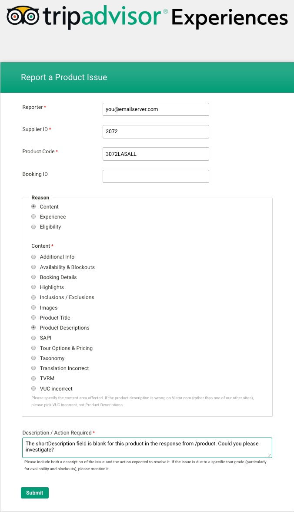
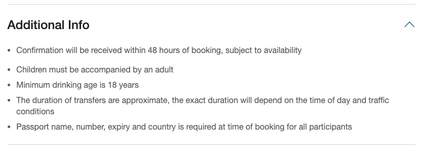
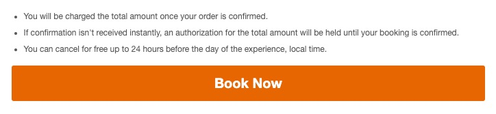
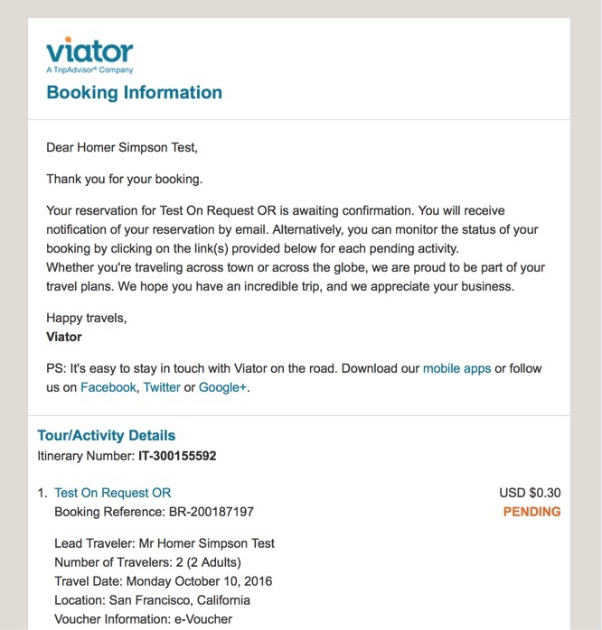

# Key concepts

## Content ingestion and caching strategy

Much of the information you will need to retrieve from the Viator API – such as the taxonomy, product lists and product details – do not change frequently.

Therefore, we recommend implementing a caching strategy in order to eliminate unnecessary traffic to Viator’s servers and improve the operation of your site. 

This section discusses the different strategies for retrieving and caching Viator’s product catalogue.

You will need to decide on how you will retrieve and manage content from Viator’s product catalogue. The two main options are as follows:

### 1. API response caching

*Partners retrieve content as-needed and cache responses on a service-by-service basis*

If you do not need to store product details locally, we recommend performing caching of on a service-by-service basis; i.e., storing the entire response and applying a time-to-live (TTL) of less than 24 hours.

#### Benefits of API response caching

* All the benefits of caching with minimal overhead
* Minimal risk of serving stale or invalid data cached on the partner's side
* No need to download data about products that are not selling
* A smaller volume of local data improves cache hit performance
* Fewer requests made of Viator's systems
* Avoids rate limitations
* Closer adherence to best practices
* Removes need to manage a complex data structure locally

#### Service endpoints to cache

Caching should only be applied to services that yield infrequently changing data; i.e.:

* [/taxonomy/destinations](](#operation/taxonomyDestinations)
* [/taxonomy/categories](#operation/taxonomyCategories)
* [/taxonomy/attractions](#operation/taxonomyAttractions)
* [/search/products](#operation/searchProducts)
* [/search/products/codes](#operation/searchProductsCodes)
* [/search/freetext](#operation/searchFreetext)
* [/product](#operation/product)
* [/product/reviews](#operation/productReviews)
* [/product/photos](#operation/productPhotos)
* [/available/products](#operation/availableProducts)

**Note**: these services should be considered cacheable even though some are POST and none include a Cache-Control HTTP header in their response.

### 2. Periodic content ingestion

*Partners download either the full product catalogue or a subset of the catalogue at regular intervals based on destination, linked attraction, or product category filters.*

#### Who should use periodic ingestion
This approach may be preferable for partners whose requirements include:
* **System agnosticism/data centralization** – i.e., partners who are simultaneously selling products from vendors other than Viator, have existing product databases or are likely to want to maintain a central product catalogue with a unified taxonomy / data structure
* **Enhanced search capability** – i.e., the ability to apply different categorization rules, filters, exclusions or search optimizations to the product catalogue; e.g., grouping or filtering products according to criteria other than those supported directly by the Viator API (destination, attraction-link or category)

#### Frequency of content ingestion
We recommend that you perform an ingestion of the product catalogue once every 24 hours.

#### How to retrieve product codes

Make a call to one of the product search services:

* [/search/products](#operation/searchProducts) – to search by `destId` (destination), `catId` (category), `subCatId` (subcategory) or `seoId` (attraction)
* [/search/freetext](#operation/searchFreetext) – free-text search across all identifying fields 

#### How to retrieve all products in the catalogue

To retrieve all products from the Viator catalogue:

* Retrieve all available destination identifiers (`destId`) from the [/taxonomy/destinations](#operation/taxonomyDestinations) service
* Iterate through the complete list of `destId`s you retrieved in the previous step, and call [/search/products](#operation/searchProducts) for each `destId`

**Note**: As some products operate in multiple destinations, the same product code may be returned for a range of different destinations. Therefore, make sure your list of product codes only contains one copy of each code.

You may then iterate through this list of product codes to retrieve any other product details necessary in order to properly populate your local database with the information you require.

#### Retrieving a subsection of the product catalogue

You may wish to retrieve only some of the products available in the Viator catalogue; for example, if your organization is only interested in selling products that operate locally.

Your top level search using [/search/products](#operation/searchProducts) is restricted to one of the three main categorization methods for products; i.e., destination, category/subcategory, or attraction-link; however, you may employ your own methods to filter the selection of products based on any attribute in the product data structure.

#### Dealing with pagination using `totalCount` and `topX`

Due to the large number of results that can be returned by the [/search/products](#operation/searchProducts) service, the request might exceed the 30-second time-out limitation on both sandbox and live servers. Therefore, you will need to make multiple requests to this service including pagination information in order to retrieve all products that match your search criteria.

This is accomplished by sequentially requesting successive segments of the results using the `topX` request parameter together with the `totalCount` response field; i.e.:

* For your first request, specify a `topX` of `"1-100"`
  - **Note**: this range is *inclusive*; i.e., `"topX": 1-100"` will yield the first 100 records 
* The first response will indicate the total number of records available through the value of the `totalCount` field in the response object; e.g.: `"totalCount": 13843`
* For each subsequent request, specify the next logical 'chunk' of data via the `topX` parameter of the request; e.g.:
  - "topX": "1-100"
  - "topX": "101-200"
  - ...
  - "topX": "13801-13843"

#### Rate limiting

Due to the heavy load that pre-caching can place on Viator's servers and the downstream servers we connect to, we apply a rate limit of **150 requests per 10 second time window**.

Request rates exceeding this limit will result in a **HTTP 429 (Too Many Requests)** status code being returned.

**Note**: The rate is calculated over a rolling 10-second time window

* In order to avoid running-up against rate limits:
  - insert a delay of 2s if you receive a HTTP 429 status code
  - do not run this as a multi-threaded process

## Categorization of content

The products available in Viator’s catalogue are mainly categorized according to:

1. **Destination**: every product in the Viator catalogue is categorized according to the destination/locale in which it operates. There are three kinds of destination:
<table>
  <thead>
    <th>Destination type</th>
    <th>Meaning</th>
  </thead>
  <tbody>
    <tr>
      <td>“COUNTRY”</td>
      <td>A country; e.g., “Australia”, “Japan”, “USA”</td>
    </tr>
    <tr>
      <td>"REGION"</td>
      <td>A geographical region or state; e.g., “South Australia”, “French Riviera”, “Punjab”</td>
    </tr>
    <tr>
      <td>"CITY"</td>
      <td>A city within a state; e.g., “Townsville”, “Osaka”, “Singapore”</td>
    </tr>
  </tbody>
</table>
<table>
  <thead>
    <tr>
      <th><code>destinationName</code></th>
      <th><code>destId</code></th>
      <th><code>destinationType</code></th>
    </tr>
  </thead>
  <tbody>
    <tr>
      <td>USA</td>
      <td>77</td>
      <td>COUNTRY</td>
    </tr>
    <tr>
      <td>Wisconsin</td>
      <td>22231</td>
      <td>REGION</td>
    </tr>
    <tr>
      <td>Madison</td>
      <td>24146</td>
      <td>CITY</td>
    </tr>
    <tr>
      <td>France</td>
      <td>51</td>
      <td>COUNTRY</td>
    </tr>
    <tr>
      <td>Brittany</td>
      <td>21942</td>
      <td>REGION</td>
    </tr>
    <tr>
      <td>Rennes</td>
      <td>21943</td>
      <td>CITY</td>
    </tr>
  </tbody>
</table>

1. **Category and subcategory**: the products in the Viator catalogue are grouped according to the kind of activity they entail and may be subcategorized further to provide greater specificity; for example:
<table>
  <thead>
    <tr>
      <th>Category</th>
      <th>Subcategories</th>
    </tr>
  </thead>
  <tbody>
    <tr>
      <td rowspan=3>Air, Helicopter & Balloon Tours</td>
      <td>Air Tours</td>
    </tr>
    <tr>
      <td>Helicopter Tours</td>
    </tr>
    <tr>
      <td>Balloon Rides</td>
    </tr>
    <tr>
      <td rowspan=2>Weddings & Honeymoons</td>
      <td>Wedding Packages</td>
    </tr>
    <tr>
      <td>Honeymoon Packages</td>
    </tr>
  </tbody>
</table>
1. **Attraction link** (i.e., association to a particular "point of interest"); e.g.:
<table>
  <thead>
    <tr>
      <th>Attraction</th>
      <th>`seoId`</th>
    <tr>
  </thead>
  <tbody>
    <tr>
      <td>Bellagio Fountains</td>
      <td>1243</td>
    </tr>
    <tr>
      <td>Black Canyon</td>
      <td>4437</td>
    </tr>
    <tr>
      <td>Epcot Centre</td>
      <td>1141</td>
    </tr>
  </tbody>
</table>


## Booking concepts

### Booking types - *on-request* and *freesale*

Bookings made with Viator can be either *freesale* (immediate confirmation) or *on-request*, which require us to confirm with our product supplier that the product has not sold out and is still available. This difference must be clearly communicated to the customer during the price check and on the *order summary* post-purchase page.

For *freesale* bookings, the voucher becomes available immediately, and the customer's credit card will be charged at the time of booking. For *on-request* bookings, confirmation will be sent to the customer within a timeframe supplied in the [/booking/calculateprice](#operation/bookingCalculateprice) and [/booking](#operation/bookingBook) service responses.

The customer's credit card will be charged once their *on-request* booking is confirmed.

###  bookingEngineId

`bookingEngineId` is a field returned in the responses from several endpoints documented in this manual. It is a **booking type specifier** indicating whether, when the product in question is booked, the booking will be `CONFIRMED` immediately or if it will remain `PENDING` even after the booking has been made, indicating that it is an on-request product.

`bookingEngineId` takes *one of* the following values:

  - `"FreesaleBE"` – the product will be confirmed immediately and the supplier will be sent a notification.

  - `"UnconditionalBE"` - the product will be confirmed immediately and the supplier will not be notified.

  - `"DeferredCRMBE"` - the product is an on-request product and the booking will not be confirmed immediately. The booking will remain with a `PENDING` status after it is made, to be confirmed by the supplier within the time specified in the `hoursConfirmed` field available in the booking response and post-booking services.

  - `"FreesaleOnRequestBE"` - The product is freesale up until a certain number of days before the travel date, after which it becomes on-request. It is then referred to as being within the *on-request period*. If a booking is made within the on-request period, the product can be considered to be an on-request product. Once the booking has been made, the `bookingEngineId` will change to either `"FreesaleOnRequestBE:OnRequest"` or `"FreesaleOnRequestBE:Freesold"` depending on the travel date and the on-request period.                      

### Tour grades

Products can have one or more *tour grades*. Each tour grade might represent a departure time or different tour option, such as additional meals, transport and so forth. If the tour grade code is `"DEFAULT"`, *do not* display this to the customer, simply hide the product's tour grade information.

### Language options

Many tours deliver a commentary in multiple languages using multilingual tour guides or with written or prerecorded information. Where available, the customer can preselect their preferred language option.

### Traveler mix (pax)

Some tour grades have defined traveler mixes used to price family passes; or, they might have special mixes for limited passenger tours, such as small buggies or weddings.

These traveler mixes are provided by the [/booking/availability/tourgrades](#operation/bookingAvailabilityTourgrades) service. You may need to display these to your customers so that they are able to understand why they can or cannot select a particular tour grade if there is a traveler mix mismatch.

### Pick-up location and hotel lists

Some products have pick-up and return shuttle bus services. For these tours, you will need the customer to supply a pick-up hotel, or they must select *live locally* or *hotel not yet booked* options.

Viator maintains pick-up hotel lists for many popular destinations. These lists are available for customers to select their pick-up location for various tours. For destinations without hotel lists, customers can enter the name of their hotel. If a customer's hotel is not listed, they should be able to enter a hotel name; however, pick-up may not be possible for that hotel.

### Lead traveler

Each tour booking requires a lead traveler to be identified. To identify the lead traveler in your request, set the `leadTraveller` flag to `true` in the traveler class.

### Booking questions

Some products have a list of one or more [booking questions](#section/Appendices/Booking-questions) that need to be asked. Some are mandatory. The question, a description, etc are provided in the product details object. The answers need to be included with the booking request.

### SSL/HTTPS

Calls to the [/booking/book](#operation/bookingBook) service *must* use a secure channel (https) as they contain credit card information.

### Promo codes

Viator can create promotional (promo) codes for discounts and other purposes. As it's unlikely for you to wish to support this feature, we recommend supplying `null` in the `promoCode` field and not including any customer-entered fields during the checkout process.

### Partner data

Partners can also supply additional information for their own internal purposes. These are attached to booking reports and other materials for use in allocating commissions to agents and so forth.

## Availability services

Product availability information can be retrieved with the following services:

- [/booking/availability](#operation/bookingAvailability): get the tourgrade with the lowest price available on a day
- [/booking/availability/dates](#operation/bookingAvailabilityDates): get all available dates for a product excluding days it does not operate and blockouts
- [/booking/availability/tourgrades](#operation/bookingAvailabilityTourgrades): list all available tour grades for a specific day
- [/booking/availability/tourgrades/pricingmatrix](#operation/bookingAvailabilityTourgradesPricingmatrix): returns available days only (ie days which have at least one tour grade available), and the pricing matrix for that tour grade on that day

### Example: multiple departures in a single day

Multiple departures in a single day (each represented by a tour grade) and the language options (langServices).

This request is for 3 adults on a helicopter tour:
- **Note:** No prices are returned if the tour grade is unavailable.

**Request object** ([/booking/availability/tourgrades](#operation/bookingAvailabilityTourgrades)):

```javascript
{
  "productCode": "2280AAHT",
  "bookingDate": "2013-05-11",
  "currencyCode": "EUR",
  "ageBands": [{
    "bandId": 1,
    "count": 3
  }]
}
```

**Response object** ([/booking/availability/tourgrades](#operation/bookingAvailabilityTourgrades))
:

```javascript
{
  "data": [{
    "available": false,
    "ageBands": null,
    "langServices": null,
    "gradeCode": "EARLYM",
    "unavailableReason": "BOOKING_CUTOFF_EXPIRED",
    "gradeTitle": "Early Morning Departure",
    "gradeDepartureTime": "",
    "gradeDescription": "Flight departs Las Vegas between 7am & 8am",
    "defaultLanguageCode": "en",
    "ageBandsRequired": null,
    "currencyCode": "ERROR",
    "retailPrice": 0,
    "bookingDate": "2013-05-11",
    "retailPriceFormatted": "",
    "merchantNetPrice": 0,
    "merchantNetPriceFormatted": "",
    "sortOrder": 1
  },
  {
    "available": false,
    "ageBands": null,
    "langServices": null,
    "gradeCode": "LATEM",
    "unavailableReason": "BOOKING_CUTOFF_EXPIRED",
    "gradeTitle": "Late Morning Departure",
    "gradeDepartureTime": "",
    "gradeDescription": "Flight departs Las Vegas between 9:45am & 10:45am",
    "defaultLanguageCode": "en",
    "ageBandsRequired": null,
    "currencyCode": "ERROR",
    "retailPrice": 0,
    "bookingDate": "2013-05-11",
    "retailPriceFormatted": "",
    "merchantNetPrice": 0,
    "merchantNetPriceFormatted": "",
    "sortOrder": 2
  },
  {
    "available": false,
    "ageBands": null,
    "langServices": null,
    "gradeCode": "EARLYA",
    "unavailableReason": "BOOKING_CUTOFF_EXPIRED",
    "gradeTitle": "Early Afternoon Departure",
    "gradeDepartureTime": "2:50 PM",
    "gradeDescription": "Flight departs Las Vegas between 12:30pm & 1:30pm",
    "defaultLanguageCode": "en",
    "ageBandsRequired": null,
    "currencyCode": "ERROR",
    "retailPrice": 0,
    "bookingDate": "2013-05-11",
    "retailPriceFormatted": "",
    "merchantNetPrice": 0,
    "merchantNetPriceFormatted": "",
    "sortOrder": 3
  },
  {
    "available": false,
    "ageBands": null,
    "langServices": null,
    "gradeCode": "LATEA",
    "unavailableReason": "BOOKING_CUTOFF_EXPIRED",
    "gradeTitle": "Late Afternoon Departure",
    "gradeDepartureTime": "",
    "gradeDescription": "Flight departs Las Vegas between 3:15pm & 4:15pm; available Ap",
    "defaultLanguageCode": "en",
    "ageBandsRequired": null,
    "currencyCode": "ERROR",
    "retailPrice": 0,
    "bookingDate": "2013-05-11",
    "retailPriceFormatted": "",
    "merchantNetPrice": 0,
    "merchantNetPriceFormatted": "",
    "sortOrder": 4
  }],
  "vmid": "221001",
  "errorMessage": null,
  "errorType": null,
  "dateStamp": "2013-06-04T17:01:34+0000",
  "totalCount": 1,
  "errorReference": null,
  "errorMessageText": null,
  "success": true,
  "errorName": null
}
```

### Example: traveler mix mismatch

The request is for five adults, but this product only support up to four adults.

**Example request object** ([/booking/availability/tourgrades](#operation/bookingAvailabilityTourgrades)):
```javascript
{
  "productCode": "2280ULTWED",
  "bookingDate": "2013-12-11",
  "currencyCode": "EUR",
  "ageBands": [{
    "bandId": 1,
    "count": 5
  }]
}
```

**Example response object**
The response contains `"TRAVELLER_MISMATCH"` and you can see the `ageBandsRequired` values for the adult (1) age band in the available tour grade.

```javascript
{
  "data": [{
    "available": false,
    "ageBands": null,
    "langServices": null,
    "gradeCode": "DEFAULT",
    "unavailableReason": "TRAVELLER_MISMATCH",
    "gradeTitle": "DEFAULT",
    "gradeDepartureTime": "12:00 AM",
    "gradeDescription": "DEFAULT",
    "defaultLanguageCode": "en",
    "ageBandsRequired": [
    [{
      "bandId": 1,
      "minimumCountRequired": 2,
      "maximumCountRequired": 2
    }],
    [{
      "bandId": 1,
      "minimumCountRequired": 3,
      "maximumCountRequired": 3
    }],
    [{
      "bandId": 1,
      "minimumCountRequired": 4,
      "maximumCountRequired": 4
    }]],
    "currencyCode": "ERROR",
    "retailPrice": 0,
    "bookingDate": "2013-12-11",
    "retailPriceFormatted": "",
    "merchantNetPrice": 0,
    "merchantNetPriceFormatted": "",
    "sortOrder": 1
  }],
  "vmid": "221001",
  "errorMessage": null,
  "errorType": null,
  "dateStamp": "2013-06-04T17:02:35+0000",
  "totalCount": 1,
  "errorReference": null,
  "errorMessageText": null,
  "success": true,
  "errorName": null
}
```

## Understanding the pricingUnit field

This section explains the meaning and function of the `pricingUnit` field in the response object received from the [/booking/availability/tourgrades/pricingmatrix](#operation/bookingAvailabilityTourgradesPricingmatrix) service.

### Request body
The [/booking/availability/tourgrades/pricingmatrix](#operation/bookingAvailabilityTourgradesPricingmatrix) service takes the following parameters as input in its request body:

| Parameter | Type | Meaning |
|-----------|------|---------|
| `productCode` | string | unique alphanumeric identifier of the product to enquire about; e.g., `10040WORLD` |
| `month` | string | **month** of the year by which to filter results |
| `year` | string | **year** by which to filter results |
| `currencyCode` | string | **currency code** for the currency in which to display pricing information |

#### Example request body

Sending the following request body to the [/booking/availability/tourgrades/pricingmatrix](#operation/bookingAvailabilityTourgradesPricingmatrix) service will retrieve pricing information for "Skip the Line: World of Discoveries Entrance Ticket in Porto" (product code: 10040WORLD).

```javascript
{
  "productCode": "10040WORLD",
  "currencyCode": "USD",
  "month": "06",
  "year": "2019"
}
```

### Response object

Within each object item of the `tourGrades` array – each of which gives the pricing details for a specific tour grade – is a `pricingMatrix` array. Each object in this array details the per-age-band pricing for a specific pricing unit (`pricingUnit`) associated with that product.

Using this information, you should be able to calculate the total cost of the booking – considering any booking options – with regard to the number of participants.

How to identify the fundamental unit prices for a booking, which are then summed in order to calculate a total price, is detailed below.

Note that in the response object received from the service, pricing schedules are organized hierarchically as follows:

```c
bookingDate
--tourGrade
----ageBand
------price
```

### Types of pricing unit
There are two fundamental types of pricing unit – **per-person** and **per-group**.

#### Per-person pricing schedule
If the pricing is *per-person*, then the total price of the booking will be directly proportional to the number of participants (passengers) of each type that are booking the product; i.e., a direct multiple of the per-person price.

The only pricing unit specifier for *per-person* pricing is “per person”, given in the `pricingUnit` field; i.e.:

- `"pricingUnit": "per person"`

| Pricing unit | Example product | Meaning |
|--------------|---------|---------|
| `"per person"` | **10040WORLD** | **Per-person pricing** – the unit price refers to the price for an individual participant.<br />Some products have tiered pricing arrangements; i.e., a different per-person price can apply if certain numbers and combinations of participants in a particular age band are booking the product; e.g.:<br /><ul><li>**1-2 adults**: $50 per person</li><li>**3-4 adults**: $45 per person</li></ul><br />Whether a range is available to be booked depends on whether the customer’s desired passenger mix satisfies the `minimumCountRequired` and `maximumCountRequired` fields in each item of the `ageBandPrices` array. |

#### Per-group pricing
If the pricing is per-group, then the total price of the booking will depend on the number of groups and types of group that ideally accommodate the participant mix.

The following pricing schedules follow “per-group” logic:

- `"pricingUnit": "per vehicle"`
- `"pricingUnit": "per car"`
- `"pricingUnit": "per group"`
- `"pricingUnit": "per boat"`
- `"pricingUnit": "per package"`
- `"pricingUnit": "per jetski"`
- `"pricingUnit": "per vessel"`
- `"pricingUnit": "per helicopter"`
- `"pricingUnit": "per room"`
- `"pricingUnit": "per bike"`
- `"pricingUnit": "per flight"`
- `"pricingUnit": "per plane"`
- `"pricingUnit": "per couple"`

Eligibility for a certain individual pricing schedule; or, for inclusion in a particular group type, depends on the tour grade for the product, the type of participant (e.g., the age-band they fall into) and the date of the booking.

#### Group pricing schedules

| Pricing unit  | Example product | Meaning |
|---------------|-----------|---------|
| `"per group"` | **10847P42**  | **Per-group** pricing – the unit price is calculated according to the number of groups the specified passenger will fit into rather than the exact number of participants. `minimumCountRequired` and `maximumCountRequired` must be considered as these fields relate to the available group sizes. |
| `"per room"`  | **6279P26** | **Per-room** pricing relates the room price, which depends on the number of participants making the booking. |
| `"per package"` | **25941P70**  | **Per-package** pricing refers to products that are sold as part of a package; for example a family package stipulating a passenger mix of two adults and two children |
| `"per vehicle"` | **6154SHOP**  | **Per-vehicle** pricing is calculated according to the number of vehicles required for the specified passenger mix rather than the exact number of participants. `minimumCountRequired` and `maximumCountRequired` must be considered as these fields relate to the occupancy limitations for each vehicle. The minimum price will depend on the rate for a single vehicle. |
| `"per car"` | **10175P10**  | **Per-car** pricing – identical to "per vehicle", but refers specifically to vehicles that are cars. |
| `"per boat"`  | **11121P40**  | **Per-boat** pricing – identical to "per vehicle", but refers specifically to vehicles that are boats. |
| `"per jetski"`  | **28965P127** | **Per-jetski** pricing – identical to "per vehicle", but refers specifically to vehicles that are jet-skis. |
| `"per vessel"`  | **17295P24**  | **Per-vessel** pricing – identical to "per vehicle", but refers specifically to maritime vessels that are not strictly boats. |
| `"per helicopter"`  | **12189P23**  | **Per-helicopter** pricing – identical to "per vehicle", but refers specifically to vehicles that are helicopters. |
| `"per bike"`  | **17448P8** | **Per-bike** pricing – identical to "per vehicle", but refers specifically to vehicles that are bikes. |
| `"per flight"`  | **28965P134** | **Per-flight** pricing – identical to "per vehicle", but refers specifically to the act of being aboard a flying vehicle. |
| `"per plane"` | **14876P5** | **Per-plane** pricing – identical to "per vehicle", but refers specifically to vehicles that are aeroplanes. |

### Interpreting response objects by example

In this section, we’ll have a look at snippets from the response objects received from the [/booking/availability/tourgrades/pricingmatrix](#operation/bookingAvailabilityTourgradesPricingmatrix) service and interpret the results.

#### Per-person pricing
##### Request object
```javascript
{
  "productCode": "10040WORLD",
  "currencyCode": "USD",
  "month": "06",
  "year": "2019"
}
```
#### Response snippet

**Note:** `pricingMatrix` is an array of objects that detail the available pricing schedules for the product:

```javascript
"pricingMatrix": [
  {
    "sortOrder": 1,
    "pricingUnit": "per person",
    "bookingDate": "2019-06-01",
    "ageBandPrices": [
      {
        "bandId": 1,
        "prices": [
          {
            "sortOrder": 1,
            "currencyCode": "USD",
            "price": 13.85,
            "priceFormatted": "$13.85",
            "merchantNetPrice": 11.05,
            "merchantNetPriceFormatted": "$11.05",
            "minNoOfTravellersRequiredForPrice": 1
          }
        ],
        "sortOrder": 1,
        "minimumCountRequired": 0,
        "maximumCountRequired": 15
      },
      {
        "bandId": 2,
        "prices": [
          {
            "sortOrder": 1,
            "currencyCode": "USD",
            "price": 6.92,
            "priceFormatted": "$6.92",
            "merchantNetPrice": 5.53,
            "merchantNetPriceFormatted": "$5.53",
            "minNoOfTravellersRequiredForPrice": 1
          }
        ],
        "sortOrder": 2,
        "minimumCountRequired": 0,
        "maximumCountRequired": 15
      },
      {
        "bandId": 3,
        "prices": [
          {
            "sortOrder": 1,
            "currencyCode": "USD",
            "price": 0,
            "priceFormatted": "$0.00",
            "merchantNetPrice": 0,
            "merchantNetPriceFormatted": "$0.00",
            "minNoOfTravellersRequiredForPrice": 1
          }
        ],
        "sortOrder": 3,
        "minimumCountRequired": 0,
        "maximumCountRequired": 15
      },
      {
        "bandId": 5,
        "prices": [
          {
            "sortOrder": 1,
            "currencyCode": "USD",
            "price": 10.39,
            "priceFormatted": "$10.39",
            "merchantNetPrice": 8.3,
            "merchantNetPriceFormatted": "$8.30",
            "minNoOfTravellersRequiredForPrice": 1
          }
        ],
        "sortOrder": 4,
        "minimumCountRequired": 0,
        "maximumCountRequired": 15
      }
    ]
  }
]
```

In this example, four age bands (1, 2, 3 and 5) have pricing information available. These numerically-identified age bands are the age bands allowed to book the product. Details of the age ranges that the product operator has defined are available from the **/product** service.

A call to **/product** regarding `10040WORLD` yields the following information:

```javascript
"ageBands": [
  {
    "sortOrder": 1,
    "ageFrom": 13,
    "ageTo": 64,
    "adult": true,
    "bandId": 1,
    "pluralDescription": "Adults",
    "treatAsAdult": true,
    "count": 0,
    "description": "Adult"
  },
  {
    "sortOrder": 2,
    "ageFrom": 65,
    "ageTo": 99,
    "adult": false,
    "bandId": 5,
    "pluralDescription": "Seniors",
    "treatAsAdult": true,
    "count": 0,
    "description": "Senior"
  },
  {
    "sortOrder": 3,
    "ageFrom": 4,
    "ageTo": 12,
    "adult": false,
    "bandId": 2,
    "pluralDescription": "Children",
    "treatAsAdult": false,
    "count": 0,
    "description": "Child"
  },
  {
    "sortOrder": 4,
    "ageFrom": 0,
    "ageTo": 3,
    "adult": false,
    "bandId": 3,
    "pluralDescription": "Infants",
    "treatAsAdult": false,
    "count": 0,
    "description": "Infant"
  }
```

Product operators choose the age bands available for their product from the following five categories and define the age ranges that pertain to each band; i.e.:

| `bandId` | `description` |
|:----------:|:-----------:|
| **1** | Adult |
| **2** | Child |
| **3** | Infant |
| **4** | Youth |
| **5** | Senior |

For this product, the age bands have been defined as follows:

| `bandId` | `description` | `ageFrom` | `ageTo` |
|:--------:|:-----------:|:-------:|:-----:|
| **1** | Adult | 13 | 64 |
| **5** | Senior | 65 | 99 |
| **2** | Child | 4 | 12 |
| **3** | Infant | 0 | 3 |

Therefore, for this product, the following pricing applies:

| Passenger type | Number | Price |
|----------------|:------:|-------|
| **Adult** | 1-15 | $13.85 per person |
| **Senior** | 1-15 | $10.39 per person |
| **Child** | 1-15 | $6.92 per person |
| **Infant** | 1-15 | free ($0) |

Per-person pricing might depend on the mix of passengers booking the tour. In the following example (`5010SYDNEY`), a "48 Hour Family Pass Ticket" has a different price for children depending on how many are participating, which we'll see in the following snippet.

##### Response snippet
```javascript
"tourGrades": [
  {
    "sortOrder": 1,
    "gradeCode": "14HFAM",
    "gradeTitle": "48 Hour Family Pass Ticket",
    "pricingMatrix": [
      {
        "sortOrder": 1,
        "pricingUnit": "per person",
        "bookingDate": "2019-08-01",
        "ageBandPrices": [
          {
            "bandId": 1,
            "prices": [
              {
                "sortOrder": 1,
                "currencyCode": "USD",
                "price": 133.47,
                "minNoOfTravellersRequiredForPrice": 1,
                "priceFormatted": "$133.47",
                "merchantNetPrice": 106.62,
                "merchantNetPriceFormatted": "$106.62"
              }
            ],
            "sortOrder": 1,
            "minimumCountRequired": 1,
            "maximumCountRequired": 1
          },
          {
            "bandId": 2,
            "prices": [
              {
                "sortOrder": 1,
                "currencyCode": "USD",
                "price": 0,
                "minNoOfTravellersRequiredForPrice": 1,
                "priceFormatted": "$0.00",
                "merchantNetPrice": 0,
                "merchantNetPriceFormatted": "$0.00"
              }
            ],
            "sortOrder": 2,
            "minimumCountRequired": 2,
            "maximumCountRequired": 2
          },
          {
            "bandId": 3,
            "prices": [
              {
                "sortOrder": 1,
                "currencyCode": "USD",
                "price": 0,
                "minNoOfTravellersRequiredForPrice": 1,
                "priceFormatted": "$0.00",
                "merchantNetPrice": 0,
                "merchantNetPriceFormatted": "$0.00"
              }
            ],
            "sortOrder": 3,
            "minimumCountRequired": 0,
            "maximumCountRequired": null
          }
        ]
      },
      {
        "sortOrder": 2,
        "pricingUnit": "per person",
        "bookingDate": "2019-08-01",
        "ageBandPrices": [
          {
            "bandId": 1,
            "prices": [
              {
                "sortOrder": 1,
                "currencyCode": "USD",
                "price": 133.47,
                "minNoOfTravellersRequiredForPrice": 1,
                "priceFormatted": "$133.47",
                "merchantNetPrice": 106.62,
                "merchantNetPriceFormatted": "$106.62"
              }
            ],
            "sortOrder": 1,
            "minimumCountRequired": 1,
            "maximumCountRequired": 1
          },
          {
            "bandId": 2,
            "prices": [
              {
                "sortOrder": 1,
                "currencyCode": "USD",
                "price": 3.71,
                "minNoOfTravellersRequiredForPrice": 1,
                "priceFormatted": "$3.71",
                "merchantNetPrice": 2.96,
                "merchantNetPriceFormatted": "$2.96"
              }
            ],
            "sortOrder": 2,
            "minimumCountRequired": 3,
            "maximumCountRequired": 4
          },
          {
            "bandId": 3,
            "prices": [
              {
                "sortOrder": 1,
                "currencyCode": "USD",
                "price": 0,
                "minNoOfTravellersRequiredForPrice": 1,
                "priceFormatted": "$0.00",
                "merchantNetPrice": 0,
                "merchantNetPriceFormatted": "$0.00"
              }
            ],
            "sortOrder": 3,
            "minimumCountRequired": 0,
            "maximumCountRequired": null
          }
        ]
      }
    ]
  },
  …
]
```

##### Interpretation

To be eligible for a family pass ticket, the group must consist of an adult and at least two children.

| Passenger mix | Adult price | Child price | Infant price |
|---------------|:-----------:|:-----------:|:------------:|
| 1 Adult +<br />1 Child | N/A | N/A | N/A |
| 1 Adult +<br />2 Children +<br />Any infants | $133.47 | FREE | FREE |
| 1 Adult +<br />3-4 Children +<br />Any infants | $133.47 | $3.71 | FREE |

#### Tiered per-person pricing

In this example, we see a per-person pricing schedule with a tiered arrangement, where the per-person price decreases depending on how many people are booking the tour, but the total price is still calculated as the sum of the individual per-person prices rather than an overall 'group' price.

##### Request object
```javascript
{
  "productCode": "17972P102",
  "currencyCode": "USD",
  "month": "08",
  "year": "2019"
}
```
##### Response snippet

```javascript
"tourGrades": [
  {
    "sortOrder": 1,
    "gradeCode": "TG1",
    "gradeTitle": "Arrival transfer",
    "pricingMatrix": [
      {
        "sortOrder": 1,
        "pricingUnit": "per person",
        "bookingDate": "2019-08-01",
        "ageBandPrices": [
          {
            "bandId": 1,
            "prices": [
              {
                "sortOrder": 1,
                "currencyCode": "USD",
                "price": 52.45,
                "priceFormatted": "$52.45",
                "merchantNetPrice": 40.87,
                "merchantNetPriceFormatted": "$40.87",
                "minNoOfTravellersRequiredForPrice": 1
              }
            ],
            "sortOrder": 1,
            "maximumCountRequired": 1,
            "minimumCountRequired": 1
          }
        ]
      },
      {
        "sortOrder": 2,
        "pricingUnit": "per person",
        "bookingDate": "2019-08-01",
        "ageBandPrices": [
          {
            "bandId": 1,
            "prices": [
              {
                "sortOrder": 1,
                "currencyCode": "USD",
                "price": 26.22,
                "priceFormatted": "$26.22",
                "merchantNetPrice": 20.44,
                "merchantNetPriceFormatted": "$20.44",
                "minNoOfTravellersRequiredForPrice": 1
              }
            ],
            "sortOrder": 1,
            "maximumCountRequired": 2,
            "minimumCountRequired": 2
          }
        ]
      },
      {
        "sortOrder": 3,
        "pricingUnit": "per person",
        "bookingDate": "2019-08-01",
        "ageBandPrices": [
          {
            "bandId": 1,
            "prices": [
              {
                "sortOrder": 1,
                "currencyCode": "USD",
                "price": 17.91,
                "priceFormatted": "$17.91",
                "merchantNetPrice": 13.62,
                "merchantNetPriceFormatted": "$13.62",
                "minNoOfTravellersRequiredForPrice": 1
              }
            ],
            "sortOrder": 1,
            "maximumCountRequired": 3,
            "minimumCountRequired": 3
          }
        ]
      },
      {
        "sortOrder": 4,
        "pricingUnit": "per person",
        "bookingDate": "2019-08-01",
        "ageBandPrices": [
          {
            "bandId": 1,
            "prices": [
              {
                "sortOrder": 1,
                "currencyCode": "USD",
                "price": 19.19,
                "priceFormatted": "$19.19",
                "merchantNetPrice": 14.99,
                "merchantNetPriceFormatted": "$14.99",
                "minNoOfTravellersRequiredForPrice": 1
              }
            ],
            "sortOrder": 1,
            "maximumCountRequired": 4,
            "minimumCountRequired": 4
          }
        ]
      },
      {
        "sortOrder": 5,
        "pricingUnit": "per person",
        "bookingDate": "2019-08-01",
        "ageBandPrices": [
          {
            "bandId": 1,
            "prices": [
              {
                "sortOrder": 1,
                "currencyCode": "USD",
                "price": 15.35,
                "priceFormatted": "$15.35",
                "merchantNetPrice": 12.25,
                "merchantNetPriceFormatted": "$12.25",
                "minNoOfTravellersRequiredForPrice": 1
              }
            ],
            "sortOrder": 1,
            "maximumCountRequired": 5,
            "minimumCountRequired": 5
          }
        ]
      },
      {
        "sortOrder": 6,
        "pricingUnit": "per person",
        "bookingDate": "2019-08-01",
        "ageBandPrices": [
          {
            "bandId": 1,
            "prices": [
              {
                "sortOrder": 1,
                "currencyCode": "USD",
                "price": 12.66,
                "priceFormatted": "$12.66",
                "merchantNetPrice": 10.08,
                "merchantNetPriceFormatted": "$10.08",
                "minNoOfTravellersRequiredForPrice": 1
              }
            ],
            "sortOrder": 1,
            "maximumCountRequired": 6,
            "minimumCountRequired": 6
          }
        ]
      },
      {
        "sortOrder": 7,
        "pricingUnit": "per person",
        "bookingDate": "2019-08-01",
        "ageBandPrices": [
          {
            "bandId": 1,
            "prices": [
              {
                "sortOrder": 1,
                "currencyCode": "USD",
                "price": 10.94,
                "priceFormatted": "$10.94",
                "merchantNetPrice": 8.72,
                "merchantNetPriceFormatted": "$8.72",
                "minNoOfTravellersRequiredForPrice": 1
              }
            ],
            "sortOrder": 1,
            "maximumCountRequired": 7,
            "minimumCountRequired": 7
          }
        ]
      }
    ]
  }
```

##### Interpretation

| Travelers | Per-person price | Total price |
|:----------------:|:----------------:|:-----------:|
| 1 | $52.45 | $52.45 |
| 2 | $26.22 | $52.44 |
| 3 | $17.91 | $53.73 |
| 4 | $19.19 | $76.76 |
| 5 | $15.35 | $76.75 |
| 6 | $12.66 | $75.96 |
| 7 | $10.94 | $76.58 |

#### Per-group pricing
##### Request object
```javascript
{
  "productCode": "10847P42",
  "currencyCode": "USD",
  "month": "06",
  "year": "2019"
}
```

##### Response snippet

```javascript
"pricingMatrix": [
  {
    "sortOrder": 1,
    "pricingUnit": "per group",
    "bookingDate": "2019-06-01",
    "ageBandPrices": [
      {
        "bandId": 1,
        "prices": [
          {
            "sortOrder": 1,
            "currencyCode": "USD",
            "price": 390,
            "minNoOfTravellersRequiredForPrice": 1,
            "priceFormatted": "$390.00",
            "merchantNetPrice": 339.74,
            "merchantNetPriceFormatted": "$339.74"
          },
          {
            "sortOrder": 2,
            "currencyCode": "USD",
            "price": 390,
            "minNoOfTravellersRequiredForPrice": 2,
            "priceFormatted": "$390.00",
            "merchantNetPrice": 0,
            "merchantNetPriceFormatted": "$0.00"
          }
        ],
        "sortOrder": 1,
        "minimumCountRequired": 1,
        "maximumCountRequired": 10
      }
    ]
  }
]
```

##### Interpretation

- "$390 per group of up to 10 adults"

#### Per-room pricing

##### Request object
```javascript
{
  "productCode": "100245P40",
  "currencyCode": "USD",
  "month": "08",
  "year": "2019"
}
```
##### Response snippet

```javascript
"pricingMatrix": [
{
    "sortOrder": 1,
    "pricingUnit": "per room",
    "bookingDate": "2019-08-01",
    "ageBandPrices": [
      {
        "bandId": 1,
        "prices": [
          {
            "sortOrder": 1,
            "currencyCode": "USD",
            "price": 110,
            "minNoOfTravellersRequiredForPrice": 1,
            "priceFormatted": "$110.00",
            "merchantNetPrice": 95.85,
            "merchantNetPriceFormatted": "$95.85"
          },
          {
            "sortOrder": 2,
            "currencyCode": "USD",
            "price": 110,
            "minNoOfTravellersRequiredForPrice": 2,
            "priceFormatted": "$110.00",
            "merchantNetPrice": 0,
            "merchantNetPriceFormatted": "$0.00"
          }
        ],
        "sortOrder": 1,
        "minimumCountRequired": 1,
        "maximumCountRequired": 10
      }
    ]
  }
]
```

##### Interpretation
- "$110 per group of up to 10 adults"

#### Per-package pricing

##### Request object
```javascript
{
  "productCode": "25941P70",
  "currencyCode": "USD",
  "month": "02",
  "year": "2019"
}
```

##### Response snippet
```javascript
"pricingMatrix": [
  {
    "sortOrder": 1,
    "pricingUnit": "per package",
    "bookingDate": "2019-02-01",
    "ageBandPrices": [
      {
        "bandId": 1,
        "prices": [
          {
            "sortOrder": 1,
            "currencyCode": "USD",
            "price": 87.7,
            "minNoOfTravellersRequiredForPrice": 1,
            "priceFormatted": "$87.70",
            "merchantNetPrice": 67.23,
            "merchantNetPriceFormatted": "$67.23"
          },
          {
            "sortOrder": 2,
            "currencyCode": "USD",
            "price": 87.7,
            "minNoOfTravellersRequiredForPrice": 2,
            "priceFormatted": "$87.70",
            "merchantNetPrice": 0,
            "merchantNetPriceFormatted": "$0.00"
          }
        ],
        "sortOrder": 1,
        "minimumCountRequired": 1,
        "maximumCountRequired": 10
      }
    ]
  }
]
```

##### Interpretation
- "$87.70 per group of up to 10 adults"

#### Per-vehicle pricing

##### Request object
```javascript
{
  "productCode": "20190P4",
  "currencyCode": "USD",
  "month": "06",
  "year": "2019"
}
```

##### Response snippet
```javascript
"pricingMatrix": [
  {
    "sortOrder": 1,
    "pricingUnit": "per vehicle",
    "bookingDate": "2019-06-01",
    "ageBandPrices": [
      {
        "bandId": 1,
        "prices": [
          {
            "sortOrder": 1,
            "currencyCode": "USD",
            "price": 250,
            "minNoOfTravellersRequiredForPrice": 1,
            "priceFormatted": "$250.00",
            "merchantNetPrice": 186.38,
            "merchantNetPriceFormatted": "$186.38"
          },
          {
            "sortOrder": 2,
            "currencyCode": "USD",
            "price": 250,
            "minNoOfTravellersRequiredForPrice": 2,
            "priceFormatted": "$250.00",
            "merchantNetPrice": 0,
            "merchantNetPriceFormatted": "$0.00"
          }
        ],
        "sortOrder": 1,
        "minimumCountRequired": 1,
        "maximumCountRequired": 7
      }
    ]
  }
]
```

##### Interpretation
- "$250 per group of up to 7 adults"

#### Per-car pricing
##### Request object
```javascript
{
  "productCode": "10175P10",
  "currencyCode": "USD",
  "month": "06",
  "year": "2019"
}
```

#### Response snippet

```javascript
"pricingMatrix": [
  {
    "sortOrder": 1,
    "pricingUnit": "per car",
    "bookingDate": "2019-06-01",
    "ageBandPrices": [
      {
        "bandId": 1,
        "prices": [
          {
            "sortOrder": 1,
            "currencyCode": "USD",
            "price": 98.08,
            "priceFormatted": "$98.08",
            "merchantNetPrice": 78.34,
            "merchantNetPriceFormatted": "$78.34",
            "minNoOfTravellersRequiredForPrice": 1
          },
          {
            "sortOrder": 2,
            "currencyCode": "USD",
            "price": 98.08,
            "priceFormatted": "$98.08",
            "merchantNetPrice": 0,
            "merchantNetPriceFormatted": "$0.00",
            "minNoOfTravellersRequiredForPrice": 2
          }
        ],
        "sortOrder": 1,
        "minimumCountRequired": 1,
        "maximumCountRequired": 3
      }
    ]
  }
]
```
##### Interpretation
- "$98.08 per group of up to 3 adults"

#### Per-boat pricing
##### Request object
```javascript
{
  "productCode": "11121P40",
  "currencyCode": "USD",
  "month": "08",
  "year": "2018"
}
```
##### Response snippet

```javascript
"pricingMatrix": [
  {
    "sortOrder": 1,
    "pricingUnit": "per boat",
    "bookingDate": "2018-06-01",
    "ageBandPrices": [
      {
        "bandId": 1,
        "prices": [
          {
            "sortOrder": 1,
            "currencyCode": "USD",
            "price": 266.21,
            "merchantNetPrice": 226.81,
            "merchantNetPriceFormatted": "$226.81",
            "priceFormatted": "$266.21",
            "minNoOfTravellersRequiredForPrice": 1
          },
          {
            "sortOrder": 2,
            "currencyCode": "USD",
            "price": 266.21,
            "merchantNetPrice": 0,
            "merchantNetPriceFormatted": "$0.00",
            "priceFormatted": "$266.21",
            "minNoOfTravellersRequiredForPrice": 2
          }
        ],
        "sortOrder": 1,
        "minimumCountRequired": 1,
        "maximumCountRequired": 2
      }
    ]
  }
]
```

##### Interpretation
- "$266.21 per group of up to 2 adults"

#### Per-jetski pricing
##### Request object
```javascript
{
  "productCode": "28965P127",
  "currencyCode": "USD",
  "month": "08",
  "year": "2018"
}
```
##### Response snippet
```javascript
"tourGrades": [
  {
    "sortOrder": 1,
    "gradeCode": "TG1",
    "gradeTitle": "20 minutes for 1 person",
    "pricingMatrix": [
      {
        "sortOrder": 1,
        "pricingUnit": "per jetski",
        "bookingDate": "2018-06-01",
        "ageBandPrices": [
          {
            "bandId": 1,
            "prices": [
              {
                "sortOrder": 1,
                "currencyCode": "USD",
                "price": 55.46,
                "minNoOfTravellersRequiredForPrice": 1,
                "priceFormatted": "$55.46",
                "merchantNetPrice": 47.25,
                "merchantNetPriceFormatted": "$47.25"
              }
            ],
            "sortOrder": 1,
            "minimumCountRequired": 1,
            "maximumCountRequired": 1
          }
        ]
      }
    ]
  },
  {
    "sortOrder": 2,
    "gradeCode": "TG3",
    "gradeTitle": "20 minutes for 2 persons",
    "pricingMatrix": [
      {
        "sortOrder": 1,
        "pricingUnit": "per jetski",
        "bookingDate": "2018-06-01",
        "ageBandPrices": [
          {
            "bandId": 1,
            "prices": [
              {
                "sortOrder": 1,
                "currencyCode": "USD",
                "price": 66.55,
                "minNoOfTravellersRequiredForPrice": 1,
                "priceFormatted": "$66.55",
                "merchantNetPrice": 56.7,
                "merchantNetPriceFormatted": "$56.70"
              },
              {
                "sortOrder": 2,
                "currencyCode": "USD",
                "price": 66.55,
                "minNoOfTravellersRequiredForPrice": 2,
                "priceFormatted": "$66.55",
                "merchantNetPrice": 0,
                "merchantNetPriceFormatted": "$0.00"
              }
            ],
            "sortOrder": 1,
            "minimumCountRequired": 1,
            "maximumCountRequired": 2
          }
        ]
      }
    ]
  }
]
```

##### Interpretation

This example shows how group prices can differ according to the size of the group in question. In this case, two adults can ride together on a two-person jet ski, whereas a single adult requires his or her own jet ski, and therefore the unit price is slightly higher for the single adult.

| Travelers | Vehicle type | Price per jet ski | Price per person |
|:----------:|--------------|:-----------------:|:----------------:|
| 1 | Single-person jet ski | $55.46 | $55.46 |
| 2 | Two-person jet ski | $66.55 | $33.275 |

#### Per-vessel pricing

##### Request object

```javascript
{
  "productCode": "17295P24",
  "currencyCode": "USD",
  "month": "06",
  "year": "2019"
}
```

##### Response snippet

```javascript
"pricingMatrix": [
  {
    "sortOrder": 1,
    "pricingUnit": "per vessel",
    "bookingDate": "2019-06-01",
    "ageBandPrices": [
      {
        "bandId": 1,
        "prices": [
          {
            "sortOrder": 1,
            "currencyCode": "USD",
            "price": 799,
            "priceFormatted": "$799.00",
            "merchantNetPrice": 680.75,
            "merchantNetPriceFormatted": "$680.75",
            "minNoOfTravellersRequiredForPrice": 1
          },
          {
            "sortOrder": 2,
            "currencyCode": "USD",
            "price": 799,
            "priceFormatted": "$799.00",
            "merchantNetPrice": 0,
            "merchantNetPriceFormatted": "$0.00",
            "minNoOfTravellersRequiredForPrice": 2
          }
        ],
        "sortOrder": 1,
        "minimumCountRequired": 1,
        "maximumCountRequired": 12
      }
    ]
  }
]
```

##### Interpretation
- "$799.00 per group of up to 12 adults"

#### Per-helicopter pricing

##### Request object

```javascript
{
  "productCode": "12189P23",
  "currencyCode": "USD",
  "month": "08",
  "year": "2018"
}
```

##### Response snippet
```javascript
"tourGrades": [
  {
    "sortOrder": 1,
    "gradeCode": "TG1",
    "gradeTitle": "Private Helicopter 1 to 2 Pax",
    "pricingMatrix": [
      {
        "sortOrder": 1,
        "pricingUnit": "per helicopter",
        "bookingDate": "2018-06-01",
        "ageBandPrices": [
          {
            "bandId": 1,
            "prices": [
              {
                "sortOrder": 1,
                "currencyCode": "USD",
                "price": 1714.83,
                "priceFormatted": "$1,714.83",
                "merchantNetPrice": 1461.03,
                "merchantNetPriceFormatted": "$1,461.03",
                "minNoOfTravellersRequiredForPrice": 1
              },
              {
                "sortOrder": 2,
                "currencyCode": "USD",
                "price": 1714.83,
                "priceFormatted": "$1,714.83",
                "merchantNetPrice": 0,
                "merchantNetPriceFormatted": "$0.00",
                "minNoOfTravellersRequiredForPrice": 2
              }
            ],
            "sortOrder": 1,
            "minimumCountRequired": 1,
            "maximumCountRequired": 2
          }
        ]
      }
    ]
  },
  {
    "sortOrder": 2,
    "gradeCode": "TG2",
    "gradeTitle": "Private Helicopter 1 to 3 Pax",
    "pricingMatrix": [
      {
        "sortOrder": 1,
        "pricingUnit": "per helicopter",
        "bookingDate": "2018-06-01",
        "ageBandPrices": [
          {
            "bandId": 1,
            "prices": [
              {
                "sortOrder": 1,
                "currencyCode": "USD",
                "price": 2047.41,
                "priceFormatted": "$2,047.41",
                "merchantNetPrice": 1744.4,
                "merchantNetPriceFormatted": "$1,744.40",
                "minNoOfTravellersRequiredForPrice": 1
              },
              {
                "sortOrder": 2,
                "currencyCode": "USD",
                "price": 2047.41,
                "priceFormatted": "$2,047.41",
                "merchantNetPrice": 0,
                "merchantNetPriceFormatted": "$0.00",
                "minNoOfTravellersRequiredForPrice": 2
              }
            ],
            "sortOrder": 1,
            "minimumCountRequired": 1,
            "maximumCountRequired": 3
          }
        ]
      }
    ]
  }
]
```

##### Interpretation
| Travelers | Vehicle type | Price per helicopter | Price per person |
|:----------:|--------------|:--------------------:|:----------------:|
| 1 | 1-2-person helicopter | $1,714.83 | $1,714.83 |
| 2 | 1-2-person helicopter | $1,714.83 | $857.415 |
| 3 | 1-3-person helicopter | $2,047.41 | $682.47 |

#### Per-bike pricing

##### Request object
```javascript
{
  "productCode": "17448P8",
  "currencyCode": "USD",
  "month": "08",
  "year": "2018"
}
```

#### Response snippet
```javascript
"pricingMatrix": [
  {
    "sortOrder": 1,
    "pricingUnit": "per bike",
    "bookingDate": "2018-06-01",
    "ageBandPrices": [
      {
        "bandId": 1,
        "prices": [
          {
            "sortOrder": 1,
            "currencyCode": "USD",
            "price": 208.53,
            "priceFormatted": "$208.53",
            "merchantNetPrice": 177.67,
            "merchantNetPriceFormatted": "$177.67",
            "minNoOfTravellersRequiredForPrice": 1
          },
          {
            "sortOrder": 2,
            "currencyCode": "USD",
            "price": 208.53,
            "priceFormatted": "$208.53",
            "merchantNetPrice": 0,
            "merchantNetPriceFormatted": "$0.00",
            "minNoOfTravellersRequiredForPrice": 2
          }
        ],
        "sortOrder": 1,
        "minimumCountRequired": 1,
        "maximumCountRequired": 2
      }
    ]
  }
]
```

##### Interpretation

- "$208.53 per bike, with up to two adults per bike"

#### Per-flight pricing

##### Request object

```javascript
{
  "productCode": "28965P134",
  "currencyCode": "USD",
  "month": "08",
  "year": "2018"
}
```

##### Response snippet

```javascript
"tourGrades": [
  {
    "sortOrder": 1,
    "gradeCode": "TG1",
    "gradeTitle": "Individual flight",
    "pricingMatrix": [
      {
        "sortOrder": 1,
        "pricingUnit": "per flight",
        "bookingDate": "2018-06-01",
        "ageBandPrices": [
          {
            "bandId": 1,
            "prices": [
              {
                "sortOrder": 1,
                "currencyCode": "USD",
                "price": 61.01,
                "merchantNetPrice": 51.98,
                "merchantNetPriceFormatted": "$51.98",
                "priceFormatted": "$61.01",
                "minNoOfTravellersRequiredForPrice": 1
              }
            ],
            "sortOrder": 1,
            "minimumCountRequired": 1,
            "maximumCountRequired": 1
          }
        ]
      }
    ]
  },
  {
    "sortOrder": 2,
    "gradeCode": "TG2",
    "gradeTitle": "Double",
    "pricingMatrix": [
      {
        "sortOrder": 1,
        "pricingUnit": "per flight",
        "bookingDate": "2018-06-01",
        "ageBandPrices": [
          {
            "bandId": 1,
            "prices": [
              {
                "sortOrder": 1,
                "currencyCode": "USD",
                "price": 94.28,
                "merchantNetPrice": 80.33,
                "merchantNetPriceFormatted": "$80.33",
                "priceFormatted": "$94.28",
                "minNoOfTravellersRequiredForPrice": 1
              },
              {
                "sortOrder": 2,
                "currencyCode": "USD",
                "price": 94.28,
                "merchantNetPrice": 0,
                "merchantNetPriceFormatted": "$0.00",
                "priceFormatted": "$94.28",
                "minNoOfTravellersRequiredForPrice": 2
              }
            ],
            "sortOrder": 1,
            "minimumCountRequired": 1,
            "maximumCountRequired": 2
          }
        ]
      }
    ]
  }
]
```

##### Interpretation

| Travelers | `gradeTitle` | Price per flight | Price per person |
|:----------:|-----------|:----------------:|:----------------:|
| 1 | Individual flight | $61.01 | $61.01 |
| 2 | Double | $94.28 | $47.14 |

#### Per-plane pricing

##### Request object

```javascript
{
  "productCode": "14876P5",
  "currencyCode": "USD",
  "month": "06",
  "year": "2019"
}
```

##### Response snippet

```javascript
"pricingMatrix": [
  {
    "sortOrder": 1,
    "pricingUnit": "per plane",
    "bookingDate": "2019-01-02",
    "ageBandPrices": [
      {
        "bandId": 1,
        "prices": [
          {
            "sortOrder": 1,
            "currencyCode": "USD",
            "price": 433.03,
            "priceFormatted": "$433.03",
            "merchantNetPrice": 391.99,
            "merchantNetPriceFormatted": "$391.99",
            "minNoOfTravellersRequiredForPrice": 1
          },
          {
            "sortOrder": 2,
            "currencyCode": "USD",
            "price": 433.03,
            "priceFormatted": "$433.03",
            "merchantNetPrice": 0,
            "merchantNetPriceFormatted": "$0.00",
            "minNoOfTravellersRequiredForPrice": 2
          }
        ],
        "sortOrder": 1,
        "minimumCountRequired": 1,
        "maximumCountRequired": 3
      }
    ]
  }
]
```

##### Interpretation
- "$433.03 per group of up to three people"

## Working with age bands

### Age bands

The available age bands for a product, such as *adult*, *child*, *infant*, etc., are returned by the [/product](#operation/product) service. The customer can select a different number of people from each age band during the price check and checkout process.

### Why have age bands?

Tour and experience product operators can set different prices for (and impose different rules on) those wishing to make a booking for their product according to how old they are. 

For example, suppliers might choose to charge people 18 years and older ('adults') the full ticket price, while 'children' can book at a lower price. 

Or, the tour operator may only allow children to make a group booking for the tour so long as the group contains 'at least one adult'.

Viator provides five categories (age bands) that product operators can use to segregate travelers into age groups (the limits of which they also define) in order to set pricing and traveler-count participation rules for their product according to the age band categories.

### Supported age band categories

The age bands supported by the Viator API are as follows:

| `bandId` | Description |
|:------:|-------|
| **1** | Adult |
| **2** | Child |
| **3** | Infant |
| **4** | Youth |
| **5** | Senior |

The names and corresponding numeric identifiers of these categories are fixed as in the table above (i.e., `1` is always `Adult`); however, the exact age range to which each category pertains must be defined manually by the supplier.

The maximum and minimum ages that each age band describes for each product can be retrieved from the [/product](#operation/product) service.

### Example of age band definitions

For example, a call to [/product](#operation/product) regarding `10040WORLD` yields the following `ageBands` array within its response object:

```javascript
"ageBands": [
  {
    "sortOrder": 1,
    "ageFrom": 13,
    "ageTo": 64,
    "adult": true,
    "bandId": 1,
    "pluralDescription": "Adults",
    "treatAsAdult": true,
    "count": 0,
    "description": "Adult"
  },
  {
    "sortOrder": 2,
    "ageFrom": 65,
    "ageTo": 99,
    "adult": false,
    "bandId": 5,
    "pluralDescription": "Seniors",
    "treatAsAdult": true,
    "count": 0,
    "description": "Senior"
  },
  {
    "sortOrder": 3,
    "ageFrom": 4,
    "ageTo": 12,
    "adult": false,
    "bandId": 2,
    "pluralDescription": "Children",
    "treatAsAdult": false,
    "count": 0,
    "description": "Child"
  },
  {
    "sortOrder": 4,
    "ageFrom": 0,
    "ageTo": 3,
    "adult": false,
    "bandId": 3,
    "pluralDescription": "Infants",
    "treatAsAdult": false,
    "count": 0,
    "description": "Infant"
  }
```

For this product, the age bands have been defined as follows:

| `bandId` | `description` | `ageFrom` | `ageTo` |
|:--------:|:-----------:|:-------:|:-----:|
| **1** | Adult | 13 | 64 |
| **5** | Senior | 65 | 99 |
| **2** | Child | 4 | 12 |
| **3** | Infant | 0 | 3 |

Product operators must define at least one age band for their tour, and there are no 'default' age ranges. Therefore, if the product operator has only specified a single 'adult' age band covering ages 18-99, it must be assumed that only people aged 18-99 are eligible to book the tour, essentially excluding children and centenarians in this case.

| Field | Type | Definition |
|-------|------|------|
| `sortOrder` | integer | the sort order for *this* age band |
| `adult` | boolean | `true` if this age band is the 'adult' age band |
| `treatAsAdult` | boolean | `true` if this age band can book the tour without the need for adult accompaniment |

**Note**: `bandId` must be supplied in the request body of the following services:

- [/booking/availability](#operation/bookingAvailability)
- [/booking/availability/tourgrades](#operation/bookingAvailabilityTourgrades)
- [/booking/calculateprice](#operation/bookingCalculateprice)
- [/booking/book](#operation/bookingBook)

Age bands are referenced by their `bandId` in the responses from the following services:

- [/product](#operation/product)
- [/booking/availability/tourgrades](#operation/bookingAvailabilityTourgrades)
- [/booking/availability/tourgrades/pricingmatrix](#operation/bookingAvailabilityTourgradesPricingmatrix)
- [/booking/book](#operation/bookingBook)
- [/booking/pastbooking](#operation/bookingPastbooking)
- [/booking/mybookings](#operation/bookingMybookings)
- [/booking/calculateprice](#operation/bookingCalculateprice)

## How to report a product issue

Occasionally, a product schema in the Viator database will contain incorrect or invalid information. Usually, this occurs due to a mistake made by the supplier of the product when creating the product or updating its details.

Nonetheless, it's in all our best interests for product information to be accurate and up-to-date; therefore, if you discover a problem with a product, we would greatly appreciate it if you could report the error through our [product issue reporting form](https://www.tfaforms.com/433240).

### How to use the product issue reporting form

1. Navigate to the [product issue reporting page](https://www.tfaforms.com/433240)
2. Fill in the **Reporter**, **Supplier ID**, **Product Code** and **Booking ID** fields:

| Field | How to fill it in | Example |
|-------|-------------------|---------|
| Reporter | Enter your email address for tracking or correspondence | `you@emailserver.com` |
| Supplier ID | Enter the value returned in the `supplierCode` field by the [/product](#operation/product) service for the product in question. | `3072` |
| Product Code | Enter the value returned in the `code` field by the [/product](#operation/product) service for the product in question. | `3072LASALL` |
| Booking ID | Leave this field blank | |

3. In the **Reason** box below, choose **Content** by clicking on its radio selector. A list of categories will appear, with meanings as follows:

| Category | Included issues | 
|----------|---------|
| Additional Info | clauses in the `additionalInfo` array in the response from [/product](#operation/product); e.g., departure time or hotel pick-up information |
| Availability & Blockouts | N/A |
| Booking Details | N/A |
| Highlights | `highlights` array items in the response from [/product](#operation/product) |
| Inclusions / Exclusions | `inclusions` or `exclusions` array items in the response from [/product](#operation/product) |
| Images | `productPhotos` and `userPhotos` returned by [/product](#operation/product) or [/product/photos](#operation/productPhotos) |
| Product Title | `title` in the response from [/product](#operation/product), [/search/products](#operation/searchProducts), [/search/products/codes](#operation/searchProductsCodes) and [/search/products/freetext](#operation/searchFreetext) |
| Product Descriptions | `description` and `shortDescription` in the response from [/product](#operation/product)|
| SAPI | N/A |
| Tour Options & Pricing | pricing issues; e.g. when the value of `merchantNetPrice` is `0`; or, if `merchantNetPrice` > `price` |
| Taxonomy | <ul><li>destination issues in response from [/taxonomy/destination](#operation/taxonomyDestinations)</li><li>category / subcategory issues in response from [/taxonomy/categories](#operation/taxonomyCategories)</li></ul> |
| Translation Incorrect | mistakes in any natural-language field in the response from any service where `translationLevel` is non-zero |
| TVRM | N/A |
| VUC incorrect | N/A |

4. After selecting the category of issue from the options shown, fill-in the **Description / Action Required** box with a good, clear description of the problem and any specific additional actions you would like us to take
5. Click **Submit** to send the report

<figure>
    
    <figcaption>Example Report a Product Issue form</figcaption>
</figure>

Once your report has been submitted, a member of our Supplier Support Team will contact the supplier of the product in question to resolve any problems with their listing.

## Selling on-request products

This section explains what merchant API partners need to do in order to be granted access to (and, ultimately, sell) the many on-request products available in Viator's product catalogue.

### 'Freesale' vs 'on-request' products

Among the products in our inventory, a major differentiating feature is whether they are 'freesale' or 'on-request':

- **Freesale** products are always available to be booked on their days of operation; therefore, when a freesale product is purchased, the booking is confirmed and the customer is charged immediately.
- **On-request** products only operate at the discretion of the supplier, who must confirm (or reject) each booking request, which will remain 'pending' in the interim. The customer is only charged once confirmation is received.

#### Access to on-request products

By default, you will only have access to the freesale product range; access to the on-request product range is restricted on account of the extra complexities involved with handling this kind of booking.

### Should I elect to sell on-request products?

#### Business case for including on-request products in your inventory

While the majority of products in our inventory are 'freesale', a significant proportion remain 'on-request'. Upgrading your booking platform to support on-request products can lead to an increase in revenue of between 5% and 13%, depending on the locale(s) in which you operate.

| Locale | Revenue increase % |
|:------:|:------------------------:|
| en | 8% |
| es | 8% |
| fr | 11% |
| de | 10% |
| pt | 5% |
| nl | 12% |
| it | 10% |
| ja | 10% |
| sv | 8% |
| no | 8% |
| da | 13% |
| tw | 13% |
| zh | 6% |

Having a wider range of products on offer can be a key differentiator with respect to your competitors. 

Customers often purchase multiple products in the same session – if the product they're looking for isn't available on your platform, they are likely to seek a competitor with a more complete range of products for sale.

#### Logistical considerations to enable on-request products

In order to sell on-request products, you will need to:

- Modify your back-end systems to support extra logic and API requests
- Establish and support an extra, email-based communications channel with your customers
- Create some email templates
- Modify your platform's front end to accommodate the extra steps required in the booking process
- Write copy that ensures customers clearly understand that they are booking a product that will not be confirmed or charged immediately

However, as the on-request booking confirmation process is fully automated, you will not need to:

- Undertake any additional manual steps compared with booking a freesale product
- Personally contact the product supplier or our partner support team

Instead, checking the status of bookings (whether confirmed or not) can be accomplished using the [/booking/status](#operation/bookingStatus) and [/booking/status/items](#operation/bookingStatusItems) services. These services can be polled periodically to determine the confirmation status of your bookings.

<u>**Note**</u>: We recommend using the [/booking/status/items](#operation/bookingStatusItems) service to poll for booking statuses, as it is both faster and can be polled more frequently than [/booking/status](#operation/bookingStatus), which can only be polled once every thirty minutes.

### How to support on-request products

#### Product detail page

Managing customer expectations is a key factor in supporting on-request products on your booking platform. 

Make clear mention that this is a product for which confirmation will not be received immediately, but rather within 48 hours of making the booking.

This fact, as well as other pertinent tidbits, can be found in the `additionalInfo` array in the response from **/product**. It is mandatory that all clauses in the `additionalInfo` array are clearly displayed on your product detail page.

<figure>
    
    <figcaption>Additional info displayed on a product page on the Viator site
     </figcaption>
</figure>

#### Check-out

As you will only charge the customer's credit card once the on-request booking is confirmed (i.e., after we have received confirmation of the booking from the product supplier) it's best to display a message to this effect at a prominent point of the check-out flow for all on-request products.

<figure>
    
    <figcaption>Example checkout-flow instruction on the Viator site</figcaption>
</figure>

In this way, customers can be reassured that they are not being charged for a booking that may never be confirmed, thereby minimizing needless calls to your customer service team.

#### Combination purchases

If a single booking includes both freesale (instantly confirmed) and on-request products, only the amount for the freesale product should be charged immediately; the portion corresponding to the on-request booking should only be charged once confirmation is received. 

Until that time, a pre-authorization should be held against the customer’s credit card until confirmation is received.

It is important that you clearly differentiate between products that are confirmed and those that are pending confirmation, and communicate the status of each and that the pre-authorization will only finalize once the on-request products are confirmed.

#### Confirmation page

Changes will need to be made to your confirmation page because it will not be possible for your customer to download a voucher after completing an on-request booking.

Vouchers for freesale products, however, must be made available immediately following the completion of the booking process.

#### Email communications

You will need to create email templates for <u>all</u> the following scenarios:

- Confirmation emails for bookings with on-request products should indicate that the item is pending confirmation from the supplier; and, that confirmation for this activity will take up to 48 hours, depending on availability.
- If the on-request booking is confirmed by the supplier (this time including the voucher details)
- If the on-request booking is rejected
- If multiple on-request products have been booked:
    + If all items have been accepted/confirmed
    + If all items were rejected
    + If there is a mixture of acceptance and rejection; i.e., 'pending' + 'rejected' + 'cancelled' + 'amended' and so forth.
- If a mixture of freesale and on-request products are booked at the same time; i.e., in the same cart or booking

<u>**Note**</u>: When a booking is declined, it is useful to mention that the customer's card was not charged.

##### Example email for an on-request booking pending confirmation:

<figure>
    
    
    
</figure>

### Confirmation time-outs resulting in rejection

As mentioned above, once a booking for an on-request product is made, it remains in a 'pending' state, awaiting confirmation by the supplier. The supplier has the option of 'confirming' or 'rejecting' the booking.

Such bookings will not remain 'pending' indefinitely, however. If the supplier has not confirmed the booking within 72 hours – or if they have not confirmed the booking by the time it reaches 24 hours from departure – our systems will automatically reject the booking, and this will be reflected in the response from the [/booking/status/items](#operation/bookingStatusItems) and [/booking/status](#operation/bookingStatus) services.

There will be no indication that the rejection occurred on account of the supplier being unable to perform their duties. Therefore, you should simply inform the customer that, for reasons out of your control, this on-request tour was unavailable.

### Building in the sandbox environment

Upgrading your booking platform to support on-request products will require you to build and test this functionality in the sandbox environment. However, as no actual booking requests are made with the supplier when using a sandbox-only API-key, you will need to contact our API tech support team at [apitechsupport@viator.com](mailto:apitechsupport@viator.com) and request that the booking be confirmed or rejected as you require.

While necessary, this is a manual process. We'd genuinely appreciate your effort in keeping the number of these requests to a minimum.

### Certification and going live

Once you have completed all tasks mentioned here and sent your Viator account manager the email copy for the different scenarios [described above](#email-communications), we will change the status of your product API-key to include on-request products.

## Localization and translation

### Foreign language products

The products available through the Viator API have been created in a variety of languages, often by the suppliers of those products themselves. 

Although the majority of these have been created in English, many have been created in other languages. For example, a tour that operates in Paris might have been created in French.

Viator provides translation services to localize product descriptions to the language of the locale in which they are being presented. In this way, products with descriptions – for example, in French – can be displayed in English on English-language websites. Conversely, products with English-language-descriptions can be displayed in French on French-language websites.

 * **Note**: product descriptions are translated into the language specified in the `Accept-Language` header parameter in the request to each endpoint. 

### Human and machine translation

Some products have been translated by actual humans – 'human translated' –  while others have been automatically translated using Google Translate – 'machine translated'.

The type of translation that has been applied to a product (if any) is indicated by its `translationLevel`, a numeric specifer with meanings as follows:

| `translationLevel` | Meaning |
|-----------------|---------|
| `0` | The product was created by the supplier in the language you specifed using the `Accept-Language` header parameter in the request; i.e., the natural-language text in this response has not been translated |
| `80` | All product information has been <u>machine translated</u> |
| `90` or `100` | All product information has been <u>human translated</u> |

Therefore, any product with a non-zero `translationLevel` has been translated either by a human or via an automatic process.

The `translationLevel` field is returned in the response objects from the following services:

* [/search/products](#operation/searchProducts)
* [/search/products/codes](#operation/searchProductsCodes)
* [/search/freetext](#operation/searchFreetext)
* [/product](#operation/product)
* [/available/products](#operation/availableProducts)

When performing a product search using any of these services, you will receive - by default - products with a `translationLevel` of:

* `0` (products that are in the language you specified in `Accept-Language` and are configured for your API-keys), and
* `90` or `100` (products that have been <u>fully human translated</u>)

### Accessing machine-translated products

If your implementation can support the large number of products available that are machine translated, you can.

However, access to the considerable volume of machine-translated products (level `80`), is <u>not granted by default</u>.

To access machine-translated products, you will need to: 

1. Request access to machine-translated products in sandbox from your Business Development account manager.
2. Test your site with sandbox to ensure that you can download and display all the available content.
3. Have your Business Development account manager review your implementation and grant access in the production environment.

## Merchant pricing

Many of the endpoints in the Viator API return pricing information. Due to the necessity of supporting legacy implementations, some pricing fields may not be named in an intuitive way.

This section seeks to clarify what each of the pricing fields returned by each endpoint actually refer to and how you need to use this information in your implementation.

### Categories of pricing

| Category | Meaning |
|----------|---------|
| **Suggested retail price** | The recommended retail price for the product and the price that the product is sold at on the Viator site |
| **Merchant net rate** | The amount that Viator will invoice the merchant for this sale, **excluding the transaction fee** |
| **Merchant total price** | The total amount that Viator will invoice the merchant for this sale, **including the transaction fee** |

| Service | Suggested retail price | Merchant net rate |
|---------|------------------------|-------------------|
| [/search/products](#operation/searchProducts) | `price`, `priceFormatted` | `merchantNetPriceFrom`, `merchantNetPriceFromFormatted` |
| [/product](#operation/product) | `price`, `priceFormatted`, `priceFrom`, `priceFromFormatted` | `merchantNetPriceFrom`, `merchantNetPriceFromFormatted` |
| [/booking/availability](#operation/bookingAvailability) | `retailPrice`, `retailPriceFormatted` | `merchantNetPrice`, `merchantNetPriceFormatted` |
| [/booking/availability/tourgrades](#operation/bookingAvailabilityTourgrades) | `retailPrice`, `retailPriceFormatted` | `merchantNetPrice`, `merchantNetPriceFormatted` |
| [/booking/availability/tourgrades/pricingmatrix](#operation/bookingAvailabilityTourgradesPricingmatrix) | `price`, `priceFormatted` | `merchantNetPrice`, `merchantNetPriceFormatted` |
| [/booking/book](#operation/bookingBook) | N/A | `merchantNetPrice`, `merchantNetPriceFormatted`, `lastRetailPrice`, `lastRetailPriceFormatted` |
| [/booking/pricingmatrix](#operation/bookingPricingmatrix) | `price`, `priceFormatted` | `merchantNetPrice`, `merchantNetPriceFormatted` |
| [/booking/calculateprice](#operation/bookingCalculateprice) | N/A | `merchantNetPrice`, `merchantNetPriceFormatted`, `lastRetailPrice`, `lastRetailPriceFormatted`, `itineraryFromPrice`, `itineraryFromPriceFormatted`, `itineraryNewPrice`, `itineraryNewPriceFormatted` |
| [/booking/pastbooking](#operation/bookingPastbooking) | N/A | `merchantNetPrice`, `merchantNetPriceFormatted`, `lastRetailPrice`, `lastRetailPriceFormatted`,  |
| [/booking/mybookings](#operation/bookingMybookings) | N/A | `merchantNetPrice`, `merchantNetPriceFormatted`, `lastRetailPrice`, `lastRetailPriceFormatted` |

The following services return the **merchant total price** (i.e., the merchant net rate + transaction fee) in the fields shown:

| Service | Merchant total price fields |
|---------|-----------------------------|
| [/booking/book](#operation/bookingBook) | `price`, `priceFormatted`, `totalPrice`, `totalPriceFormatted`, `priceUSD`, `totalPriceUSD` |
| [/booking/calculateprice](#operation/bookingCalculateprice) | `price`, `priceFormatted`, `priceUSD`, `totalPrice`, `totalPriceFormatted`, `totalPriceUSD` |
| [/booking/pastbooking](#operation/bookingPastbooking) | `price`, `priceFormatted`, `totalPrice`, `totalPriceFormatted`, `priceUSD`, `totalPriceUSD`, |
| [/booking/mybookings](#operation/bookingMybookings) | `price`, `priceFormatted`, `priceUSD`, `totalPrice`, `totalPriceFormatted`, `totalPriceUSD` |

### Using the pricing fields

Let's have a look at the various pricing fields for a specific product - the Grand Canyon All-American Helicopter Tour (product code: 2280AAHT).

A search for this product (at the time of writing) on the Viator.com site gives the 'from' price of the tour as **$601.11**:

<figure>
    
    <figcaption>Retail price shown on viator.com</figcaption>
</figure>

This value comes from the `price` or `priceFormatted` fields in the response from [/product](#operation/product) for this tour; i.e.,:

```javascript
{
  ...,
  "price": 601.11,
  "priceFormatted": "$601.11",
  ...
}
```

Essentially, this value is the price that the product is sold at on the viator site, and is therefore the **suggested retail price**; i.e., the price at which we recommend you advertise and sell the product for.

It is also the price of the tour grade with the lowest price; in this case, the "Earlybird A-Star" tour grade detailed here:

```javascript
{
    "sortOrder": 5,
    "currencyCode": "AUD",
    "langServices": {
        "en/SERVICE_AUDIO": "English - Audio"
    },
    "gradeCode": "EB_ASTAR_SP",
    "merchantNetPriceFrom": 555.37,
    "priceFrom": 601.11,
    "priceFromFormatted": "$601.11",
    "merchantNetPriceFromFormatted": "$555.37",
    "gradeTitle": "Special: Earlybird A-Star",
    "gradeDepartureTime": "",
    "gradeDescription": "Special Offer: Receive a discounted seat for the Grand Canyon All American Helicopter Tour departing between 6:45am and 7am on an A-Star helicopter",
    "defaultLanguageCode": "en"
},
```

As you can see, the "suggested retail price" is given in the `priceFrom` field.

#### Low and zero-margin products

When setting the retail price at which you sell products on your site, it’s important to remember that the “suggested sell price” is the price at which the product is currently advertised on the Viator site and reflects the current standard industry price for the product. It <u>does not</u> take into consideration the merchant net price (i.e., the price at which you as a merchant partner will be invoiced for the sale) and, in the case of discounting scenarios, may in fact be less than the merchant net price.

Therefore, to ensure that you sell the product at a price which guarantees that you receive at least as much as you will be invoiced for, as well as any extra profit margin that you desire to generate, we recommend you include a check in your implementation that these requirements are satisfied by comparing the suggested retail and merchant net prices and adjusting the retail price at which you advertise the product accordingly.

For example, if the merchant net price for a product is $100, the suggested sell price is $101, and your requirement for a minimum margin is 5%, you should adjust the price at which you advertise the product to $105.

While we recommend that you charge your customers this amount, it is ultimately up to you as to the price you set for the product, bearing in mind that  Viator will then invoice you for the **merchant net rate** (`merchantNetPriceFrom`) of $555.37 <u>plus</u> a **transaction fee** calculated as a percentage of the net rate; i.e., the **merchant total price**. 

**The exact value of this transaction fee is detailed in your contract with Viator.**

## Special offers and on-sale pricing

Suppliers have the option of setting special pricing deals for their products. When a product is 'on sale'; i.e., has a temporarily lowered price, it will be reflected in the product content response, as follows:

| Field name | Standard pricing | Special offer / on-sale pricing |
|------------|----------------|-------------------------|
| `specialOfferAvailable` | `false` | `true` |
| `specialOffer` | `""` (empty string) | e.g.: `"Book by February 28 to save 10%"` |
| `rrp` | `0.0` | pre-discount price |
| `rrpFormatted` | `""` (empty string) | currency-formatted pre-discount price |
| `price` | standard price | special offer price |
| `priceFormatted` | currency-formatted **standard price** | currency-formatted **special-offer price** |
| `merchantNetPriceFrom` | standard merchant net rate | special offer merchant net rate |
| `merchantNetPriceFromFormatted` | currency formatted standard merchant net rate | currency formatted special offer merchant net rate |
| `priceFormatted` | currency-formatted **standard price** | currency-formatted **special-offer price** |
| `priceFrom` (in `tourgrades`) | standard price | special offer price |
| `priceFromFormatted` (in `tourgrades`) | currency-formatted **standard price** | currency-formatted **special-offer price** |

You can use this information to highlight which products are on special and provide details to the user about the special offer.

## Supplier communications

### How can suppliers communicate with end customers?

Suppliers occasionally need to reach out to customers for a variety of reasons, such as:

* Requesting pick-up locations, flight details or passenger weight information
* Providing weather alerts, sold-out notifications or general messaging

To allow suppliers to contact customers directly, Viator provides a **Closed Loop Communication (CLC)** system. 

### How to enable CLC

CLC is enabled per-booking and at the time of booking by supplying the customer’s `email` and either `homePhone` or [`cellphone` + `cellPhoneCountryCode`] – or both – in the `booker` object in the request body sent to the [/booking/book](#operation/bookingBook) service when making a booking.

This will allow suppliers to send CLC messages directly to the end customer.

#### Note:

* You will receive a CC of each supplier message to your customer support email address in case further assistance is required, but no action from your support team will be necessary for suppliers to communicate with customers.

* Merchants choosing this option should mention to their customers that they are purchasing a product from a third-party supplier, and that they may therefore receive communications regarding the purchase directly from that supplier. 

#### Example request body snippet to enable direct CLC
```javascript
{
    ...
    "booker": {
        "homePhone": "(02)66987564",
        "firstname": "Homer Test",
        "surname": "Simpson Test",
        "title": "Mr",
        "cellPhoneCountryCode": "61",
        "cellPhone": "431532778",
        "email": "hsimpson@customeremail.com"
    }
    ...
}
```

### Supplier communications without CLC

To have CLCs from the supplier sent <u>only</u> to your (the merchant's) customer support team:

* Leave the `cellPhone`, `cellPhoneCountryCode` and `homePhone` fields blank in the request to the [/booking/book](#operation/bookingBook) service when making a booking.

**Note:** Utilizing this option requires merchants to manage the final loop of communication with the end customer to ensure that their tour/activity can be fulfilled successfully.

## Cancellation policy

As well as *making* bookings, merchant partners are also able to *cancel* bookings through the Viator API using the [/bookings/cancel-reasons](#operation/cancellationReasons), [/bookings/{booking-ref}/cancel-quote](#operation/cancelBookingQuote) and [/bookings/{booking-ref}/cancel](#operation/cancelBooking) endpoints. Items cancelled via the [/bookings/{booking-ref}/cancel](#operation/cancelBooking) endpoint will be cancelled in full, and only one booking can be cancelled at a time.

For more information about the content of the new `merchantTermsAndConditions` object, see [Cancellation policy](#section/Key-concepts/Cancellation-policy).


### Cancellation policies

All products can be cancelled by the merchant; however, the refund granted by the supplier to the customer differs depending on the cancellation policy for the product in question.

There are <u>three</u> cancellation policy categories, **standard**, **custom** and **all sales final**, represented by an integer in the `merchantTermsAndConditionsType` field in the `merchantTermsAndConditions` object returned by [/product](#operation/product): `1`, `2` or `3`, respectively.

**Note:** *These policies are those provided by Viator to our merchant partners. Merchants can choose whether to extend these terms to their customers unchanged or set their own cancellation terms. For example, the merchant partner can choose to make all products non-refundable; or, they might change the full-refund cancellation window to 72 hours instead of 24 hours, and so forth.*

### `1` – Standard cancellation policy
Products in this category are cancellable up to 24 hours before the travel date (local supplier time) for a full refund. However, a <u>100% cancellation penalty</u> applies for cancellations submitted less than 24 hours before the start time. Most products (about 85%) fall into this category.

#### Example response snippet

- **Source endpoint**: [/product](#operation/product)
- **Product**: `5010SYDNEY`

```javascript
{
  "data": {
    "merchantTermsAndConditions": {
      "termsAndConditions": "For a full refund, cancel at least 24 hours in advance of the start date of the experience.",
      "merchantTermsAndConditionsType": 1,
      "amountRefundable": null,
      "cancellationFromTourDate": [
        {
          "dayRangeMin": 0,
          "dayRangeMax": 1,
          "percentageRefundable": 0,
          "policyStartTimestamp": null,
          "policyEndTimestamp": null
        },
        {
          "dayRangeMin": 1,
          "dayRangeMax": null,
          "percentageRefundable": 100,
          "policyStartTimestamp": null,
          "policyEndTimestamp": null
        }
      ]
    },
    "...": "..."
  }
}
```

This product has the *standard* cancellation policy; i.e., when a booking is cancelled:

| Policy | **dayRangeMin** | **dayRangeMax** | Logic | **percentageRefundable** |
|--------|:-----------:|:-----------:|-------|:--------------------------:|
| *less than* <u>one</u> day (24 hours) before the start time | 0 | 1 | (product_start_time - cancellation_time) >= 0 days && (product_start_time - cancellation_time) < 1 days | 0 |
| *more than* <u>one</u> day (24 hours) before the start time | 1 | null | (product_start_time - cancellation_time) >= 1 day | 100 |

### `2` – Custom cancellation policy
The refund amount for products in this category varies depending on how long before its start time the product is cancelled. Many products on a custom policy are multi-day tours, which require more sophisticated planning on the supplier’s end. Only a small number of products (around 5%) fall into this category.

#### Example response snippet

- **Source endpoint**: [/product](#operation/product)
- **Product**: `2264RJ410`

```javascript
"data": {
  "merchantTermsAndConditions": {
    "termsAndConditions": "If you cancel at least 30 day(s) in advance of the scheduled departure, there is no cancellation fee.<br>If you cancel between 10 and 29 day(s) in advance of the scheduled departure, there is a 50 percent cancellation fee.<br>If you cancel within 9 day(s) of the scheduled departure, there is a 100 percent cancellation fee.<br>",
    "merchantTermsAndConditionsType": 2,
    "amountRefundable": null,
    "cancellationFromTourDate": [
      {
        "dayRangeMin": 10,
        "dayRangeMax": 30,
        "percentageRefundable": 50,
        "policyStartTimestamp": null,
        "policyEndTimestamp": null
      },
      {
        "dayRangeMin": 30,
        "dayRangeMax": null,
        "percentageRefundable": 100,
        "policyStartTimestamp": null,
        "policyEndTimestamp": null
      },
      {
        "dayRangeMin": 0,
        "dayRangeMax": 10,
        "percentageRefundable": 0,
        "policyStartTimestamp": null,
        "policyEndTimestamp": null
      }
    ]
  },
  "...": "..."
}
```

This product has a complex cancellation policy; where cancellations processed:

| Policy | **dayRangeMin** | **dayRangeMax** | Logic | **percentageRefundable** |
|--------|:-----------:|:-----------:|-------|:--------------------------:|
| <u>30</u> days or more before the start time | 30 | null | (product_start_time - cancellation_time) >= 30 days | 100 |
| <u>10</u> days and *less than* <u>30</u> days (10 to 30 days) *before* the start time or more | 10 | 30 | (product_start_time - cancellation_time) >= 10 days && (product_start_time - cancellation_time) < 30 days | 50 |
| *less than* <u>10</u> days *before* the start time | 0 | 10 | (product_start_time - cancellation_time) < 10 days | 0 |

**Note:** `null` in the `dateRangeMax` field means *negative infinity*; i.e., *infinitely far in the past with respect to* `dateRangeMin`.

Additional clauses will be included in the `termsAndConditions` field in natural language. This field is for human consumption and is not classically machine-interpretable.

### `3` – All sales final (100% cancellation penalty / no refund offered)

Products in this category cannot be cancelled or amended without incurring a 100% penalty; i.e., the refund amount will be zero. Around 10% of products fall into this category.

#### Example response snippet

- **Source endpoint**: [/product](#operation/product)
- **Product**: `5985P7`

```javascript
{
  "data": {
    "merchantTermsAndConditions": {
      "termsAndConditions": "All sales are final and incur 100% cancellation penalties.<br>",
      "merchantTermsAndConditionsType": 3,
      "amountRefundable": null,
      "cancellationFromTourDate": [
        {
          "dayRangeMin": 0,
          "dayRangeMax": null,
          "percentageRefundable": 0,
          "policyStartTimestamp": null,
          "policyEndTimestamp": null
        }
      ]
    },
    "...": "..."
  }
}
```
Products in this category can be cancelled, but no refund will be granted (in most cases...)

### Canceling items with a 'pending' booking status

As alluded, there is an exception to this rule. Products with an 'on-request' [booking type](#section/Key-concepts/Booking) can still be cancelled when their booking status is `"pending"` – i.e., before the supplier has confirmed the booking – and a full refund will be granted.

It is impossible to predict how long an 'on-request' booking will remain 'pending'. However, it is possible to check by enquiring about the booking using one of the post-booking services; i.e.:

* [/booking/status](#operation/bookingStatus)
* [/booking/status/items](#operation/bookingStatusItems)
* [/booking/pastbooking](#operation/bookingPastbooking)
* [/booking/mybookings](#operation/bookingMybookings)

An 'all sales final' product in a 'pending' state that can be cancelled and a refund granted will have the following characteristics:

1. The `bookingStatus` object returned from one of the services above will have a `type` of `"PENDING"`, and `pending` will be `true`.
2. The `amountRefundable` field of the `merchantTermsAndConditions` object will be non-zero and non-null. Rather, it will contain a currency-formatted string showing the amount that would be refunded if the cancellation were performed immediately; e.g., "USD 55.33".


### Policy start and end times

Within the `merchantTermsAndConditions` object returned in the response from [/booking/book](#operation/bookingBook), [/booking/pastbooking](#operation/bookingPastbooking) and [/booking/mybookings](#operation/bookingMybookings), the `amountRefundable` field shows the amount of money in the selected currency that will be refunded if the cancellation is processed now, while the `policyStartTimestamp` and `policyEndTimestamp` fields indicate the exact times between which the different cancellation refund rates apply.

#### Example response snippet (`merchantTermsAndConditions`) from [/booking/book](#operation/bookingBook)

- **Product**: `5010SYDNEY`
- **Note**: observe that `amountRefundable`, `policyStartTimestamp` and `policyEndTimestamp` are populated here.

```javascript
"data": {
  "merchantTermsAndConditions": {
    "termsAndConditions": "For a full refund, cancel at least 24 hours in advance of the start date of the experience.",
    "amountRefundable": "USD 55.33",
    "cancellationFromTourDate": [
      {
        "dayRangeMin": 1,
        "dayRangeMax": null,
        "percentageRefundable": 100,
        "policyStartTimestamp": null,
        "policyEndTimestamp": 1551513600000
      },
      {
        "dayRangeMin": 0,
        "dayRangeMax": 1,
        "percentageRefundable": 0,
        "policyStartTimestamp": 1551340800000,
        "policyEndTimestamp": 1551427200000
      }
    ]
  },
  "...": "..."
}
```

### Post-travel cancellations

Occasionally, customers seek a refund for a product **after** completing their travels.

The reason for this might be because they were unable to attend the tour due to the supplier having cancelled the tour due to bad weather or some other reason out of the customer's control; or, the customer might have been extremely dissatisfied with the tour itself, felt that it was misrepresented in its advertising, or some other serious complaint.

When this occurs, you will need to [send a refund request by email to dpsupport](mailto:dpsupport@viator.com) and include both "CANCEL" and the booking reference number in the subject line.

For **all** post-travel cancellation requests, you will need to include a detailed description of the issue. 

Except in cases of known service interruptions (e.g., due to extreme weather events), we will first verify the issue and seek authorization from the product supplier. 

Once a decision regarding the refund has been made, we will notify your Customer Services Department with this information. You will then need to advise your customer directly and process the refund if granted.

### Interpreting `policyStartTimestamp` and `policyEndTimestamp`

The integers that populate the `policyStartTimestamp` and `policyEndTimestamp` fields represent points in time that mark the boundaries of the policy time period in the [Unix time format](https://en.wikipedia.org/wiki/Unix_time); i.e., the number of seconds that have elapsed since 00:00:00 Thursday, 1 January 1970, Coordinated Universal Time (UTC), minus leap seconds.

Unix timestamps can be easily read and interpreted using the 'time' (or similar) library of your favorite programming language. For human purposes, an [online conversion tool](https://www.epochconverter.com/) can be used.

As per the example above, canceling this booking between the following times yields zero refund (because it is within the 24 hour window):

| **Field name** | `policyStartTimestamp` | `policyEndTimestamp` |
|----------------|------------------------|----------------------|
| **Unix time** | 1551340800000 | 1551427200000 |
| **Human readable time** | GMT: Thursday, February 28, 2019 8:00:00 AM | GMT: Friday, March 1, 2019 8:00:00 AM |

* **Note**: Please use `policyStartTimestamp` and `policyEndTimestamp`, rather than `dayRangeMin` and `dayRangeMax`, to determine which cancellation policy is in effect.

### Partial refunds

While we recommend that you, as a merchant partner, support the processing of partial refunds for your customers, it is up to your whether you implement this functionality. 

If you would prefer to only grant the full (100%) refund that is offered on most products so long as the cancellation is processed more than 24 hours prior to the product's start time, we recommend that you implement logic that checks whether a 100% refund is available for the product at the time the customer wishes to cancel their booking.

| **Type 1: Standard policy** (`merchantTermsAndConditionsType` is `1`) |
|-------------------------------------------------------------|
| The 100% refund is available so long as the cancellation is performed more than 24 hours prior to the product start time |

| **Type 2: Custom policy** (`merchantTermsAndConditionsType` is `2`) |
|-----------------------------------------------------------|
| You will need to check whether any of the object-items in the `cancellationFromTourDate` array have: <ul><li>a `percentageRefundable` value of `100`, and</li><li>`dayRangeMin` and `dayRangeMax` **or** `policyStartTimestamp` and `policyEndTimestamp` values that include the present time</li></ul> |

| **Type 3: All sales final** (`merchantTermsAndConditionsType` is `3`) |
|-------------------------------------------------------------|
| No refunds are available; therefore, granting a refund to your customer for this kind of product will be solely at *your* expense (i.e., you will still be invoiced for the cost of the tour by Viator). Therefore, we recommend that you do not allow refunds for products with this policy. |

## Booking references 

When a booking is made successfully via the [/booking/book](#operation/bookingBook) endpoint, Viator assigns it a numeric identifier, now known as the **booking reference**.

This booking reference is returned in the service's response in the `itemId` field; however, this `itemId` is found in different locations depending on the endpoint used:

| Endpoint |  itemId element location |
|----------|-------------------|
| [/booking/book](#operation/bookingBook) | `data.itemSummaries[].itemId` |
| [/booking/status](#operation/bookingStatus) | `data.itemSummaries[].itemId` |
| [/booking/status/items](#operation/bookingStatusItems) | `data[].itemId` |
| [/booking/pastbooking](#operation/bookingPastbooking) | `data.itemSummaries[].itemId` |
| [/booking/mybookings](#operation/bookingMybookings) | `data[].itemSummaries[].itemId` |

The booking reference can used in the **request** in the following endpoints as the value in the `itemId` field or in the `itemIds` array:

- [/booking/status](#operation/bookingStatus)
- [/booking/status/items](#operation/bookingStatusItems)
- [/booking/pastbooking](#operation/bookingPastbooking)
- [/booking/mybookings](#operation/bookingMybookings)
- [/booking/voucher](#operation/bookingVoucher)

### New booking references

The new booking cancellation endpoints; i.e.: 

- [/bookings/{booking-reference}/cancel-quote](#operation/cancelBookingQuote)
- [/bookings/{booking-reference}/cancel](#operation/cancelBooking)

...use this booking reference value as an in-URL request parameter, but its format is slightly different. 

Essentially, it is the booking's numeric identifier (`itemId`), but prepended with `BR-`.  For example, if the `itemId` is `580254558`, the `bookingId` value in the cancellation request should be `BR-580254558`. 

The booking cancellation endpoints confirm the booking reference in the response in the `bookingId` field; e.g.:

```json
{
  "bookingId": "BR-580669678",
  "refundDetails": {
    "itemPrice": 412.04,
    "refundAmount": 412.04,
    "refundPercentage": 100,
    "currencyCode": "USD"
  },
  "status": "CANCELLABLE"
}
```