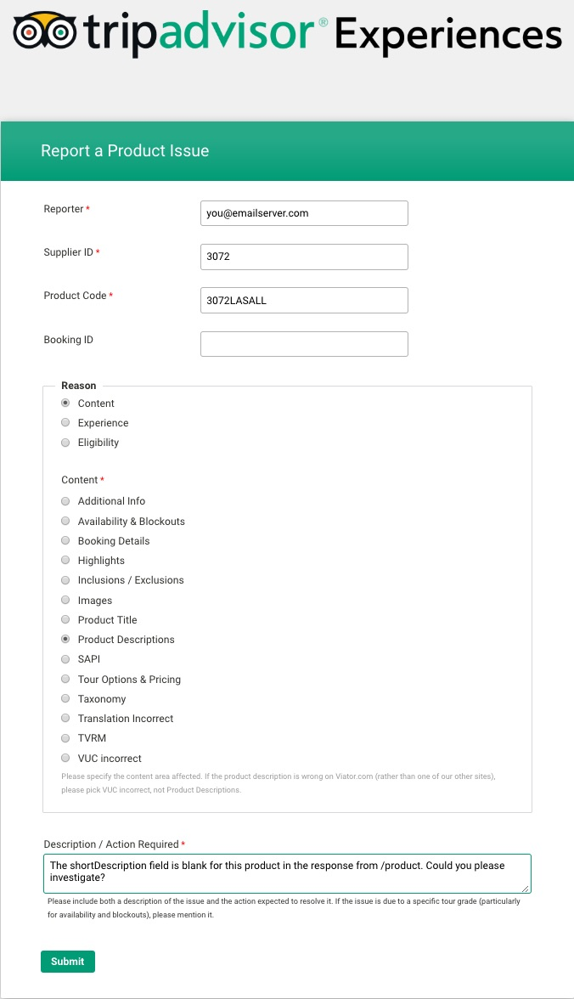

# How to report a product issue

Occasionally, a product schema in the Viator database will contain incorrect or invalid information. Usually, this occurs due to a mistake made by the supplier of the product when creating the product or updating its details.

Nonetheless, it's in all our best interests for product information to be accurate and up-to-date; therefore, if you discover a problem with a product, we would greatly appreciate it if you could report the error through our [product issue reporting form](https://www.tfaforms.com/433240).

## How to use the product issue reporting form

1. Navigate to the [product issue reporting page](https://www.tfaforms.com/433240)
2. Fill in the **Reporter**, **Supplier ID**, **Product Code** and **Booking ID** fields:

| Field | How to fill it in | Example |
|-------|-------------------|---------|
| Reporter | Enter your email address for tracking or correspondence | `you@emailserver.com` |
| Supplier ID | Enter the value returned in the `supplierCode` field by the [/product](../../../../openapi/reference/operation/product) service for the product in question. | `3072` |
| Product Code | Enter the value returned in the `code` field by the [/product](../../../../openapi/reference/operation/product) service for the product in question. | `3072LASALL` |
| Booking ID | Leave this field blank | |

3. In the **Reason** box below, choose **Content** by clicking on its radio selector. A list of categories will appear, with meanings as follows:

| Category | Included issues | 
|----------|---------|
| Additional Info | clauses in the `additionalInfo` array in the response from [/product](../../../../openapi/reference/operation/product); e.g., departure time or hotel pick-up information |
| Availability & Blockouts | N/A |
| Booking Details | N/A |
| Highlights | `highlights` array items in the response from [/product](../../../../openapi/reference/operation/product) |
| Inclusions / Exclusions | `inclusions` or `exclusions` array items in the response from [/product](../../../../openapi/reference/operation/product) |
| Images | `productPhotos` and `userPhotos` returned by [/product](../../../../openapi/reference/operation/product) or [/product/photos](../../../../openapi/reference/operation/productPhotos) |
| Product Title | `title` in the response from [/product](../../../../openapi/reference/operation/product), [/search/products](../../../../openapi/reference/operation/searchProducts), [/search/products/codes](../../../../openapi/reference/operation/searchProductsCodes) and [/search/products/freetext](../../../../openapi/reference/operation/searchFreetext) |
| Product Descriptions | `description` and `shortDescription` in the response from [/product](../../../../openapi/reference/operation/product)|
| SAPI | N/A |
| Tour Options & Pricing | pricing issues; e.g. when the value of `merchantNetPrice` is `0`; or, if `merchantNetPrice` > `price` |
| Taxonomy | <ul><li>destination issues in response from [/taxonomy/destination](../../../../openapi/reference/operation/taxonomyDestinations)</li><li>category / subcategory issues in response from [/taxonomy/categories](../../../../openapi/reference/operation/taxonomyCategories)</li></ul> |
| Translation Incorrect | mistakes in any natural-language field in the response from any service where `translationLevel` is non-zero |
| TVRM | N/A |
| VUC incorrect | N/A |

4. After selecting the category of issue from the options shown, fill-in the **Description / Action Required** box with a good, clear description of the problem and any specific additional actions you would like us to take
5. Click **Submit** to send the report

<figure>
    
    <figcaption>Example Report a Product Issue form</figcaption>
</figure>

Once your report has been submitted, a member of our Supplier Support Team will contact the supplier of the product in question to resolve any problems with their listing.