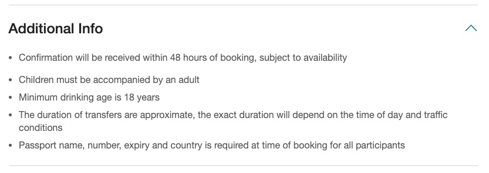
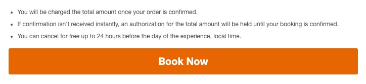
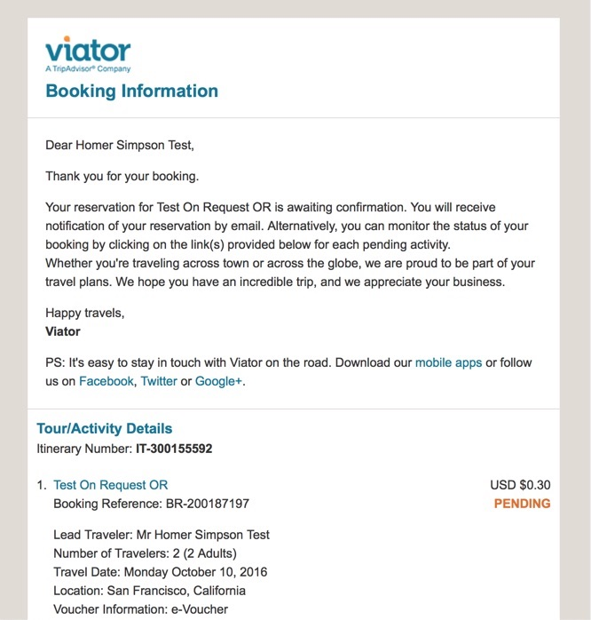
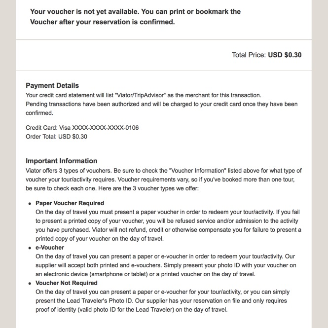
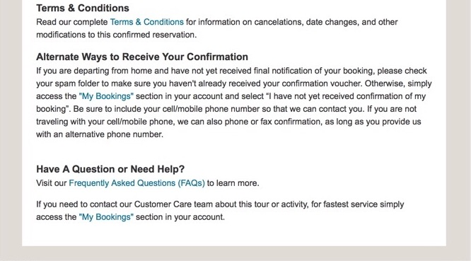

# Selling on-request products

This section explains what merchant API partners need to do in order to be granted access to (and, ultimately, sell) the many on-request products available in Viator's product catalogue.

## 'Freesale' vs 'on-request' products

Among the products in our inventory, a major differentiating feature is whether they are 'freesale' or 'on-request':

- **Freesale** products are always available to be booked on their days of operation; therefore, when a freesale product is purchased, the booking is confirmed and the customer is charged immediately.
- **On-request** products only operate at the discretion of the supplier, who must confirm (or reject) each booking request, which will remain 'pending' in the interim. The customer is only charged once confirmation is received.

### Access to on-request products

By default, you will only have access to the freesale product range; access to the on-request product range is restricted on account of the extra complexities involved with handling this kind of booking.

## Should I elect to sell on-request products?

### Business case for including on-request products in your inventory

While the majority of products in our inventory are 'freesale', a significant proportion remain 'on-request'. Upgrading your booking platform to support on-request products can lead to an increase in revenue of between 5% and 13%, depending on the locale(s) in which you operate.

| Locale | Revenue increase % |
|:------:|:------------------------:|
| en | 8% |
| es | 8% |
| fr | 11% |
| de | 10% |
| pt | 5% |
| nl | 12% |
| it | 10% |
| ja | 10% |
| sv | 8% |
| no | 8% |
| da | 13% |
| tw | 13% |
| zh | 6% |

Having a wider range of products on offer can be a key differentiator with respect to your competitors. 

Customers often purchase multiple products in the same session – if the product they're looking for isn't available on your platform, they are likely to seek a competitor with a more complete range of products for sale.

### Logistical considerations to enable on-request products

In order to sell on-request products, you will need to:

- Modify your back-end systems to support extra logic and API requests
- Establish and support an extra, email-based communications channel with your customers
- Create some email templates
- Modify your platform's front end to accommodate the extra steps required in the booking process
- Write copy that ensures customers clearly understand that they are booking a product that will not be confirmed or charged immediately

However, as the on-request booking confirmation process is fully automated, you will not need to:

- Undertake any additional manual steps compared with booking a freesale product
- Personally contact the product supplier or our partner support team

Instead, checking the status of bookings (whether confirmed or not) can be accomplished using the [/booking/status](../../../../openapi/reference/operation/bookingStatus) and [/booking/status/items](../../../../openapi/reference/operation/bookingStatusItems) services. These services can be polled periodically to determine the confirmation status of your bookings.

<u>**Note**</u>: We recommend using the [/booking/status/items](../../../../openapi/reference/operation/bookingStatusItems) service to poll for booking statuses, as it is both faster and can be polled more frequently than [/booking/status](../../../../openapi/reference/operation//bookingStatus), which can only be polled once every thirty minutes.

## How to support on-request products

### Product detail page

Managing customer expectations is a key factor in supporting on-request products on your booking platform. 

Make clear mention that this is a product for which confirmation will not be received immediately, but rather within 48 hours of making the booking.

This fact, as well as other pertinent tidbits, can be found in the `additionalInfo` array in the response from **/product**. It is mandatory that all clauses in the `additionalInfo` array are clearly displayed on your product detail page.

<figure>
    
    <figcaption>Additional info displayed on a product page on the Viator site
     </figcaption>
</figure>

### Check-out

As you will only charge the customer's credit card once the on-request booking is confirmed (i.e., after we have received confirmation of the booking from the product supplier) it's best to display a message to this effect at a prominent point of the check-out flow for all on-request products.

<figure>
    
    <figcaption>Example checkout-flow instruction on the Viator site</figcaption>
</figure>

In this way, customers can be reassured that they are not being charged for a booking that may never be confirmed, thereby minimizing needless calls to your customer service team.

### Combination purchases

If a single booking includes both freesale (instantly confirmed) and on-request products, only the amount for the freesale product should be charged immediately; the portion corresponding to the on-request booking should only be charged once confirmation is received. 

Until that time, a pre-authorization should be held against the customer’s credit card until confirmation is received.

It is important that you clearly differentiate between products that are confirmed and those that are pending confirmation, and communicate the status of each and that the pre-authorization will only finalize once the on-request products are confirmed.

### Confirmation page

Changes will need to be made to your confirmation page because it will not be possible for your customer to download a voucher after completing an on-request booking.

Vouchers for freesale products, however, must be made available immediately following the completion of the booking process.

### Email communications

You will need to create email templates for <u>all</u> the following scenarios:

- Confirmation emails for bookings with on-request products should indicate that the item is pending confirmation from the supplier; and, that confirmation for this activity will take up to 48 hours, depending on availability.
- If the on-request booking is confirmed by the supplier (this time including the voucher details)
- If the on-request booking is rejected
- If multiple on-request products have been booked:
    + If all items have been accepted/confirmed
    + If all items were rejected
    + If there is a mixture of acceptance and rejection; i.e., 'pending' + 'rejected' + 'cancelled' + 'amended' and so forth.
- If a mixture of freesale and on-request products are booked at the same time; i.e., in the same cart or booking

<u>**Note**</u>: When a booking is declined, it is useful to mention that the customer's card was not charged.

#### Example email for an on-request booking pending confirmation:

<figure>
    
    
    
</figure>

## Confirmation time-outs resulting in rejection

As mentioned above, once a booking for an on-request product is made, it remains in a 'pending' state, awaiting confirmation by the supplier. The supplier has the option of 'confirming' or 'rejecting' the booking.

Such bookings will not remain 'pending' indefinitely, however. If the supplier has not confirmed the booking within 72 hours – or if they have not confirmed the booking by the time it reaches 24 hours from departure – our systems will automatically reject the booking, and this will be reflected in the response from the [/booking/status/items](../../../../openapi/reference/operation/bookingStatusItems) and [/booking/status](../../../../openapi/reference/operation/bookingStatus) services.

There will be no indication that the rejection occurred on account of the supplier being unable to perform their duties. Therefore, you should simply inform the customer that, for reasons out of your control, this on-request tour was unavailable.

## Building in the sandbox environment

Upgrading your booking platform to support on-request products will require you to build and test this functionality in the sandbox environment. However, as no actual booking requests are made with the supplier when using a sandbox-only API-key, you will need to contact our API tech support team at [apitechsupport@viator.com](mailto:apitechsupport@viator.com) and request that the booking be confirmed or rejected as you require.

While necessary, this is a manual process. We'd genuinely appreciate your effort in keeping the number of these requests to a minimum.

## Certification and going live

Once you have completed all tasks mentioned here and sent your Viator account manager the email copy for the different scenarios [described above](#email-communications), we will change the status of your product API-key to include on-request products.