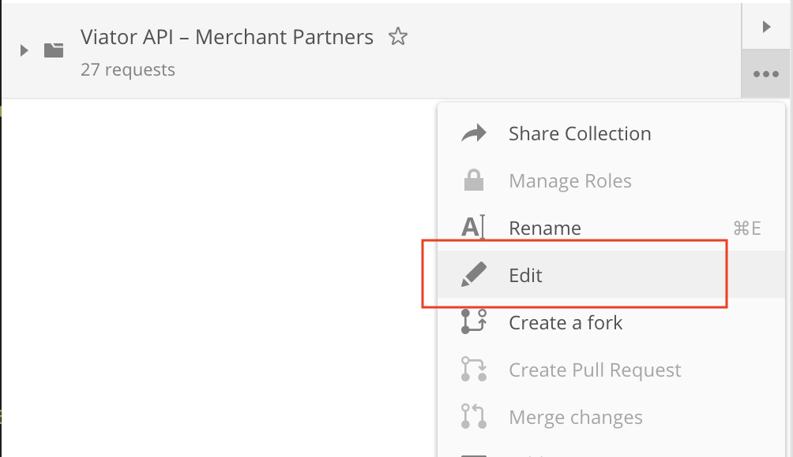
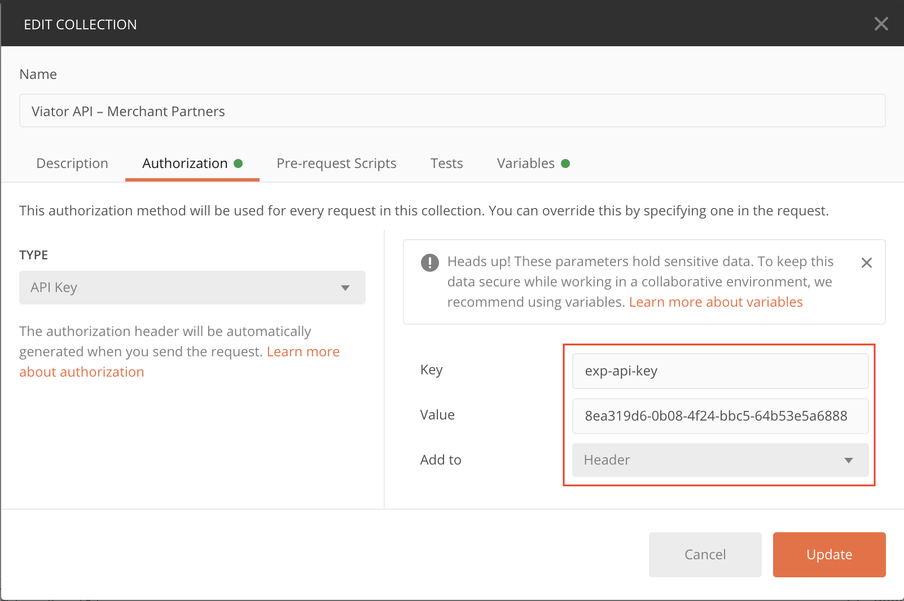

# Testing

## Postman collection for testing

To facilitate your testing of the APIs functionality in the sandbox environment, please use the following file, which can be loaded into the [Postman](https://www.getpostman.com/) API development environment via its **import** function:

  - [Merchant partner API Postman collection](https://docs.viator.com/partner-api/resources/merchant/technical/postman/Viator-API-merchant-Postman.json)

### Setting up API-key authentication in Postman

Before you start using the linked Postman collection for testing, you will need to set up the authorization method you wish to use. This can be either the new method (the `exp-api-key` <u>header</u> parameter) or, the legacy method (the `apiKey` <u>query</u> parameter).

While both methods remain available, we strongly recommend that you use the new method, as it:

1. Provides access to all languages available for your organization with a single API-key as opposed to one API-key per language
2. Allows access to the new [booking cancellation endpoints](../workflows/cancellation-api-workflow), as well as all newly-created endpoints in future
 
Please speak to your account manager if you are still using the legacy apiKey and would like to switch to our new authentication mechanism.

#### How to set up the new exp-api-key header parameter

1. Select **Edit** from the collection menu:

2. Set the following values:

* **Key**: `exp-api-key`
* **Value**: Your organization's single exp-api-key, which will have an identical format to that shown in the image below
* **Add to**: Header

3. Click **Update**

#### How to set up the legacy apiKey query parameter

1. Select **Edit** from the collection menu:

2. Set the following values:

* **Key**: `apiKey`
* **Value**: One of your organization's legacy apiKeys, which will have an identical format to that shown in the image below
* **Add to**: Query Params

3. Click **Update**