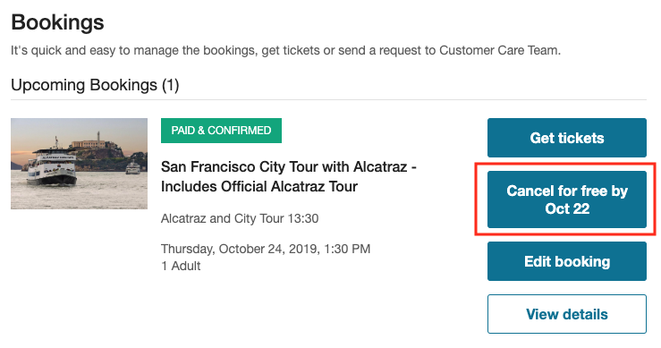
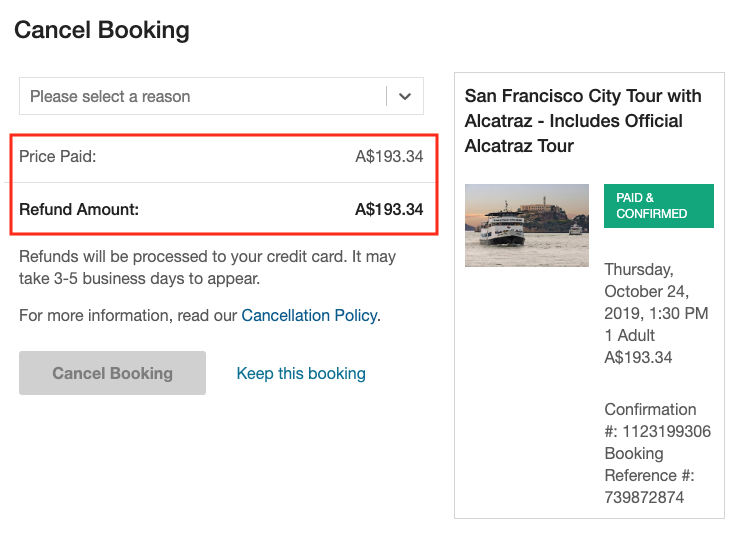
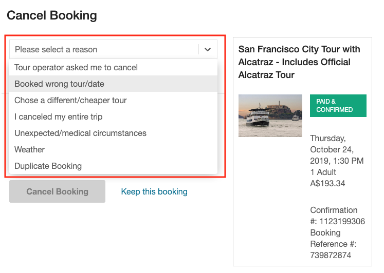
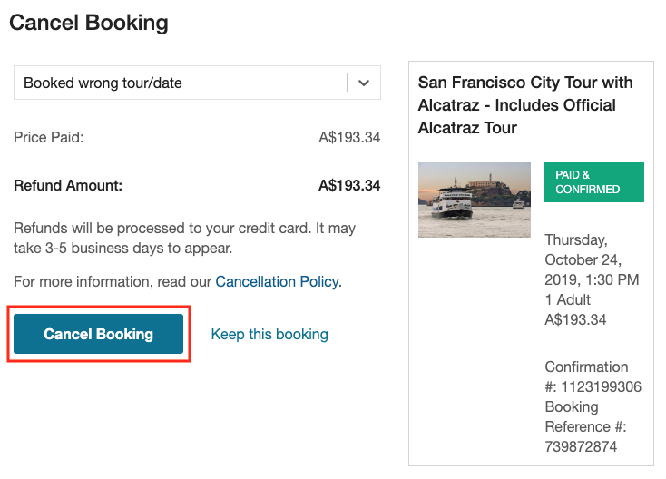
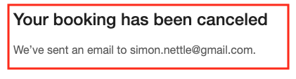
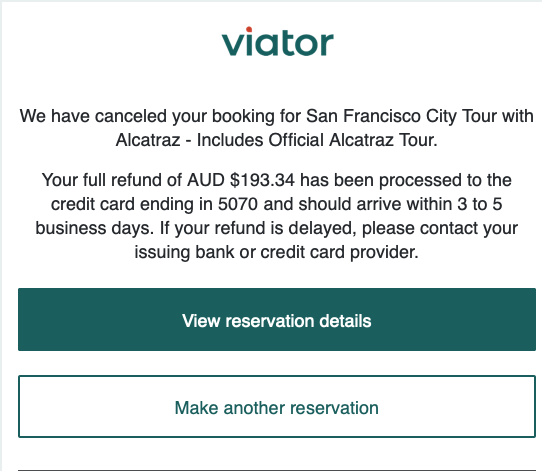
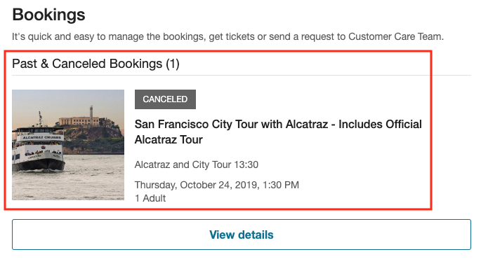

# Common workflows and data validation

Users of the API usually implement a booking process workflow. The common workflows are:
- [add to cart](#section/Common-workflows-and-data-validation/Add-to-cart)
- [checkout](#section/Common-workflows-and-data-validation/Checkout)
- [view voucher or confirmation status](#section/Common-workflows-and-data-validation/View-voucher-or-confirmation-status)
- [make a booking](#section/Common-workflows-and-data-validation/Booking-process-flow)

## Add to cart

### Summary

Because the Viator API is both stateless and does not include services for managing a customer's shopping cart, this functionality must be fully managed on the merchant's side.

Viator's servers can generate a price quote for one or several items, but this collection will not be saved by the server.

We recommend the following process:

1. **View product** - allow the customer to browse products and product details
2. **Select date and passengers** - allow the customer to check available dates and select the type and number of passengers
3. **Select tourgrade** - display the available tour grades
4. **View cart** -> **price quote** - display a total price (including multiple items)

### View product
From your *view product details* section, a button should be presented to **check availability** or **book now** or something similar. Use the [/product](#operation/product) service to retrieve product details and schedules.

### Select date and passengers
Here, the customer is presented with the dates that remain available for the product. Available dates can be obtained via a request to [/booking/availability/dates](#operation/bookingAvailabilityDates). The list of [age bands](#section/Key-concepts/Working-with-age-bands) (i.e.: 'adult', 'child'; and, each band's maximum and minimum age) is available from the [/product](#operation/product) service.

**Validation** – ensure that:
1. The total number of travelers being booked does not exceed the limit returned in the `maxTravellerCount` field of the [/product](#operation/product) service
2. *At least one* adult (or adult equivalent) passenger has been selected
3. The selected dates are available (use [/booking/availability/dates](#operation/bookingAvailabilityDates))

### Select tour grade

Once the date and traveler mix have been selected, the customer may need to select a tour grade. Products that do not have this information recorded in the Viator database are assigned a tour grade of `"DEFAULT"`. For these products, it is unnecessary to select a tour grade.

Tour grade options must be displayed to the customer when the product has multiple tour grades, due to:
- different departure times
- traveler mix price deals, like family passes
- different inclusions and prices - e.g., limo pickup, different language delivery options), or...
- non-default tour grades – these tour grades *must* be presented to the customer.

The tour grades for a product are retrieved with the [/booking/availability/tourgrades](#operation/bookingAvailabilityTourgrades) service. If a tour grade is available (check the `available` flag), an 'add to cart' button can be displayed. For unavailable tour grades (`available` is `false`), a reason (`unavailableReason`) is provided, which will be one of:

- `"TRAVELLER_MISMATCH"`
- `"BLOCKED_OUT"`, or
- `"UNAVAILABLE"`

You may choose to hide the blocked-out tour grades (if all tour grades are unavailable on a particular day, a day's tour grades are all `"BLOCKED_OUT"`, or the product is not operating that day, the [/booking/availability/dates](#operation/bookingAvailabilityDates) service will not return that date).

You may also find that a product has no bookable tour grades on a day if the traveler mix does not meet that tour grade's traveler mix restrictions. For example, a honeymoon might require two adults as the only possible traveler mix.

You can choose to hide the `"BLOCKED_OUT"` tour grades, but you will probably want to display the `"TRAVELLER_MISMATCH"` grades with the traveler mix requirements listed so that the customer can elect to alter their traveler mix to suit (e.g., for family passes, etc.) You cannot allow the passenger to book with an incompatible traveler mix.

The return object includes information about tour grade restrictions:

`ageBandsRequired`:
- `minimumCountRequired`: minimum number of travelers for an [age band](#section/Key-concepts/Working-with-age-bands)
- `maximumCountRequired`: maximum number of travelers for an [age band](#section/Key-concepts/Working-with-age-bands). If this field is `null`, any number of travelers may be booked.

You will need to present the `ageBandsRequired` information as in the following examples:

| In 'Adult' age band | Meaning |
|---------------------|---------|
| `minimumCountRequired` = 1<br>`maximumCountRequired` = 3 | From 1 to 3 adults |
| `minimumCountRequired` = 0<br>`maximumCountRequired` = 3 | up to three adults |
| `minimumCountRequired` = 3<br>`MaximumCountRequired` =  | 3 or more adults |
| `minimumCountRequired` = 2<br>`MaximumCountRequired` = 2 | 2 adults |


**Note:** There is a singular and plural version for each age band definition. We recommend automatically generating language that ensures the samples above are grammatically correct using this information.

The user can click **back** and change their traveler mix; or, they can try selecting another day.

### View cart / price quote

Once the item has been added to the cart, you will need to preserve this information as part of the session data in your back-end, or as a browser cookie. In particular, you will need to store the *product code* and *age band to quantity traveler mix*.

#### Sample PHP shopping cart item class
**Note:** this is only an example and is implementation dependent. Alternatively, you could use the item class (as used in the API calls), but much of the information it contains does not need to be stored:

```javascript
class shoppingCartItem {
  var $productCode;
  var $tourGrade;
  var $date;
  var $ageBandIdToQty; // assoc array
}
```

To obtain a price quote, you must call the [/booking/calculateprice](#operation/bookingCalculateprice) service. This service requires a currency code and an array of items to be specified. Each item contains the date, product code, tour grade code and an associative array of `ageBandIds` -> `quantity`.

**Validation** – the data must contain [valid age bands](#section/Key-concepts/Working-with-age-bands), tour codes, dates, etc. acquired in previous requests to the API.

**Note:** A product's availability can change in the time between API calls as tour grades or products may be blocked out, or the booking window may close for upcoming dates.

## Checkout

### Summary

The checkout process can be accomplished using the [/booking/book](#operation/bookingBook) service, but you may need to make requests to other services to calculate prices, display product information (age-band names, etc.) and list available pick-up hotels for user selection.

The Viator mobile website breaks the workflow down into three steps. For multiple items, some steps will need to be repeated, such as capturing the traveler names for each tour. In your implementation, you can reorganize/reorder the data collection to better suit your needs.

**Example workflow:**

1. **Collect traveler details** - collect the names of the lead traveler and all other travelers
2. **Collect travel details** - ask any additional questions, including those about any special requirements, and select pick-up options.
  - **Note:** the aforementioned steps will need to be repeated for each item)
3. **Collect booking details**
  - **Note:** billing and payment details *should not* be sent to Viator.

The classes for the booking request are defined here in Booking Data Classes. You will need implement these in your chosen programming language and verify that the correct JSON objects are generated during serialization.

### Traveler details

The traveler details are used to populate the `booking->items[]->travellers[]` objects.

One passenger must be identified as the "lead traveler". A boolean field in the traveler object represents this flag. The lead traveler must be an adult or have the age band `treatAsAdult` flag set to `true`.

All other travelers must be included.

**Validation** 

Ensure that:

  - `bandId` is a [valid age band ID](#section/Key-concepts/Working-with-age-bands) for the product
  - `firstname` is less than 16 chars
  - `surname` is less than 36 chars
  - `title` is not included unnecessarily (it is optional)
  - `leadTraveller` is set to `true` for one of the travelers who is in an [age band](#section/Key-concepts/Working-with-age-bands) that has the `treatAsAdult` flag set to `true`

### Other details

#### Booking questions

The travel details include the [booking questions](#section/Appendices/Booking-questions) that are supplied in the [/product](#operation/product) service.

**Sample question**

**Note:** There may be more than one.

```javascript
bookingQuestions: [{
  "message": "For safety reasons you must enter the weight of <b>all</b> passengers",
  "required": true,
  "questionId": 23,
  "title": "Passenger Weights",
  "subTitle": "(e.g. 127 pounds, 145 kilos, etc)",
  "sortOrder": 1
}]
```
The questions should be displayed with the title, message, subtitle and whether it is mandatory (required) or not.

**Validation** – if the question is mandatory, the user must enter at least one character.

#### Special requirements

'Special requirements' should be presented as a text input field so that customers can record whether they require wheelchair assistance, for example. It is not mandatory for the customer to enter any text.

#### Pick-up information

The last thing that must be collected for each item being booked is the pick-up information. If the product includes pick-up, the `hotelPickup` flag will be set to `true` (in the product object).

If pick-up is included, you will need to make a request to [/booking/hotels](#operation/bookingHotels) to determine if a hotel list exists. If it does, the list must be displayed so that the customer can make their selection. If not, a text input field should be displayed for hotel name collection.

Please note that the *first three results* in the list are *not* hotels; rather, these three are alternative selections, comprising:

- 'Hotel not listed'
- 'Live locally or staying with family/friends'
- 'Hotel not yet booked'

If the customer selects 'hotel not listed', you *must* provide a hotel selection text input field. For the other two options, no hotel name is required. In all cases, the hotel ID must be updated with either a hotel ID or the IDs of the three items listed.

If no hotel list is available, you must provide a text input field for collecting the customer's hotel name. Please include instructions to enter 'live locally' or 'hotel not yet booked' if they cannot provide a hotel name.

**Validation** – if hotel list is available, the `hotelId` must be supplied. If the `hotelId` is `notListed` the, `pickupPoint` field *must* have at least one character.

If a hotel list is not available, then `pickupPoint` must contain a value.

#### Language services

If the response from the [/product](#operation/product) service contains information in the `languageServices` field, e.g.:

```javascript
"langServices": {
  "en/SERVICE_AUDIO": "English - Audio"
}
```

...you must specify which language option you wish to book for this tour in the `languageOptionCode` field (see request body schema of the [/booking/book service](#operation/bookingBook)).

## View voucher or confirmation status

The object returned by the [/booking/book](#operation/bookingBook) service contains booking details that can be used to display an order summary to the customer.

Confirmed bookings of freesale products will return a `voucherKey` and `voucherURL`. The `voucherURL` is accessible by the customer to view their voucher.

Pending bookings of on-request products will return `null` in the `voucherKey`/`voucherURL` fields. These fields will only contain values once the booking is confirmed.

A `bookingStatus` object is included in the response that contains the status of the booking.

```javascript
"bookingStatus": {
  "status": 1,
  "text": "Paid &amp; Confirmed",
  "type": "CONFIRMED",
  "level": "ITEM",
  "failed": false,
  "confirmed": true,
  "amended": false,
  "pending": false,
  "cancelled": false
}
```

The status field corresponds to a number described in [bookingStatus field values and meanings](#section/Appendices/bookingStatus-field-values-and-meanings).

Boolean flags that you can inspect to determine the booking status of the item:
- `failed`
- `cancelled`
- `confirmed`
- `amended`
- `pending`

### Pending bookings
A booking is considered *pending* if the booking process is 'in progress'. For example, an on-request booking would be *pending* until it is confirmed/rejected by the supplier.

If a customer has made an amendment to an on-request booking that is yet to be accepted by the supplier, the booking would then have a status of *amended* when the supplier or customer service accepts the amendment.

**Example response object:**

```javascript
{
  "errorReference": null,
  "data": {
    "sortOrder": 0,
    "rulesApplied": [],
    "bookingStatus": {
      "status": 3,
      "text": "Confirmed",
      "type": "CONFIRMED",
      "level": "ITINERARY",
      "confirmed": true,
      "pending": false,
      "amended": false,
      "cancelled": false,
      "failed": false
    },
    "itemSummaries": [{
      "sortOrder": 0,
      "rulesApplied": [],
      "bookingStatus": {
        "status": 1,
        "text": "Paid &amp; Confirmed",
        "type": "CONFIRMED",
        "level": "ITEM",
        "pending": false,
        "failed": false,
        "confirmed": true,
        "amended": false,
        "cancelled": false
      },
      "travellerAgeBands": [{
        "sortOrder": 0,
        "count": 1,
        "pluralDescription": "Adults",
        "description": "Adult",
        "ageBandId": 1
      }],
      "voucherKey": "1005851866:4af44c13ecf3f1a7d3f9ef2fc00c2257e08fa42ae20f877f3039ff9b52aba24e:580669678",
      "voucherURL": "https://viatorapi.live.rc.viator.com/service/merchant/voucher.jspa?code=1005851866:4af44c13ecf3f1a7d3f9ef2fc00c2257e08fa42ae20f877f3039ff9b52aba24e:580669678&embedResources=false",
      "voucherRequirements": "You must present a paper voucher for this to",
      "productPulledDown": false,
      "merchantCancellable": true,
      "productWidgetList": null,
      "savingAmount": 0,
      "passbooks": null,
      "termsAndConditions": null,
      "itineraryId": 1000024753,
      "tourGradeCode": "1DAYBOAT",
      "productCode": "2065CPT",
      "leadTravellerSurname": "Test",
      "distributorItemRef": "distroItemRefJDP1803151135",
      "languageServicesLanguageCode": "en",
      "travelDate": "2016-02-01",
      "price": 3.72,
      "bookingEngineId": "UF",
      "merchantNetPrice": 3.51,
      "merchantNetPriceFormatted": "$3.51",
      "leadTravellerTitle": "Mr",
      "leadTravellerFirstname": "Homer",
      "lastRetailPrice": 3.51,
      "destId": 318,
      "voucherOption": "VOUCHER_PAPER_ONLY",
      "productTitle": "Cape Town City Hop-on Hop-off Tour",
      "itemId": 700025496,
      "barcodeOption": "perperson",
      "barcodeType": "code128",
      "obfsId": 3696,
      "priceFormatted": "$3.72",
      "savingAmountFormated": "",
      "priceUSD": 3.72,
      "lastRetailPriceFormatted": "$3.51",
      "departsFrom": "Cape Town, South Africa",
      "hoursConfirmed": 0,
      "currencyCode": "USD"
    }],
    "voucherKey": "1005851866:4af44c13ecf3f1a7d3f9ef2fc00c2257e08fa42ae20f877f3039ff9b52aba24e:580669678",
    "voucherURL": "https://viatorapi.live.rc.viator.com/service/merchant/voucher.jspa?code=1005851866:4af44c13ecf3f1a7d3f9ef2fc00c2257e08fa42ae20f877f3039ff9b52aba24e:580669678&embedResources=false",
    "bookerEmail": "apitest@viator.com",
    "userId": null,
    "itineraryId": 1000024753,
    "exchangeRate": 1,
    "totalPriceFormatted": "$3.51",
    "totalPriceUSD": 3.51,
    "bookingDate": "2015-03-17",
    "distributorRef": "distroRefJDP1803151135",
    "totalPrice": 3.51,
    "hasVoucher": true,
    "currencyCode": "USD"
  },
  "dateStamp": "2015-03-17T17:36:32+0000",
  "errorType": null,
  "errorMessage": null,
  "errorName": null,
  "success": true,
  "totalCount": 1,
  "vmid": "321003",
  "errorMessageText": null
}
```

### Checking the status of bookings

#### Checking the status of a single booking:

- [/booking/mybookings](#operation/bookingMybookings) can be used to check the status of a booking after it has been purchased. This is useful for checking the status of a pending booking, particularly if there are multiple items within the booking.

  It is recommended that you poll the service no more than once per hour.

#### Checking the status of multiple bookings:

- [/booking/status](#operation/bookingStatus) will return the status of all bookings, based on the following:
  - booking date range
  - travel date range
  - specific distributor/distributor item references
  - lead traveler date/first name

This is useful for checking the status of recently-made, but still *pending* bookings, or those that will commence soon.

**Note:** You can only poll this service (successful calls) once every 30 minutes.

### Confirming the booking via email

Upon receiving a successful response from [/booking/book](#operation/bookingBook), merchant partners should confirm the booking with the customer via email. This email must be sent by the merchant partner (not Viator).

#### Sample confirmation email

<pre>
Dear Traveller,

Thank you for booking with [PARTNER NAME] on [www.domain.com]. Your booking is confirmed. This is your booking notification and receipt. Please retain this email for your records.

Please note:

We offer three types of vouchers. Be sure to check below for what type of voucher your tour / activity requires. Voucher requirements vary by tour, so if you've booked more than one tour, be sure to check each one. See below for instructions.

HOTEL/FLIGHT ITINERARY
-----------------------------------------------------------------------
[Your standard reply here]

TOURS
-----------------------------------------------------------------------

1. Name: Whale Watching Cruise
  e-Voucher or Paper Voucher Accepted
  You can present either a paper or an electronic voucher for this activity.
  Voucher: [VOUCHERURL]
  Please click on the above link, follow the directions, and print your voucher to present as per instructions on the voucher under 'Important Information'.
2. Name: Boston City Pass
  Paper Voucher Required
  You must present a paper voucher for this tour. Voucher: [VOUCHERURL]
  Please click on the above link, follow the directions, and print your voucher to present as per instructions on the voucher under 'Important Information'.
3. Name: SuperShuttle Airport Transfer
  Voucher Not Required
  You must present a paper voucher for this tour. Voucher: [VOUCHERURL]
  You can present a paper or electronic voucher for this activity, or you can simply present the Lead Traveller’s Photo ID. Our supplier has your reservation on file and only requires proof of identity on the day of travel.

IMPORTANT INFORMATION
-----------------------------------------------------------------------
[Your standard reply here]

TERMS AND CONDITIONS
-----------------------------------------------------------------------
[Your standard reply here]
</pre>

## Booking process flow

In this section, we show a sample booking process flow using Viator API services.

### Search for a product

1. Determine the `destinationId` for the desired destination using the [/taxonomy/destinations](#operation/taxonomyDestinations) service.
2. Search for products in the destination with the [/search/products](#operation/searchProducts) service using the `destinationId`, along with optional parameters like the date range (`startDate` and `endDate`), attraction link (`seoId`), category (`catId`) and subcategory (`subCatId`).

#### Example [/search/products](#operation/searchProducts) POST request body:

```javascript
{
  "startDate": "2018-12-25",
  "endDate": "2018-12-28",
  "topX": "1-15", 
  "destId": 684, 
  "currencyCode": "USD",
  "sortOrder": "TOP_SELLERS"
}
```
**Note**: the `startDate` and `endDate` must be in the future.

3. Get the product details with the [/product](#operation/product) service.

#### Example parameters for a [/product](#operation/product) GET request:

```html
code=5010SYDNEY&currencyCode=USD
```

### Determine the product's available dates

Use the [/booking/availability/dates](#operation/bookingAvailabilityDates) service to retrieve a list of dates on which the product is operating. This list can be used to populate a calendar display of available dates.

#### Example parameters for an availability check using the [/booking/availability/dates](#operation/bookingAvailabilityDates) service:

```html
productCode=5010SYDNEY
```

### Determine the available age bands for the product

Because the product option (tour grade) availability check requires the desired passenger mix, the user will first need to select the number of travelers and the age band into which each can be classified.

Note: The exact ages to which each age band refers to differs between products. See [Working with age bands](#section/Key-concepts/Working-with-age-bands) for more information.

1. Determine the number of passengers/travelers (and their respective agebands) by having the user input the passenger mix for which they wish to make a booking.
2. Check for available tour grades for the date chosen using the [/booking/availability/tourgrades](#operation/bookingAvailabilityTourgrades) service; or, check for available tour grades by month using the [/booking/availability/tourgrades/pricingmatrix](#operation/bookingAvailabilityTourgradesPricingmatrix) service

#### [/booking/availability/tourgrades](#operation/bookingAvailabilityTourgrades) POST request:
```javascript
{
  "productCode": "5010SYDNEY",
  "bookingDate": "2018-12-05",
  "currencyCode": "USD",
  "ageBands": [
    {      
      "bandId": 1,
      "count": 2    
    }  
  ]
}
```

#### [/booking/availability/tourgrades/pricingmatrix](#operation/bookingAvailabilityTourgrades) POST request:
```javascript
{
  "productCode": "5010SYDNEY",
  "month": "12",
  "year": "2018",
  "currencyCode": "USD"
}
```
3. Finalize pricing using the [/booking/availability/tourgrades/pricingmatrix](#operation/bookingAvailabilityTourgradesPricingmatrix) service. 
  - **Note**: we strongly recommend using the [/booking/calculateprice](#operation/bookingCalculateprice) service prior to making the booking, as it reconfirms the product availability for the specified dates and passenger mix.

4. Make the booking
  - Note that the [/booking/book](#operation/bookingBook) service supports multi-item bookings. The response from the [/product](#operation/product) service indicates mandatory information that must be sent when making the booking, such as required [booking questions](#section/Appendices/Booking-questions) and hotel pick-up options.
  - For hotel pick-up:
    - Send a hotel ID to the [/booking/book](#operation/bookingBook) service if `hotelPickup` is `true` for the product.
    - [/booking/hotels](#operation/bookingHotels) can be used to return a list of hotels available for the product.
    - The `hotelId` is the `id` field in the response from the [/booking/hotels](#operation/bookingHotels) service. This can be:
      -  a number (represented as a string) – e.g., `'4119'`
      -  `'local'` – if the customer resides near the location in which the product operates 
      -  `'notBooked'` – if the customer's hotel is not yet booked
      -  `'notListed'` – if the customer's hotel is not listed in the response from [/booking/hotels](#operation/bookingHotels). If this is the case, capture the customer’s hotel details in a text box and pass this information in the `pickupPoint` field in the request body of the [/booking/book](#operation/bookingBook) service.

#### [/booking/book](#operation/bookingBook) POST request example:

```javascript
{
  "demo": true,
  "currencyCode": "USD",
  "partnerDetail": {
      "distributorRef": "distributorRef1550616101308"
  },
  "booker": {
      "firstname": "Homer Test",
      "surname": "Simpson Test",
      "title": "Mr",
      "email": "apitest@viator.com",
      "homePhone": "(02)66987564"
  },
  "items": [
    {
      "partnerItemDetail": {
        "distributorItemRef": "distributorItemRef1550616101308"
      },
      "hotelId": null,
      "pickupPoint": null,
      "travelDate": "2019-03-19",
      "productCode": "5010SYDNEY",
      "tourGradeCode": "24HOUR",
      "languageOptionCode": "en/SERVICE_GUIDE",
      "bookingQuestionAnswers": [
        {
          "questionId": 100,
          "answer": "120 kgs"
        }
      ],
      "specialRequirements": "",
      "travellers": [
        {
          "bandId":1,
          "firstname": "Homer",
          "surname": "Simpson Test",
          "title": "Mr",
          "leadTraveller": true
        }, {
          "bandId": 1,
          "firstname": "Marge",
          "surname": "Merchant Viator Test",
          "title": "Mrs"
        }
      ]
    }
  ]
}
```

#### [/booking/hotels](#operation/bookingHotels) GET example parameters:

```html
productCode=5010SYDNEY
```
or
```html
destId=684
```

5. You will receive different booking statuses depending on the product's booking engine. 
  - For products that are free-sale (`'FreesaleBE'`), unconditional free-sale (`'UnconditionalBE'`) and free-sale / on-request (`'FreesaleOnRequestBE'`) - i.e., during the free-sale period, confirmation should occur instantly. 
  - The `'FreesaleOnRequestBE'` status means that the product will only remain free-sale up until a certain number of days before the travel date, after which it becomes on-request. 
  - Normally, if the product is on-request, its booking status will be `'Pending'`.

### Post-booking

#### Displaying vouchers

To display the voucher to your customer, direct them to the URL returned in the `voucherURL` field in the response from the [/booking/book](#operation/bookingBook) service.

**Note**: the voucher will not be available until the booking is confirmed – the value of the `hoursConfirmed` field in the response from the [/booking/book](#operation/bookingBook) service can be shown to the customer to indicate the time frame within which they are likely to be notified as to their booking confirmation.

#### Viewing bookings

- To view a **single** booking, use the [/booking/pastbooking](#operation/bookingPastbooking) service, which returns one booking at a time. 
- To retrieve **all** bookings for a customer, use the [/booking/mybookings](#operation/bookingMybookings) service.

#### Viewing booking statuses

To view the booking statuses for multiple items based on various criteria, use the [/booking/status](#operation/bookingStatus) service.

Note that this service can only be polled once every five minutes. Ideally, this service should be used by your software implementation to perform bulk updates of pending itineraries. The maximum number of itinerary results returned is 1,000.

#### `merchantNetPrice` and `price` in the [/search/products](#operation/searchProducts) service

The difference between these fields is as follows:

- `merchantNetPrice` is the amount you, as the merchant partner will be invoiced for, excluding any fees.
- `price` is the price at which Viator sells the product

**Note**: these prices are also returned (per age band) by the following services:

- [/booking/availability/tourgrades/pricingmatrix](#operation/bookingAvailabilityTourgradesPricingmatrix)
- [/booking/pricingmatrix](#operation/bookingPricingmatrix)
- [/booking/book](#operation/bookingBook)

### Currency considerations for bookings

If the booking shows prices converted to and formatted according to a different currency to that in which it was made, it is because each API partner has a particular 'base currency', and all bookings will be made in that currency.

### Booking and transaction fees

The total price may be different to the `merchantNetPrice` due to the fact that a booking fee – i.e., a transaction fee or commission – is added to all bookings.

This fee is a fixed percentage with a capped maximum. The exact percentage depends on your merchant partner agreement with Viator and can be found in your contract with Viator.

### Making demo bookings

To make a demo booking, simply set the `demo` field to `true` in the [/booking/book](#operation/bookingBook) service.

While demo bookings are allowed on the live production environment, we recommend not doing so as it is possible that a notification could be sent to the supplier. Performing a cancellation of the demo booking is therefore recommended.

To cancel the booking, partners should use the [/bookings/{id}/cancel](#operation/cancelBooking) service. For details on canceling a booking, see: [Cancellation API workflow](#section/Common-workflows-and-data-validation/Cancellation-API-workflow)

## Cancellation UX

On the Viator.com website, once the customer has made a booking, they are able to access the details of all their upcoming, past and cancelled bookings by navigating to the **bookings** section of the website.

You must communicate to the user the terms and conditions that pertain to canceling their booking; i.e., what to expect in terms of the refund they will receive if they were to cancel their booking now.

On the Viator website, this information is communicated in the cancellation button text. In the following example, the user has booked the "San Francisco City Tour with Alcatraz", and is viewing their **bookings** page.

In this way, the user is told that they can "cancel for free by Oct 22" – i.e., they will be issued a full refund if they cancel the product prior to October 22:



This text is programmatically generated by inspecting the product's cancellation policy, which is contained within the `merchantTermsAndConditions` object, which is included in the response object from the following endpoints:

- [/booking/book](/partner-api/merchant/technical/#operation/bookingBook)
- [/booking/pastbooking](/partner-api/merchant/technical/#operation/bookingPastbooking)
- [/booking/mybookings](/partner-api/merchant/technical/#operation/bookingMybookings)

For details on how to interpret the `merchantTermsAndConditions` object, see: [Cancellation policy](#section/Key-concepts/Cancellation-policy)

Once the user clicks the button labelled: **Cancel for free by Oct 22**, they are brought to the cancellation confirmation page, where they are provided a more formal cancellation quote prior to confirming their intention to cancel the product.

### Cancellation refund display

As the merchant of record, the amount your customer was charged for the product was your decision; therefore, the amount that you elect to grant the customer as a refund is also up to you, so you will need to retrieve the amount the customer has paid for the product from your own records/databases.

The amount that Viator would have invoiced you for the booking – equivalent to the merchant net price at the time of booking plus the transaction fee – can be retrieved using the [/bookings/{booking-ref}/cancel-quote](#operation/cancelBookingQuote) endpoint. For more information see: [Get a cancellation quote](#get-a-cancellation-quote)

Here, the customer is shown that they will receive a full refund if they cancel the product now:



### Displaying and choosing cancellation reasons

At this point in the workflow, the user must select a reason for their cancellation. Viator's systems require that a reason for the cancellation be given in order to carry out the cancellation process.

As the set of acceptable reasons for canceling a booking are formally specified by the Viator Partner API and are not necessarily immutable (new reasons may be added at any time) you should retrieve the presently available cancellation reasons from the [/bookings/cancel-reasons](#operation/cancellationReasons) endpoint. We require you to present these to the customer for them to select.

Use the `cancellationReasonText` fields in the response to populate the list from which the customer can select the most-appropriate match for why they are canceling, as on the Viator website:



For more information about getting cancellation reasons, see: [Getting cancellation reasons](#getting-cancellation-reasons)

**Note**: As it is necessary for the user to provide a cancellation reason, it is required that the **Cancel Booking** button remain disabled until a reason has been selected by the customer.

### Completing the cancellation

Once the user has selected a reason, the **Cancel Booking** button can be activated:



Clicking the **Cancel Booking** button is the final action required of the customer to complete the cancellation.

At this point, you will want to cancel the booking using the [/bookings/{booking-ref}/cancel](#operation/cancelBooking) API endpoint. For more information on using this service, see: [Cancel the booking](#cancel-the-booking)

### Obtaining confirmation for the cancellation

On the Viator.com site, the following confirmation message is displayed on the page that loads after the **Cancel Booking** button is clicked:



### Cancellation confirmation email

Once the cancellation is accepted, a short, succinct email informing the customer that their booking has been successfully canceled is sent immediately:



### Viewing canceled bookings

Clicking on the **View reservation details** button in the cancellation confirmation email returns the customer to their bookings page, where the fact of the booking being canceled is communicated clearly:



## Cancellation API workflow

### Note:

- All booking cancellations (except for those requested after the date of travel) must now be performed via the API. Viator no longer offers ordinary cancellation services via our customer support function.
- To cancel a booking after the tour or activity has occurred, please contact [Viator Partner Support](mailto:dpsupport@viator.com)
- **Legacy API keys:** Bookings made via the [v1 /booking/book](#operation/bookingBook) endpoint using a [v1 legacy API key](#section/Authentication/Legacy-API-keys) can be canceled using the [v2 cancellation endpoint](#operation/cancelBooking) and a [v2 API key](#section/Authentication/API-key) so long as the [legacy (v1) API key](#section/Authentication/Legacy-API-keys) used to make the booking is linked to the partner's [v2 API key](#section/Authentication/API-key).


### Getting cancellation reasons
<a id="getting-cancellation-reasons"></a>

When canceling a booking, you are required to submit a valid 'reason for the cancellation' to assist with Viator's internal processes. This is accomplished via the inclusion of a valid reason code in the body of the request. The reason codes can be retrieved from the [/bookings/cancel-reasons](#operation/cancellationReasons) endpoint.

As the acceptable reasons for cancellation may be extended at any point (existing reasons will not change or be removed), we recommend retrieving an up-to-date list from this endpoint at least weekly.

The output from the [/bookings/cancel-reasons](#operation/cancellationReasons) endpoint at the time of writing is as follows:

```javascript
{
    "reasons": [
        {
            "cancellationReasonCode": "Customer_Service.I_canceled_my_entire_trip",
            "cancellationReasonText": "I canceled my entire trip"
        },
        {
            "cancellationReasonCode": "Customer_Service.Booked_wrong_tour_date",
            "cancellationReasonText": "Booked wrong tour/date"
        },
        {
            "cancellationReasonCode": "Customer_Service.Duplicate_Booking",
            "cancellationReasonText": "Duplicate Booking"
        },
        {
            "cancellationReasonCode": "Customer_Service.Chose_a_different_cheaper_tour",
            "cancellationReasonText": "Chose a different/cheaper tour"
        },
        {
            "cancellationReasonCode": "Customer_Service.Weather",
            "cancellationReasonText": "Weather"
        },
        {
            "cancellationReasonCode": "Customer_Service.Unexpected_medical_circumstances",
            "cancellationReasonText": "Unexpected/medical circumstances"
        },
        {
            "cancellationReasonCode": "Customer_Service.Tour operator asked me to cancel",
            "cancellationReasonText": "Tour operator asked me to cancel"
        }
    ]
}
```

### Canceling a booking

#### Getting a cancellation quote
<a id="get-a-booking-cancellation-quote"></a>

Before canceling the booking, call the [/bookings/{booking-reference}/cancel-quote](#operation/cancelBookingQuote) endpoint to get information about whether the booking can be canceled using this endpoint and what the refund will be, for example:

```html
GET https://api.viator.com/partner/bookings/BR-580254558/cancel-quote
```

**Note**: For information about the **{booking-reference}** in URL parameter, see [Key concepts: Booking references](#section/Key-concepts/Booking-references)

You will receive a cancellation quote object, e.g.:

```javascript
{
    "bookingId": "BR-580254558",
    "status": "CANCELLABLE",
    "refundDetails": {
        "itemPrice": 109.77,
        "refundAmount": 109.77,
        "currencyCode": "USD",
        "refundPercentage": 100.00
    }
}
```

 **Note**: Bookings that have not been confirmed by the supplier and have a status of `"PENDING"` will report an `itemPrice`, `refundAmount` and `refundPercentage` of `0`, as no fees are charged until the booking's status is `"CONFIRMED"`.

The data elements in this object have meanings as follows:

| Element | Meaning | Example |
|---------|---------|---------|
| `bookingId` | the booking reference number prepended with `BR-` | `BR-580254556` |
| `status` | One of the following: <ul><li>`CANCELLABLE`: the booking is eligible to be cancelled</li><li>`CANCELLED`: the booking has already been cancelled</li><li>`NOT_CANCELLABLE`: the booking is for a product that operated in the past, and therefore cannot be cancelled using this endpoint (you will need to [send an email to dpsupport](mailto:dpsupport@viator.com) including both "CANCEL" and the booking reference number in the subject line in order to request a refund for such a booking)</li></ul> | `CANCELLABLE` |
| `refundDetails` | object containing information about the refund | |
| `itemPrice` | the **merchant net price** + **transaction fee** for this product at the time of booking in the currency specified by `currencyCode` | `109.77` |
| `refundAmount` | the amount that will be deducted from your invoice if the booking is cancelled now | `109.77` |
| `currencyCode` | the currency code for the currency in which pricing information is displayed | `USD` |
| `refundPercentage` | the refund amount expressed as a percentage of the `itemPrice` | `100.00` |

#### Canceling the booking
<a id="cancel-the-booking"></a>

If the `status` field has a value of `CANCELLABLE` and you are happy with the `refundAmount`, call the [/bookings/{booking-ref}/cancel](#operation/cancelBooking) endpoint to cancel the booking, e.g.:

```html
POST https://api.viator.com/partner/bookings/BR-580254558/cancel
```

A reason code corresponding to the reason for cancellation must be included in the request body; e.g.:

```javascript
{
  "reasonCode":"Customer_Service.Chose_a_different_cheaper_tour"
}
```

You should receive a response indicating that the cancellation was successful, e.g.:

```javascript
{
    "bookingId": "BR-580254558",
    "status": "ACCEPTED"
}
```

A `status` of `ACCEPTED` indicates that the booking was successfully canceled.

## Calculating prices

The [/booking/calculateprice](#operation/bookingCalculateprice) service is used to calculate a total price for one or more products, with the ability to specify the date and passenger mix for each product individually. 

It also reconfirms the availability and pricing of the products for the requested dates and passenger mixes. We strongly recommended that you call this service prior to [making a booking](#section/Common-workflows-and-data-validation/Making-a-booking) to establish that the booking will succeed once submitted.

This endpoint is useful when implementing a shopping cart, as multiple product bookings can be enquired about in a single call to this service.

#### Example request body (JSON)

```javascript
{
  "currencyCode": "USD",
  "items": [{
    "travelDate": "2015-03-01",
    "productCode": "2916ROME",
    "tourGradeCode":"24HR",
    "travellers": [
      {
        "bandId": 1
      },
      {
        "bandId": 1
      }
    ]
  }]
}
```
The quirky `travellers` array is used to specify the number of travellers in each age band. Each member object of this array corresponds to a single traveller. The example above signifies "two adults from bandId: 1".

Another example might be "three travelers from bandId:1 and two travelers from bandId:2". That would be as follows:

```javascript
"travellers": [
  {
    "bandId": 1
  },
  {
    "bandId": 1
  },
  {
    "bandId": 1
  },
  {
    "bandId": 2
  },
  {
    "bandId": 2
  }
]
```

- **Note**: See [Working with age bands](#section/Key-concepts/Working-with-age-bands) for more information.

#### Price information

The **total price** (i.e., including the transaction fee) that you will be invoiced for the products to be booked is given in the following fields in the response from this service:

- `data.itemSummaries[].price` (numeric total price of item)
- `data.itemSummaries[].priceFormatted` (currency formatted total price of item) 
- `data.itinerary.totalPrice` (numeric total price of item)
- `data.itinerary.totalPriceFormatted` (currency-formatted total price of item)

For more information about pricing fields and their meaning throughout this API, see: [Merchant pricing](#section/Key-concepts/Merchant-pricing).

#### Determining whether the product is 'freesale' or 'on request'

You can determine whether the booking is *freesale* or *on-request* by examining the response from this endpoint. 'Freesale' bookings are those that are confirmed immediately (with a status of `"CONFIRMED"`) when booked, while *on-request* bookings are instead confirmed by the supplier at a later time. 

The approximate time window for confirmation is provided in the `hoursConfirmed` (integer) field. This can be presented to the customer. 

- An `hoursConfirmed` of `0` means that the booking is *freesale*. 
- An `hoursConfirmed` greater than `0` indicates that the booking is *on-request*.

## Finding hotel pick-up points

### Hotel pickup example:

#### Example response body ([/booking/hotels](#operation/bookingHotels))
```javascript
{
  "vmid":"221002",
  "errorMessage": null,
  "errorType": null,
  "dateStamp": "2012-04-12T13:48:27+0000",
  "success": true,
  "errorReference": null,
  "errorMessageText": null,
  "totalCount": 1,
  "errorName": null
  "data": [
    {
      "address": null,
      "name": "I live locally / I'm staying with friends, relatives",
      "id": "local",
      "phone": null,
      "productCodes": null,
      "destinationId": 0,
      "city": null,
      "notes": null,
      "latitude": null,
      "longitude": null,
      "postcode": null,
      "brand": null,
      "hotelString": "I live locally / I'm staying with friends, relatives",
      "sortOrder": 1
    },
    {
      "address": null,
      "name": "My hotel is not yet booked",
      "id": "notBooked",
      "phone": null,
      "productCodes": null,
      "destinationId": 0,
      "city": null,
      "notes": null,
      "latitude": null,
      "longitude": null,
      "postcode": null,
      "brand": null,
      "hotelString": "My hotel is not yet booked",
      "sortOrder": 2
    },
    {
      "address": null,
      "name": "My hotel is not listed",
      "id": "notListed",
      "phone": null,
      "productCodes": null,
      "destinationId": 0,
      "city": null,
      "notes": null,
      "latitude": null,
      "longitude": null,
      "postcode": null,
      "brand": null,
      "hotelString": "My hotel is not listed",
      "sortOrder": 3
    },
    {
      "address": "375 East Harmon Avenue",
      "name": "Alexis Park Resort Hotel",
      "id": "684_2",
      "phone": "",
      "productCodes": null,
      "destinationId": 684,
      "city": "Las Vegas",
      "notes": null,
      "latitude": 36.106258,
      "longitude": -115.156146,
      "postcode": "89169",
      "brand": "",
      "hotelString": null,
      "sortOrder": 4
    },
    {
      "address": "167 East Tropicana Avenue",
      "name": "Americas Best Value Inn",
      "id": "684_3",
      "phone": "",
      "productCodes": null,
      "destinationId": 684,
      "city": "Las Vegas",
      "notes": null,
      "latitude": 36.100778,
      "longitude": -115.165522,
      "postcode": "89109",
      "brand": "",
      "hotelString": null,
      "sortOrder": 5
    },
    {
      "address": "3131 Las Vegas Boulevard South",
      "name": "Wynn Resort",
      "id": "684_126",
      "phone": "",
      "productCodes": null,
      "destinationId": 684,
      "city": "Las Vegas",
      "notes": null,
      "latitude": 36.127563,
      "longitude": -115.167704,
      "postcode": "89109",
      "brand": "",
      "hotelString": null,
      "sortOrder": 119
    }
  ]
}
```
## Making a booking

To make a booking, use the [/booking/book](#operation/bookingBook) service.

To make a *real* booking, ensure `demo` is set to `false` in the booking request.

Demo bookings will enter our system as a test booking and will not charge the merchant. To enable demo bookings, set `demo` to `true` in the booking request and pass `"test"` as the traveler's first or last name.

**Note:** Avoid testing on **Live**, as the booking may be sent to the supplier (depending on the product). Any test bookings on live must be cancelled via the [/bookings/{id}/cancel](#operation/cancelBooking) service; or, contact dpsupport@viator.com if you experience any other issues.

### distrbutorRef and distributorItemRef

The `distributorRef` and `distrbutorItemRef` fields are the merchant partner's own reference for the booking. All merchant partners must pass a `distributorRef` and a `distributorItemRef` in all bookings.

It can be any alphanumeric string, and in for the `distrbutorRef`, it must be unique to bookings made by the merchant.

If an existing `distributorRef` is passed, the booking with the matching `distributorRef` will be returned in the response, and a new booking will not be made.

Please see the description for these fields in the table below for more information.

**Example request**

```javascript
{
  "demo": true,
  "currencyCode": "USD",
  "partnerDetail": {
    "distributorRef": "distroRef0412141435"
  },
  "booker": {
    "email": "apitest@viator.com",
    "firstname": "Homer Test",
    "surname": "Simpson Test",
    "title": "Mr"
  },
  "items": [{
    "partnerItemDetail": {
      "distributorItemRef": "distroItemRef0412141435_1"
    },
    "hotelId": null,
    "pickupPoint": null,
    "travelDate": "2015-03-31",
    "productCode": "2916ROME",
    "tourGradeCode": "24HR",
    "languageOptionCode": "en/SERVICE_GUIDE",
    "bookingQuestionAnswers": [{
      "questionId": 100,
      "answer": "120 kgs"
    }],
    "specialRequirements": "",
    "travellers": [{
      "bandId": 1,
      "firstname": "Homer",
      "surname": "Simpson Test",
      "title": "Mr",
      "leadTraveller": true
    }]
  }]
}
```

**Description of JSON request parameters**

| Object name | Element name | Type | Comments | Mandatory |
|-------------|--------------|:----:|----------|:---------:|
|        | `demo`      | boolean | If this is set to True, then it is a demo booking only. Full demos do not send any notifications, are automatically confirmed and OnRequest products become freesale products. Default value is true. Production must have `demo` set to `false`. | ❌ |
|        | `currencyCode` | string | The currency the booking will be submitted in. You will be billed in this currency. | ❌ |
| `partnerDetail` | | object | Applicable only for extra partner detail for either partner or merchant partner for sending partner specific information | ❌ |
|  | `distributorRef` | string | Merchant API partners must pass a `distributorRef` at itinerary level in the `partnerDetails` object. The `distributorRef` passed must be alphanumeric and unique to bookings made by the merchant. Passing an existing `distributorRef`: If an existing distributorRef is passed, the booking with the matching `distributorRef` will be returned in the response and a new booking will not be made. The fields in the response are identical to the response for a new booking.| ✅ |
| `partnerItemDetail` |  | object | For extra partner detail at an item level, for either partner or merchant partner. | ❌ |
|  | `distributorItemRef` | string | Merchant API partners must pass a `distributorItemRef` into the `partnerItemDetails` object for each item in the items object. The `distributorItemRef` passed must be alphanumeric and unique to the itinerary. | ✅ |
| `booker` |  | object | The information of the primary contact. This contact does not have to be a traveler. | ✅ |
|  | `email` | string | Email address of the primary contact | ❌ |
|  | `homePhone` | string | Home phone number of the primary contact | ❌ |
|  | `firstname` | string | First name of the primary contact | ✅ |
|  | `surname` | string | Surname of the primary contact | ✅ |
|  | `title` | string | Title of the primary contact | ❌ |
| `items` |  |  | Array of items in itinerary to be booked | ✅ |
|  | `productCode` | string | product code of the itinerary to be booked | ✅ |
|  | `tourGradeCode` | string | `tourGradeCode` of the item to be booked. If tour grades are supplied in [/product](#operation/product), you must allow the customer to select a tour grade code. If no tour grades are available for the product, pass `"DEFAULT"`. | ✅ |
|  | `languageOptionCode` | string | The language service provided for this product that has been chosen for this booking. Usually in the format langcode/Service eg `"en/SERVICE_GUIDE"`. If the product details service [/product](#operation/product) for the product returns a langService, this must be provided. | ✅<br />(if `languageServices` are provided in [/product](#operation/product)) |
|  | `travelDate` | date | date of travel for the item (format is YYYY-MM-DD; e.g. 2013-12-25) | ✅ |
|  | `hotelId` | string | If [/product](#operation/product) returns `hotelPickup`: `true` and a list of hotels is available for this product in [/booking/hotels](#operation/bookingHotels), a `hotelId` must be captured. The hotel id as per the hotel service (id field) or use one of these alternative hotel ids:<br />`local`: customer lives locally<br />`notBooked`:  Customer has not booked their hotel yet<br />`notListed`: Hotel not listed | ✅<br />(if [/product](#operation/product) returns `hotelPickup`: `true` for `productCode` and hotels available) |
|  | `pickupPoint` | string | Pickup point information related to hotel pickup. Details of the hotel or pickup point must be provided if the `hotelId` selected by the user is `"notListed"` or if no hotels are returned for the product in [/booking/hotels](#operation/bookingHotels) where `hotelPickup`: `true` | ✅<br />(if `hotelId` = `"notListed"` or no hotels returned) |
|  | `specialRequirements` | string | Capture any additional requirements for the booking, such as dietary requirements or if a wheelchair is required. Suggested workflow is if there are no `bookingQuestionAnswers` for the product, to collect `specialRequirements`. | ❌ |
| `travellers` |  |  | Array of traveller names with a required lead traveller selected per item. | ✅ |
|  | `bandId` | integer |  [Age band id](#section/Key-concepts/Working-with-age-bands). Available age band details for the product is listed in [/product](#operation/product). | ✅ |
|  | `firstname` | string | First name of the traveller | ✅ |
|  | `surname` | string | Surname of the traveller | ✅ |
|  | `title` | string | Title of the traveller. Suggested options: Mr, Mrs, Ms, Miss, Mstr, Dr | ✅ |
|  | `leadTraveller` | boolean | Each item must have one traveller assigned as the lead traveller for the tour. The lead traveller will have a value of true, all other travellers will have a value of false. The lead traveller can have a mobile phone number added to the booking. | ✅ |
|  | `cellPhoneCountryCode` | string | Ideally only collect the phone number country code for the lead traveller. Alternatively, collect the phone number of the booker instead. | ❌ |
|  | `cellPhone` | string | Ideally only collect the phone number country code for the lead traveller. Alternatively, collect the phone number of the booker instead. | ❌ |
| `bookingQuestionAnswers` |  | object | Answers to [booking questions](#section/Appendices/Booking-questions) for the particular item. If a booking question is available in the `bookingQuestions` array in [/product](#operation/product) for the product, the matching `bookingQuestionAnswers` must be passed. If a product does not have any `bookingQuestion` items, you can omit the `bookingQuestionAnswers` field completely. Any invalid or unnecessary `bookingQuestionAnswers` that are passed to [/booking/book](#operation/bookingBook) will be ignored (no exceptions will be raised) | ✅<br />(if [/product](#operation/product) returns `bookingQuestions`) |
|  | `questionId` | integer | `questionId` (provided in [/product](#operation/product)) | ✅ |
|  | `answer` | string | Answer to the question at the `questionId` listed. Recommended length for the answer is 500 characters. | ✅ |

**JSON Response**

The prices returned in the booking response represent the net rate, which is the amount merchant API partners will be invoiced for. See [merchant pricing](#section/Key-concepts/Merchant-pricing) for more information.

### Booking errors

A number of errors may be returned in the response to the [/booking/book](#operation/bookingBook) service. If any errors are reported, NO items will be booked, NO items/data will be returned in the response, and NO billing will occur.

There are two error types:
- `"VALIDATION"` - occurs if a required field is missing or a field is not formatted properly
- `"EXCEPTION"` - occurs when there are issues with the booking date, product / tour grade code or the payment.

Example of an error message:

```javascript
{
  "data": null,
  "vmid": "221001",
  "errorMessage": [ "Missing distributor reference" ],
  "errorType": "EXCEPTION",
  "dateStamp": "2013-04-24T15:50:05+0000",
  "errorReference": "~3713624959841553334512668",
  "errorMessageText": ["Missing distributor reference" ],
  "success": false,
  "totalCount": 1,
  "errorName": "Exception"
}
```

Please see "Standard JSON fields" in the Appendix for an explanation of the fields.

| Scenario | `errorType` | Example error message text |
|----------|-----------|----------------------------|
| Lead traveller is not specified | `VALIDATION` | A traveler needs to be selected as lead traveler. Lead Traveler's name must match credit card name. |
| Traveller names are not provided | `VALIDATION` | First name of traveler 1 is required, Last name of traveler 1 is required |
| No travellers provided | `VALIDATION` | A traveler needs to be selected as lead traveler. Lead Traveler's name must match credit card name. |
| Product code does not exist | `EXCEPTION` | We're sorry, we cannot find the tour, activity or attraction you are looking for
| Product code exists, but tour grade code does not exist | `EXCEPTION` | SICInvalidTourGrade |
| Booking date is in the past | `EXCEPTION` | We're sorry, the following tour you are trying to book is sold out and no longer available: Grand Canyon All American Helicopter Tour (2280AAHT) |
| `languageOptionCode` is in the wrong format | `EXCEPTION` | languageOptionCode should be LangCode/LangServices |
| Missing required answers for item | `EXCEPTION` | Additional questions missing |
| Unsupported currency | `EXCEPTION` | Could not lookup SGD:java.lang.RuntimeException: Could not lookup SGDf:au.com.fim.v3.etravel.PiusRecordNotFoundException: No currency found: select * from CurrencyFormat where currencyID = 'SGD' |
| `distributorRef` not provided in `partnerDetail` object | `EXCEPTION` | Missing distributor reference |
| `distributorItemRef` not provided in `partnerItemDetail` object | `EXCEPTION` | Missing distributor item reference |
| `partnerItemDetail` object not provided for the item | `EXCEPTION` | Missing partner item details! |

## Get the booking status for multiple items

The [/booking/status](#operation/bookingStatus) service retrieves the booking status for multiple items based on different criteria.

This service can only be polled every 30 minutes. This would ideally be used in software for bulk updates of pending itineraries.

The maximum number of results returned is 1,000 itineraries. Narrow your search if you expect results greater than this.

**NOTE:** This will return both live and test bookings.

**Example request body**

```javascript
{
  "bookingDateFrom": "2013-03-22",
  "bookingDateTo": "2013-03-25",
  "itineraryIds": null,
  "itemIds": null,
  "distributorRefs": ["Ref20132603_1","Ref20132603_5"],
  "distributorItemRefs": null,
  "leadFirstName": null,
  "leadSurname": null,
  "test": true
}
```

All fields are optional and can be omitted, however at least one needs to be provided.

| Field | Meaning |
|-------|---------|
| `bookingDateFrom` | The booking date is greater than or equal this date |
| `bookingDateTo` | The booking date is less than or equal this date |
| `itemIds` | Array of item ids (AKA Viator Item Reference) to check for; e.g., `[1234657,2345267,3245154]` |
| `distributorRefs` | Array of partner-defined distributor references; e.g., `["ref1","ref2","ref3"]` |
| `distributorItemRefs` | Array of partner-defined distributor item references; e.g., `["refItem1","refItem2","refItem3"]` |
| `leadFirstName` | The lead traveller's first name |
| `leadSurname` | The lead traveller's surname |
| `test` | Setting `test` to `true` will bypass the poll limit on the sandbox environment only. The default value for `test` is `false`. |

**Example response object** ([/booking/status](#operation/bookingStatus))

```javascript
{
  "data": [
  {
    "itineraryId": 3332064,
    "bookingStatus": {
      "type": "CONFIRMED",
      "level": "ITINERARY",
      "failed": false,
      "text": "Confirmed",
      "cancelled": false,
      "status": 3,
      "confirmed": true,
      "amended": false,
      "pending": false
    },
    "bookingDate": "2013-03-25",
    "distributorRef": "Ref20132603_1",
    "itemSummaries": [{
      "itineraryId": 3332064,
      "itemId": 600088886,
      "bookingStatus": {
        "type": "CONFIRMED",
        "level": "ITEM",
        "failed": false,
        "text": "Paid &amp; Confirmed",
        "cancelled": false,
        "status": 1,
        "confirmed": true,
        "amended": false,
        "pending": false
      },
      "travelDate": "2013-12-03",
      "distributorItemRef": "ItemRefA",
      "sortOrder": 0
    }],
    "sortOrder": 1
  },
  {
    "itineraryId": 3332076,
    "bookingStatus": {
      "type": "CONFIRMED",
      "level": "ITINERARY",
      "failed": false,
      "text": "Confirmed",
      "cancelled": false,
      "status": 3,
      "confirmed": true,
      "amended": false,
      "pending": false
    },
    "bookingDate": "2013-03-26",
    "distributorRef": "Ref20132603_5",
    "itemSummaries": [{
      "itineraryId": 3332076,
      "itemId": 600088907,
      "bookingStatus": {
        "type": "CONFIRMED",
        "level": "ITEM",
        "failed": false,
        "text": "Paid &amp; Confirmed",
        "cancelled": false,
        "status": 1,
        "confirmed": true,
        "amended": false,
        "pending": false
      },
      "travelDate": "2013-12-03",
      "distributorItemRef": "ItemRefA",
      "sortOrder": 0
    }],
    "sortOrder": 2
  }],
  "vmid": "221002",
  "errorMessage": null,
  "errorType": null,
  "dateStamp": "2013-03-26T10:25:57+0000",
  "errorReference": null,
  "errorMessageText": null,
  "success": true,
  "totalCount": 2,
  "errorName": null
}
```

### Exceeding the poll limit

You will receive the following error if you exceed the number of calls allowed to the service within the timeframe:

```javascript
{
  "data": null,
  "vmid": "221002",
  "errorMessage": [
    "Access allowed every 30 minutes"
  ],
  "errorType": "EXCEPTION",
  "dateStamp": "2013-03-26T10:28:51+0000",
  "errorReference": "~55315512721712161381352771",
  "errorMessageText": [
    "Access allowed every 30 minutes"
  ],
  "success": false,
  "totalCount": 1,
  "errorName": "PollingDeniedException"
}
```

## Get the tour grade pricing matrix

The [/booking/pricingmatrix](#operation/bookingPricingmatrix) service retrieves the pricing matrix for tour grades, product age bands and pax (passenger) mixes.

**Example request object** ([/booking/pricingmatrix](#operation/bookingPricingmatrix))

```javascript
  "productCode": "5261HTLAP",
  "tourGradeCode": "Zone 1",
  "bookingDate": "2013-12-01",
  "currencyCode": "USD",
  "specialReservation": false
```

`bookingDate`: The date to check for pricing data. This is an optional parameter for a normal product.

If the date is not provided then the nearest available date is determined (i.e. not blocked out or unavailable for any reason)

**Example response object** ([/booking/pricingmatrix](#operation/bookingPricingmatrix))

```javascript
{
  "data": [{
    "pricingUnit": "per person",
    "bookingDate": "2013-12-01",
    "sortOrder": 1,
    "ageBandPrices": [{
      "bandId": 1,
      "prices": [{
        "sortOrder": 1,
        "currencyCode": "USD",
        "price": 81.94,
        "priceFormatted": "$81.94",
        "merchantNetPrice": 65.44,
        "merchantNetPriceFormatted": "$65.44",
        "minNoOfTravellersRequiredForPrice": 1
      }],
      "sortOrder": 1,
      "minimumCountRequired": 1,
      "maximumCountRequired": 1
    }]
  },
  {
    "pricingUnit": "per person",
    "bookingDate": "2013-12-01",
    "sortOrder": 2,
    "ageBandPrices": [{
      "bandId": 1,
      "prices": [{
        "sortOrder": 1,
        "currencyCode": "USD",
        "price": 40.97,
        "priceFormatted": "$40.97",
        "merchantNetPrice": 32.73,
        "merchantNetPriceFormatted": "$32.73",
        "minNoOfTravellersRequiredForPrice": 1
      }],
      "sortOrder": 1,
      "minimumCountRequired": 2,
      "maximumCountRequired": 2
    }]
  },
  {
    "pricingUnit": "per person",
    "bookingDate": "2013-12-01",
    "sortOrder": 3,
    "ageBandPrices": [{
      "bandId": 1,
      "prices": [{
        "sortOrder": 1,
        "currencyCode": "USD",
        "price": 27.32,
        "priceFormatted": "$27.32",
        "merchantNetPrice": 21.81,
        "merchantNetPriceFormatted": "$65.44",
        "minNoOfTravellersRequiredForPrice": 1
      }],
      "sortOrder": 1,
      "minimumCountRequired": 3,
      "maximumCountRequired": 3
    }]
  }],
  "errorReference": null,
  "dateStamp": "2017-11-24T21:30:47+0000",
  "errorType": null,
  "errorCodes": null,
  "errorMessage": null,
  "errorName": null,
  "success": true,
  "totalCount": 3,
  "errorMessageText": null,
  "vmid": "321050"
}
```

**Description of elements in JSON response object**

| Object | Element | Type | Comments | To be viewed by customer | Required field |
|--------|---------|------|----------|:------------------------:|:--------------:|
| `data`   | | object | main response object | ❌ | ✅ |
|  | `sortOrder` | integer | order in which to show the pricing | ✅ | ✅ |
|  | `bookingDate` | date | booking date criteria | ✅ | ✅ |
|  | `pricingUnit` | string | unit for pricing: currently, only "per person" is supported | ✅ | ✅ |
| `ageBandPrices` | | object | available age bands and their pricing | ❌ | ✅ |
| | `sortOrder` | integer | sort order for age band display | ✅ | ✅ |
| | `bandId` | integer | **Note**: the numeric `bandId` is associated with an age band description (e.g., `"Adult"`, `"Infant"` etc.) and a corresponding age range (e.g., from 12 to 99) - these details are available from the [/product](#operation/product) service. See [Working with age bands](#section/Key-concepts/Working-with-age-bands) | ❌ | ✅ |
| | `minimumCountRequired` | integer | minimum number of pricing units that apply to these prices | | ✅ |
| | `maximumCountRequired` | integer | maximum number of pricing units that apply to these prices | | ✅ |
| `prices` | | object | pricing available for the age band (based on the min and max count requirements) | ✅ | ✅ |
| | `currencyCode` | string | currency of the pricing | ✅ | ✅ |
| | `sortOrder` | integer | order the pricing is to be shown within the `bandId` | ✅ | ✅ |
| | `price` | number | price in decimal format (for merchant API partners, this is the 'suggested sell price') | ❌ | ✅ |
| | `priceFormatted` | string | suggested sell price formatted according to the currency selected (with two decimal places where applicable) | ✅ | ✅ |
| | `merchantNetPrice` | number | merchant net price in decimal format | ❌ | ✅ |
| | `merchantNetPriceFormatted` | string | merchant net price formatted according to the selected currency | ❌ | ✅ |
| | `minNoOfTravellersRequiredForPrice` | integer | number of units that the pricing applies to (e.g., a `minNoOfTravellersRequiredForPrice` of `3` means that the price is for three people) | ✅ | ✅ |


## Dealing with vouchers

The [/booking/voucher](#operation/bookingVoucher) service retrieves details for a complete itinerary or a single itinerary item. The data is returned as HTML that can be wrapped in a header/footer.

### Sample URL parameters

`leadLastName=DP&itemId=600033670`

or

`voucherKey=3299307:93c7f36a56b18ba1068787ba7fb7988da5c8ad08db77604110141ff21498603e:600033670`

### Key concepts

#### `voucherKey`
- Use either the `voucherKey` or the three separate parameters.
- If `voucherKey` is provided as well as other parameters, then the `voucherKey` overrides the other parameters.
- The `voucherKey` is obtained from [/booking/mybookings](#operation/bookingMybookings) or in the [/booking/book](#operation/bookingBook) response object when a booking is made.

#### `fullHTML`
This is an optional parameter: 
- If `true`, the full HTML (including `<!DOCTYPE>`, `<html>` and `<head>` tags) will be returned.
- If `false`, an HTML `<div>` element will be returned.
- The default for this parameter is `false`

#### `mobileVoucher`
- Optional parameter. Defaults to `true`. If `true`, the mobile (cut down) voucher HTML is returned; otherwise, the full voucher HTML is returned and `fullHTML` is ignored
- This field should only be enabled for products that have a `voucherOption` of `"VOUCHER_E"` (electronic voucher). Do not enable `mobileVouchers` for paper vouchers (`voucherOption` of `"VOUCHER_PAPER_ONLY"`) as no barcode is returned.
- The voucher information is available in the responses for:
  - [/product](#operation/product)
  - [/booking/book](#operation/bookingBook)
  - [/booking/pastbooking](#operation/bookingPastbooking)
  - [/booking/mybookings](#operation/bookingMybookings)
- Voucher information is also displayed under the **Redemption Info** heading in the response from this service.

**Example response object** ([/booking/voucher](#operation/bookingVoucher))

```javascript
{
  "data": "<div style=\'line-height: 1.5;font-family:\'Arial\',\'Helvetica\',\'Verdana\',sans-serif; font-size: 12px; padding: 0 10px; border-bottom: 1pxsolid #CAE2EA;\'><h2 style=\'font-size:16px;font-weight:bold;margin:0.5em 0;padding:0;\'>San FranciscoBay Sunset Catamaran Cruise &reg;</h2><h2 style=\'font-size:16px;font-weight:bold;margin:0.5em0;padding:0;\'>SAMPLE ONLY</h2><ul style=\'margin:0 0 1em 1em; padding:0;\'> <li><strong>Date:</strong>Friday April 13, 2012 </li><li><strong>Time:</strong><strong>2011:</strong><br><ul><li><strong>Nov. 6 to Nov. 27</strong>: 4:00pm (Fri., Sat. &amp; Sun)</li></ul><p><strong>2012:</strong></p><ul><li><strong>March 2 to March 10:</strong>&nbsp; 5:00 pm (Fri., Sat. &amp; Sun)</li><li><strong>March 11 to April 15:</strong> 6:00pm Daily</li><li><strong>April 16 to May 20:</strong> 6:30 pm Daily</li><li><strong>May 21 to July 22:</strong> 7:00 pm Daily</li><li><strong>July 23 to Aug 26: </strong>6:30 pm Daily</li><li><strong>Aug 27 to Sept 23:</strong>6:00 pm Daily</li><li><strong>Sept. 24 to Nov. 3:</strong> 5:30 pm Daily</li><li><strong>Nov 4 to Dec 2:</strong> 4:00pm (Friday, Sat., &amp; Sun.)</li></ul><p>Please arrive 30 minutes prior to cruise departure.</li></ul> <ul style=\'margin:0 0 1em 1em; padding:0;\'> <li><strong>Lead Traveler: </strong> jos dp</li><li><strong>Number of Travelers: </strong> 1 Adult</li> <li><strong>Booking Reference: </strong>VIATOR600033672</li><li><strong>Product Code: </strong>2316SUN</li><li><strong>Confirmation Details:</strong>SUN </li> <li><strong>Location </strong><div><p>Pier 39</p></div><div></div><div>When you get to Pier 39, stand on the sidewalk &amp; look towards the water, do NOT go down the center wherethe shops are, but take the left OUTSIDE walkway. Go towards the sea lions &amp; look for a gate with the letter J on it</div></li></ul><h3 style=\'font-size:14px;font-weight:bold;margin:0.5em 0;padding:0;\'> Redemption Info</h3><ul style=\'margin:0 0 1em 1em; padding:0;\'> <li>You can present either a paper or an electronic voucherfor this activity. </li> </ul> <h3 style=\'font-size:14px;font-weight:bold;margin:0.5em 0;padding:0;\'>Important</h3> <ul><li>Your local contact is Adventure Cat Sailing Charters on +1 800 498 4228.</li><li>Please note: You mustreconfirm directly with Adventure Cat Sailing Charters at <ul> <li>Locally on 415 777 1630</li></ul> at least 24 Hour(s)prior to your tour/activity date. If you are not arriving within the specified timeframe, please contact Adventure CatSailing Charters prior to your travels, or immediately upon arrival at your destination.</li></ul><ul><li>Duringthe months of March, April and November, the weather in San Francisco can be unpredictable and sailings are subject tocancellation or rescheduling. Please ensure that you call the operator 1 day prior to sailing to confirm your tour</li></ul><h3 style=\'font-size:14px;font-weight:bold;margin:0.5em 0;padding:0;\'>Inclusions</h3><ul><li>1.5-hour Sunset Cruise</li><li>Light hors d\'oeuvres</li><li>Two complimentary drinks</li></ul><h3 style=\'font-size:14px;font-weight:bold;margin:0.5em 0;padding:0;\'>Terms and Conditions </h3> Read our completeTerms & Conditions for information on cancellations, date changes and other modifications to this confirmed reservation. </div><!-- end of voucher_item --></div>",
  "vmid": "221001",
  "errorMessage": null,
  "errorType": null,
  "dateStamp": "2012-04-13T10:40:47+0000",
  "success": true,
  "errorReference": null,
  "errorMessageText": null,
  "totalCount": 1,
  "errorName": null
}
```

## Reviewing bookings

The [/booking/pastbooking](#operation/bookingPastbooking) service gets the details of a single specific past booking based on the `voucherKey` or `itemId` passed into it.

### Sample query Parameters

`"email=john.doe@viator.com&itemId=600033670"`

or

`"voucherKey=3299307:93c7f36a56b18ba1068787ba7fb7988da5c8ad08db77604110141ff21498603e:600033670"`

### Key concepts
#### Email

The email address passed must match the email address associated to the itinerary

#### Departure Details

Departure details, such as the `departurePoint`, `departurePointAddress` and `departurePointDirections`, will be included in the response. These fields may contain HTML escape characters, such as `&amp;` and special characters that are escaped by a backslash. Ensure that these fields are parsed after receiving the response, or it may cause your JSON to be invalid.


**Example response object** ([/booking/pastbooking](#operation/bookingPastbooking)):

```javascript
{
  "errorReference": null,
  "data": {
    "sortOrder": 0,
    "rulesApplied": null,
    "bookingStatus": {
      "status": 3,
      "text": "Confirmed",
      "type": "CONFIRMED",
      "level": "ITINERARY",
      "confirmed": true,
      "pending": false,
      "amended": false,
      "cancelled": false,
      "failed": false
    },
    "itemSummaries": [{
      "sortOrder": 0,
      "rulesApplied": null,
      "bookingStatus": {
        "status": 1,
        "text": "Paid &amp; Confirmed", "type": "CONFIRMED",
        "level": "ITEM",
        "failed": false,
        "confirmed": true,
        "amended": false,
        "pending": false,
        "cancelled": false
      },
      "travellerAgeBands": [{
        "sortOrder": 0,
        "count": 2,
        "pluralDescription": "Adults",
        "description": "Adult",
        "ageBandId": 1
      }],
      "voucherKey": "1000308214:899757cf8b419ed11f39045636b0b30af986d19126d04547097f4b9c05fb4b69:700179574",
      "voucherURL": "https://viatorapi.sandbox.viator.com/service/merchant/voucher.jspa?code=1000308214:899757cf8b419ed11f39045636b0b30af986d19126d04547097f4b9c05fb4b69:700179574&embedResources=false",
      "voucherRequirements": "You must present a paper voucher for this tour. We will email a link to access and print your voucher at the Lead Travelers email address.",
      "productPulledDown": false,
      "merchantCancellable": true,
      "productWidgetList": null,
      "savingAmount": 0,
      "vouchers": null,
      "passbooks": null,
      "termsAndConditions": null,
      "itineraryId": 1000308214,
      "productCode": "2065CPT",
      "tourGradeCode": "1DAY",
      "distributorItemRef": "distroItemRefJDP1006151732",
      "languageServicesLanguageCode": "en",
      "travelDate": "2015-09-03",
      "price": 26.28,
      "leadTravellerSurname": "Test",
      "barcodeOption": "tour",
      "barcodeType": "code128",
      "destId": 318,
      "voucherOption": "VOUCHER_PAPER_ONLY",
      "productTitle": "City Sightseeing Cape Town Hop-On Hop-Off Tour",
      "itemId": 700179574,
      "obfsId": 27643,
      "departurePoint": "Tour starts at V&amp;A Waterfront, outside the Two Oceans Aquarium, however you may board the bus at any one of the stops throughout the city (see the Itinerary section below for a list of stops)",
      "departurePointAddress": "",
      "departurePointDirections": "",
      "leadTravellerTitle": "Mr",
      "leadTravellerFirstname": "Homer",
      "lastRetailPrice": 26.28,
      "bookingEngineId": "UF",
      "priceFormatted": "$26.28",
      "savingAmountFormated": "",
      "merchantNetPrice": 26.28,
      "merchantNetPriceFormatted": "$26.28",
      "currencyCode": "USD",
      "lastRetailPriceFormatted": "$26.28",
      "departsFrom": "Cape Town, South Africa",
      "tourGradeDescription": "1-Day Bus Tour (1DAY)",
      "hoursConfirmed": 0,
      "priceUSD": 26.28
    }],
    "voucherURL": "https://viatorapi.sandbox.viator.com/service/merchant/voucher.jspa?code=1000308214:899757cf8b419ed11f39045636b0b30af986d19126d04547097f4b9c05fb4b69&embedResources=false",
    "voucherKey": "1000308214:899757cf8b419ed11f39045636b0b30af986d19126d04547097f4b9c05fb4b69",
    "bookerEmail": "jocelyn@viator.com",
    "itineraryId": 1000308214,
    "exchangeRate": 1,
    "distributorRef": "distroRefJDP1006151732",
    "totalPrice": 26.28,
    "bookingDate": "2015-06-10",
    "totalPriceFormatted": "$26.28",
    "totalPriceUSD": 26.28,
    "hasVoucher": true,
    "userId": null,
    "currencyCode": "USD"
  }
}

```


## Checking bookings

The [/booking/mybookings](#operation/bookingMybookings) service gets a user's future bookings; i.e., those with travel dates in the future. This service can also be used to check the status of a booking.

### Key concepts
#### Sample URL parameters

- `"sessionId=xxx"`, or
- `"voucherKey=xxx"`, or
- `"email=terry.smith@viator.com&lastCCFourDigits=4242"`, or
- `"email=terry.smith@viator.com&itineraryOrItemId=3299307"`

Provide *one* of:
- a `sessionId` for all bookings related to a user account, or
- a `voucherKey`, or
- an email address (`email`) and the last four digits of the credit card number (`lastCCFourDigits`) used to make the booking to get all associated bookings, or
- an email address (`email`) and `itemId`

...in that order

For `"Failed"` items, display a message that communicates the following information to your customers:

<pre>"The booking has failed either because this tour or activity was not available or there was a technical issue. Please contact Customer Service if you need more information."</pre>

**See also**: [Booking and item status list](#section/Appendix/bookingStatus-field-values-and-meanings)

#### Departure details

Departure details, such as the `departurePoint`, `departurePointAddress` and `departurePointDirections` will be included in the response. These fields may contain HTML escape characters, such as `&amp;` and special characters that are escaped using a backslash. Ensure that these fields are parsed after receiving the response or it may cause your JSON to be invalid.

**Example response object** ([/booking/mybookings](#operation/bookingMybookings)):

```javascript
{
  "errorReference": null,
  "data": {
    "sortOrder": 0,
    "rulesApplied": null,
    "bookingStatus": {
      "status": 3,
      "text": "Confirmed",
      "type": "CONFIRMED",
      "level": "ITINERARY",
      "confirmed": true,
      "pending": false,
      "amended": false,
      "cancelled": false,
      "failed": false
    },
    "itemSummaries": [{
      "sortOrder": 0,
      "rulesApplied": null,
      "bookingStatus": {
        "status": 1,
        "text": "Paid &amp; Confirmed",
        "type": "CONFIRMED",
        "level": "ITEM",
        "failed": false,
        "confirmed": true,
        "amended": false,
        "pending": false,
        "cancelled": false
      },
      "travellerAgeBands": [{
        "sortOrder": 0,
        "count": 2,
        "pluralDescription": "Adults",
        "description": "Adult",
        "ageBandId": 1
      }],
      "voucherKey": "1000308214:899757cf8b419ed11f39045636b0b30af986d19126d04547097f4b9c05fb4b69:700179574",
      "voucherURL": "https://viatorapi.sandbox.viator.com/service/merchant/voucher.jspa?code=1000308214:899757cf8b419ed11f39045636b0b30af986d19126d04547097f4b9c05fb4b69:700179574&embedResources=false",
      "voucherRequirements": "You must present a paper voucher for this tour. We will email a link to access and print your voucher at the Lead Travelers email address.",
      "productPulledDown": false,
      "merchantCancellable": true,
      "productWidgetList": null,
      "savingAmount": 0,
      "vouchers": null,
      "passbooks": null,
      "termsAndConditions": null,
      "itineraryId": 1000308214,
      "productCode": "2065CPT",
      "tourGradeCode": "1DAY",
      "distributorItemRef": "distroItemRefJDP1006151732",
      "languageServicesLanguageCode": "en",
      "travelDate": "2015-09-03",
      "price": 26.28,
      "leadTravellerSurname": "Test",
      "barcodeOption": "tour",
      "barcodeType": "code128",
      "destId": 318,
      "voucherOption": "VOUCHER_PAPER_ONLY",
      "productTitle": "City Sightseeing Cape Town Hop-On Hop-Off Tour",
      "itemId": 700179574,
      "obfsId": 27643,
      "departurePoint": "Tour starts at V&amp;A Waterfront, outside the Two Oceans Aquarium, however you may board the bus at any one of the stops throughout the city (see the Itinerary section below for a list of stops)",
      "departurePointAddress": "",
      "departurePointDirections": "",
      "leadTravellerTitle": "Mr",
      "leadTravellerFirstname": "Homer",
      "lastRetailPrice": 26.28,
      "bookingEngineId": "UF",
      "priceFormatted": "$26.28",
      "savingAmountFormatted": "",
      "merchantNetPrice": 26.28,
      "merchantNetPriceFormatted": "$26.28",
      "currencyCode": "USD",
      "lastRetailPriceFormatted": "$26.28",
      "departsFrom": "Cape Town, South Africa",
      "tourGradeDescription": "1-Day Bus Tour (1DAY)",
      "hoursConfirmed": 0,
      "priceUSD": 26.28
    }],
    "voucherURL": "https://viatorapi.sandbox.viator.com/service/merchant/voucher.jspa?code=1000308214:899757cf8b419ed11f39045636b0b30af986d19126d04547097f4b9c05fb4b69&embedResources=false",
    "voucherKey": "1000308214:899757cf8b419ed11f39045636b0b30af986d19126d04547097f4b9c05fb4b69",
    "bookerEmail": "jocelyn@viator.com",
    "itineraryId": 1000308214,
    "exchangeRate": 1,
    "distributorRef": "distroRefJDP1006151732",
    "totalPrice": 26.28,
    "bookingDate": "2015-06-10",
    "totalPriceFormatted": "$26.28",
    "totalPriceUSD": 26.28,
    "hasVoucher": true,
    "userId": null,
    "currencyCode": "USD"
  },
  "dateStamp": "2015-06-10T00:33:24+0000", "errorType": null,
  "errorMessage": null,
  "errorName": null,
  "success": true,
  "totalCount": 1,
  "vmid": "321004",
  "errorMessageText": null
}
```