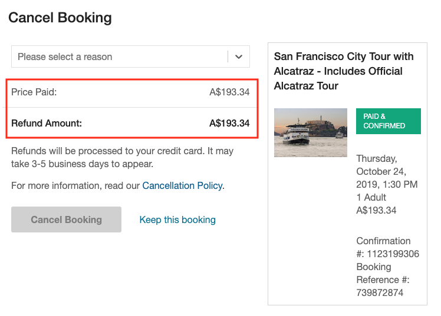
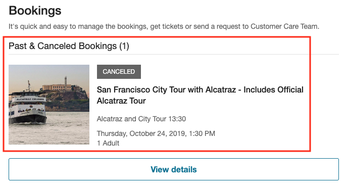

# Cancellation UX

On the Viator.com website, once the customer has made a booking, they are able to access the details of all their upcoming, past and cancelled bookings by navigating to the **bookings** section of the website.

You must communicate to the user the terms and conditions that pertain to canceling their booking; i.e., what to expect in terms of the refund they will receive if they were to cancel their booking now.

On the Viator website, this information is communicated in the cancellation button text. In the following example, the user has booked the "San Francisco City Tour with Alcatraz", and is viewing their **bookings** page.

In this way, the user is told that they can "cancel for free by Oct 22" – i.e., they will be issued a full refund if they cancel the product prior to October 22:

This text is programmatically generated by inspecting the product's cancellation policy, which is contained within the `merchantTermsAndConditions` object, which is included in the response object from the following endpoints:

- [/booking/book](../../../../openapi/reference/operation/bookingBook)
- [/booking/pastbooking](../../../../openapi/reference/operation/bookingPastbooking)
- [/booking/mybookings](../../../../openapi/reference/operation/bookingMybookings)

For details on how to interpret the `merchantTermsAndConditions` object, see: [Cancellation policy](../../key-concepts/cancellation-policy)

Once the user clicks the button labelled: **Cancel for free by Oct 22**, they are brought to the cancellation confirmation page, where they are provided a more formal cancellation quote prior to confirming their intention to cancel the product.

## Cancellation refund display

As the merchant of record, the amount your customer was charged for the product was your decision; therefore, the amount that you elect to grant the customer as a refund is also up to you, so you will need to retrieve the amount the customer has paid for the product from your own records/databases.

The amount that Viator would have invoiced you for the booking – equivalent to the merchant net price at the time of booking plus the transaction fee – can be retrieved using the [/bookings/{booking-ref}/cancel-quote](../../../../openapi/reference/operation/cancelBookingQuote) endpoint. For more information see: [Get a cancellation quote](../cancellation-api-workflow/#getting-a-cancellation-quote).

Here, the customer is shown that they will receive a full refund if they cancel the product now:

## Displaying and choosing cancellation reasons

At this point in the workflow, the user must select a reason for their cancellation. Viator's systems require that a reason for the cancellation be given in order to carry out the cancellation process.

As the set of acceptable reasons for canceling a booking are formally specified by the Viator Partner API and are not necessarily immutable (new reasons may be added at any time) you should retrieve the presently available cancellation reasons from the [/bookings/cancel-reasons](../../../../openapi/reference/operation/cancellationReasons) endpoint. We require you to present these to the customer for them to select.

Use the `cancellationReasonText` fields in the response to populate the list from which the customer can select the most-appropriate match for why they are canceling, as on the Viator website:

For more information about getting cancellation reasons, see: [Getting cancellation reasons](../cancellation-api-workflow/#getting-cancellation-reasons)

**Note**: As it is necessary for the user to provide a cancellation reason, it is required that the **Cancel Booking** button remain disabled until a reason has been selected by the customer.

## Completing the cancellation

Once the user has selected a reason, the **Cancel Booking** button can be activated:

Clicking the **Cancel Booking** button is the final action required of the customer to complete the cancellation.

At this point, you will want to cancel the booking using the [/bookings/{booking-ref}/cancel](../../../../openapi/reference/operation/cancelBooking) API endpoint. For more information on using this service, see: [Cancel the booking](../cancellation-api-workflow/#cancel-the-booking)

## Obtaining confirmation for the cancellation

On the Viator.com site, the following confirmation message is displayed on the page that loads after the **Cancel Booking** button is clicked:

## Cancellation confirmation email

Once the cancellation is accepted, a short, succinct email informing the customer that their booking has been successfully canceled is sent immediately:

## Viewing canceled bookings

Clicking on the **View reservation details** button in the cancellation confirmation email returns the customer to their bookings page, where the fact of the booking being canceled is communicated clearly:

